# Kegocnizer, v1.0

This demo project describes the development of a device to allow beer to be dispensed to authorized users, which adheres to a identified set of company policies and state law.

## The Team

Our core team works on servicing officially supported versions of Windows 10 IoT Core, so we have skills working with Windows and IoT devices.  We also realized we needed help 
with usability, graphics, and styling the application.

* Christine Ahonen – Program Manager II
* Sara Clayton – Program Manager II
* Sudheer Kusuma – Senior Software Engineer
* Dave Natsuhara – Principal Software Engineering Lead
* Rutuja Shirali – Software Engineer
* Mark Snyder – Senior Software Engineer

## The Requirements

It’s all about getting the beer to the developers, but the opportunity was to make the beer available while following applicable state laws and company policies, including:

* Beer can only be served to individuals of legal drinking age
* Events occur outside of core business hours
* Because of contractual agreements with catering vendors, an event must serve no more than 25 people

We also wanted to demonstrate Microsoft technologies using a variety of sensors in a more complex scenario than typical sample code.  In addition, we sought to address other 
misconceptions about IoT:

* These microcontrollers are often called “maker” boards to characterize them as devices that people wouldn’t really want to use in a production device.  This is true to some 
extent, due to historical performance limitations and either having not enough or too many ports/pins on them for the application that an OEM might be targeting.  This actually 
worked to our benefit, because we wanted to show that we could use a bunch of sensors at the same time and really flex the capabilities of the microcontroller.
* We wanted to show that the Windows 10 IoT Core platform is capable of performing really well for a useful, real-world scenario.
* The ability to write UWP applications really sped up our development.  It also gave us a lot of confidence in the software we had to develop.

The great thing about a project of this size is the opportunity to experience the full product life cycle.  We wanted to use this to show we could use Visual Studio Online to 
manage our project and track progress throughout.  

We also used Microsoft Teams for day to day communication and managing “living” documents related to the project.

We also wanted to make the end-result public as a sample on the Microsoft site so that others could learn from what we encountered and use our work as a roadmap to do 
similar projects on their own.

## The Design

We firmed up the broad design quickly.  We would have a unit inside the Kegerator that handled weight, temperature, and flow, and a unit outside that housed the microcontroller 
as well as the connected card reader.  In addition, the display monitor for the user interaction would be outside and our goal was to handle everything by hardware events with 
no need for user input.  This would eliminate the need for peripherals such as mouse or keyboard.

We also bestowed a name on our product.  We called it the Kegocnizer because it’s essentially a keg that recognizes.

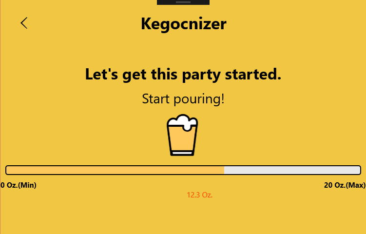

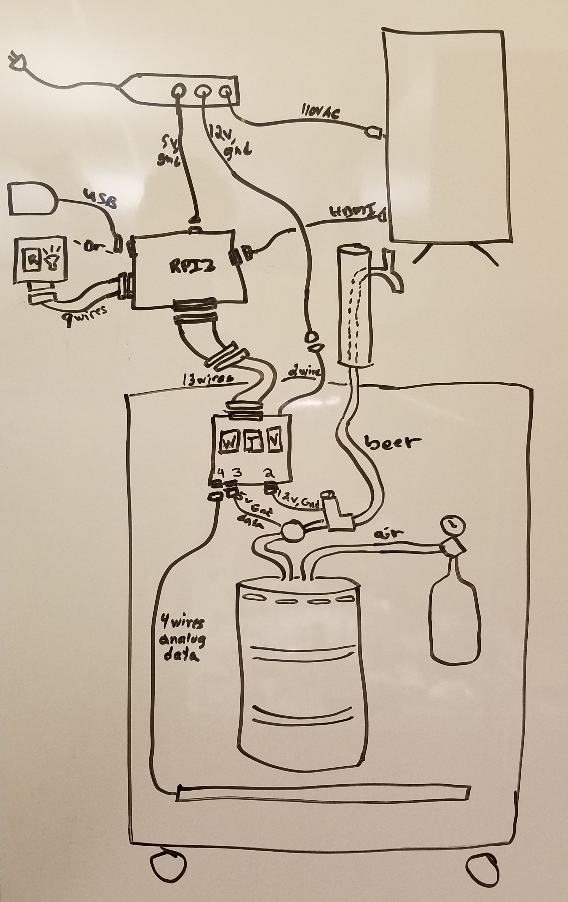

With a broad design in place, we were ready to begin building a prototype.

## Prototype

The technology and products involved included:
* Raspberry Pi 3 microcontroller
  * We considered using a Minnowboard Max (x86) microcontroller for a while because it housed a similar number of ports and GPIO pins, and because of driver support for some 
of the card readers we considered.  In the end, we went with the RPI3 because it was the cheapest option that satisfied our requirements.
* Windows 10 IoT Core, RS3 and beyond
* Universal Windows Platform (UWP) for both the user application and the admin console
* Nostalgia Electrics KRS2100 5.1 Cubic-Foot Kegorator, Draft Beer Dispenser
* A variety of sensors:
  * DHT11 for measuring the temperature inside the Kegerator
  * HX711 force sensor for determine the contents of the keg, if it was full or getting close to empty
  * DIGITEN Hall Effect Flowmeter
  * U.S. Solid Solenoid-controlled Valve
  * RF IDeas pcProx Plus dual frequency programmable card reader
* A keg of Widmer Hefeweizen
* A pressurized CO2 tank

We also used a surplus case, connectors, tape, glue gun, solder, and other sundry supplies.

First, we mapped out a general mapping of pins to make sure we wouldn’t have any collisions between sensors.  

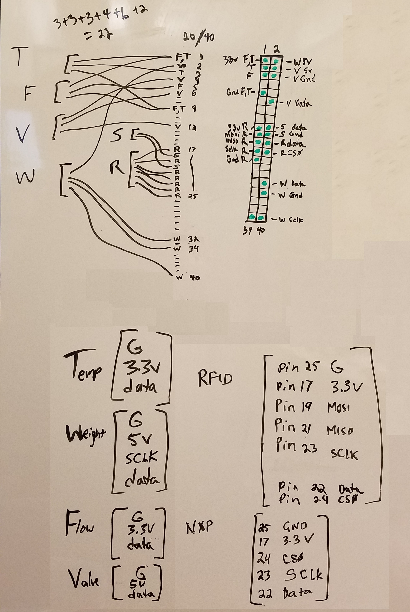

The Raspberry Pi 3 has two 3.3V and two 5V pins, and 8 ground
pins.  Plenty for our needs.  The flow and temperature sensors both need 3.3V.  We had them share power and ground, simply because initially we thought we might need the other 
3.3V source for the RFID card reader.  We eventually settled on a USB card reader, freeing up that power pin, but we had already constructed the cables by then so we left it.  The
weight sensor and valve relay require 5V, so they each got their own pin.  The weight sensor also needed a clock pin, but apart from that pin, mapping the remaining data pins was 
done simply by selecting the nearest available GPIO pin to each sensor's power source, to make circuit routing easier.

The relay, Raspberry Pi, Monitor, and Refrigerator all required a 110V AC power source.  

The Raspberry Pi and badge reader, as well as the display monitor, would live outside the refrigerator.  The rest of the hardware would live inside.  Thus, there would be a ribbon
cable carrying the power and data from the Raspberry Pi to the unit inside the refrigerator, and a single power cable carrying a 12V power source to the valve by way of the relay. 
 
We continued to refine the implementation and by the end, we had developed 3 completely different prototypes for the Kegocnizer.  Here is the schematic:

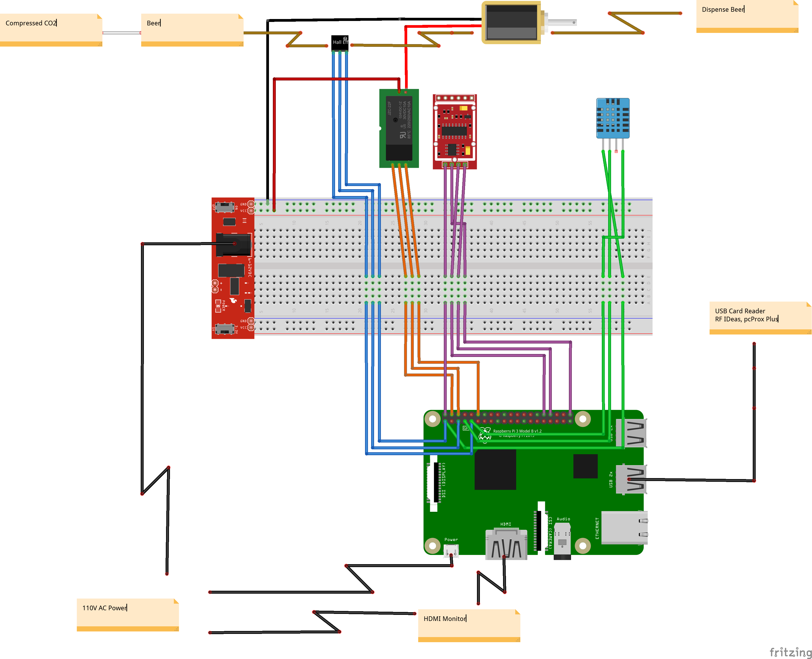
   
Prototype 1 was all done on breadboards, was pretty shaky, and required a lot of debugging. 

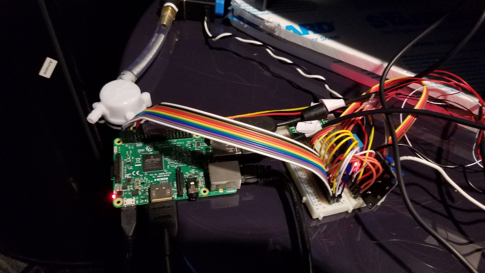

P2 was done on a circuit board but had several issues and needed to be redone.  

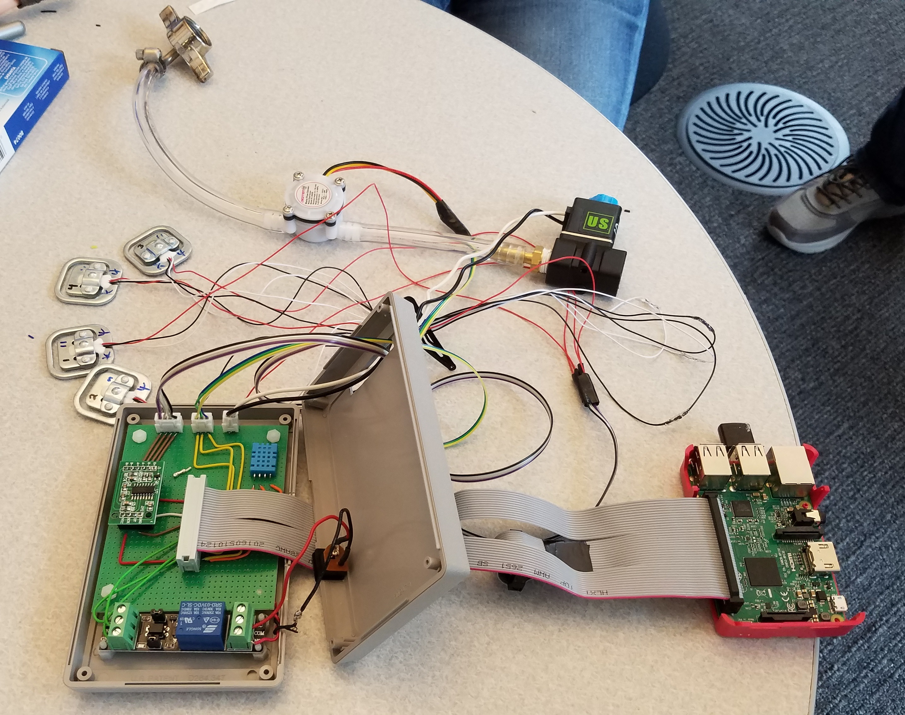

We learned a lot of lessons from this prototype regarding soldering techniques, crimping connectors, cable lengths, etc.  One of the biggest mistakes at this stage was mirroring 
the pin map onto the circuit board so that everything was plugged into the wrong pin.

We carved a groove in the side of the case for the ribbon cable to run through. The connectors were soldered onto the board and a hole was cut in the case to allow them
to route between the board and the sensors.  During testing, we had to move the keg in and out of the refrigerator a number of times, and often this would put stress on
the connectors, causing them to come unplugged and in a couple of instances, the crimps were pulled out and had to be redone.  In the next prototype, we plan to use aircraft 
style connectors so that the connections are more securely fastened without requiring an unattractive hole in the case.

 
Incremental testing was also crucial.  We learned that testing each soldered connection, each cable, each component, and each connector, was a huge timesaver over waiting 
until final assembly and trying to debug issues back to the broken component at the end.

Each component was tested on its own prior to integrating with the prototype.

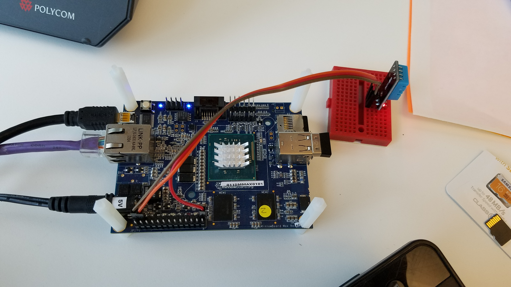
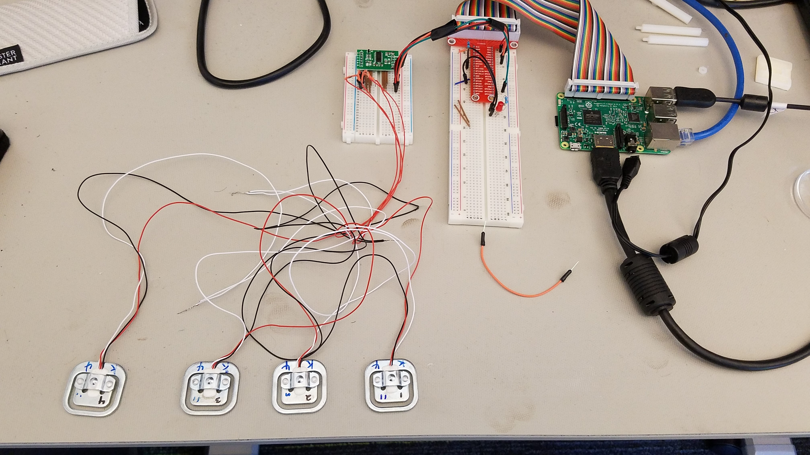
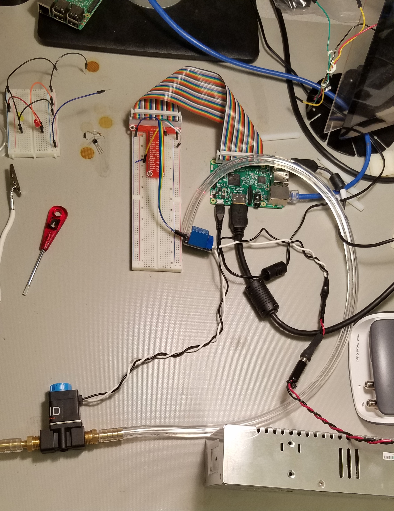

P3 worked, looked better, and got much more modular.  The new cables were of a more appropriate length, which allowed the keg to be removed and put back in the refrigerator 
without inadvertently unplugging wires or putting stress on connectors.

The weight sensors needed to be placed beneath the keg in such a way that the weight would be evenly distributed.  An empty keg can weigh around 30 pounds, while a full 
keg could weigh close to 160 pounds.  We were also concerned with using something that would bend and foul the readings.  We also needed to be stingy with the height of the 
keg from the bottom of the refrigerator, because there was only a small space for the regulator, hoses and the keg tap to fit above and behind the keg.  We made a pattern for 
the shape from a blank manila folder. Then we bought a sheet of ½” Rigid High-Density Polyethylene and cut two pieces to fit our pattern.  We fastened the force sensors between 
the two sheets with the wires coming out the back.  By placing the sensors as far apart as possible from one another, and under where the keg's weight would touch the top sheet,
this supported the weight of the keg without significant deformation.

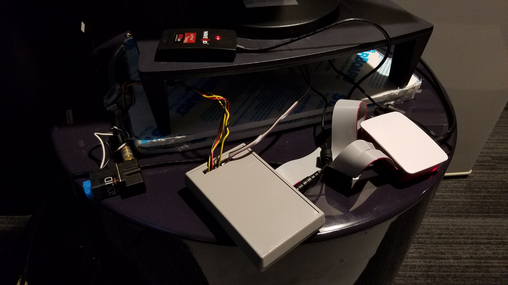

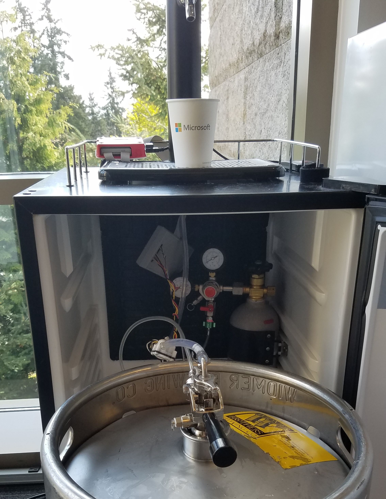

## The User Scenarios (UX) and Keg App

When a user walks up to the Kegocnizer, they are either a valid user or not.  For a user that the Kegocnizer doesn’t recognize (or Kegocnize) an error message is displayed when
they swipe their card indicating that they cannot be served.  A user that has been previously whitelisted (or “Kegocnized”) can swipe their card, and if:

1. they haven’t already exceeded their hourly limit, or 
2. the number of users per event hasn’t been exceeded, 

then the unit will serve beer.  

As the user pours beer, the amount is monitored, and the unit shuts off if:

1. the hourly limit for this user is met, or 
2. the timeout is reached.  

In order to support a variety of form factors, the application needed to use a responsive design approach.  Our goal was to at least support landscape and portrait orientations aligned with IoT Core Windows Device Portal (`http://<IPAddress>:8080/`), at common resolutions such as 1024x678 or 1280x1024.

The architecture of the client application utilizes best practices.  All hardware interactations are driven through Data Access Layer(DAL) resulting in fewer moving parts in UWP layer. We used following Nuget packages:
1. Microsoft.Data.Sqlite - as a local datastore, for storing user visits, consumption event data
2. Microsoft.Toolkit.UWP - For responsive features, including the DockPanel and other controls
3. Microsoft.ApplicationInsights - For logging insights events, exceptions, traces, metrics to the cloud for future analysis
4. Azure Functions - as a remote datastore, encapsulating the access to the whitelisted users

Utilizing Azure Functions allowed us to implement our remote datastore as a "black box".  Ours was implemented as an Azure Cosmos DB database.

## Administration

The requirements for administering the operation of the Kegocnizer fell into two categories:

1.	functionality that a superuser needed to do, such as whitelisting new users, and
2.	configuration, such as sensor calibration values and organizational parameters (such as predefined core hours, max event group size, and per-person consumption limits)

The list of kegocnized users and the configuration/calibration data are stored in Cosmos DB documents in the Cloud.  Thus, the data is secure across power outages and restarts. 
It also allows the admin app to be separate and run on Windows Desktop on a PC or laptop.

## Telemetry

Another feature we desired was to be able to track activity over time.  For this, we utilized Azure Application Insights.  The app generates telemetry events when it is activated 
on behalf of a kegocnized user, when it is deactivated (along with the reason), as some other events.  This will provide data that shows how often the unit is being used, how 
many unique users visit the device, and how much beer is consumed by the average user.  As stated before, we don’t associate any identifiable attributes to the user, but the 
data is still useful in aggregate.

## Putting It All Together

Once the hardware and software were tested to be working, we were ready to pour.  At that point, we realized we had beer issues.  We needed to learn from people experienced 
with using kegs the fine art of serving cold beer with the proper amount of pressure and carbonation.  Luckily, we know several brew-meisters, as well as several people familiar 
with using kegs of beer.  

Setting the regulator too high initially, we had to slowly bring the pressure and carbonation down over several days.  Once this process was completed, our system was able to 
produce cold beer with an acceptable level of foam (head) at the top that tasted good.

We were able to set the regulator to provide the right amount of pressure (about 8 p.s.i.) so that the carbonation would settle at an appropriate rate at the temperature we targeted 
for our beer (about 34 degrees F).  However, the valve seems to generate some foam on its own.  We theorize that this is due to cavitation within the valve and that using a ball 
valve will cut down on this effect.

## Calibration

The temperature sensor produces a value that is readily convertible to temperature, either Fahrenheit or Celsius, using straight math.  The valve and badge reader worked as-is, 
too.  However, the flow and weight sensors needed some calibration.  The values for the weight sensor are primarily used to determine when it is time to order a refill.  The software 
needed to be configured with full and empty weight settings, since we didn’t care as much about the weight in pounds as we did the percentage full.  Secondly, the flow meter 
produces essentially a tick count that must be converted to ounces of beer passing through the sensor.  When we had the Kegocnizer pouring beer with minimal foam, we poured 
an 8 ounce glass of beer and then looked at the value the sensor produced, and computed the conversion factor from there.  

## Conclusion

The completed product has produced a kegerator that is available on the floor to developers around the clock, while it enforces state law and company policy.  When an event is underway, individuals that have been previously whitelisted may swipe their employee id and receive beer.
