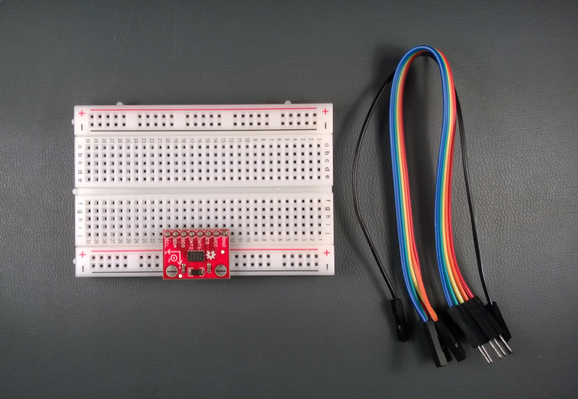
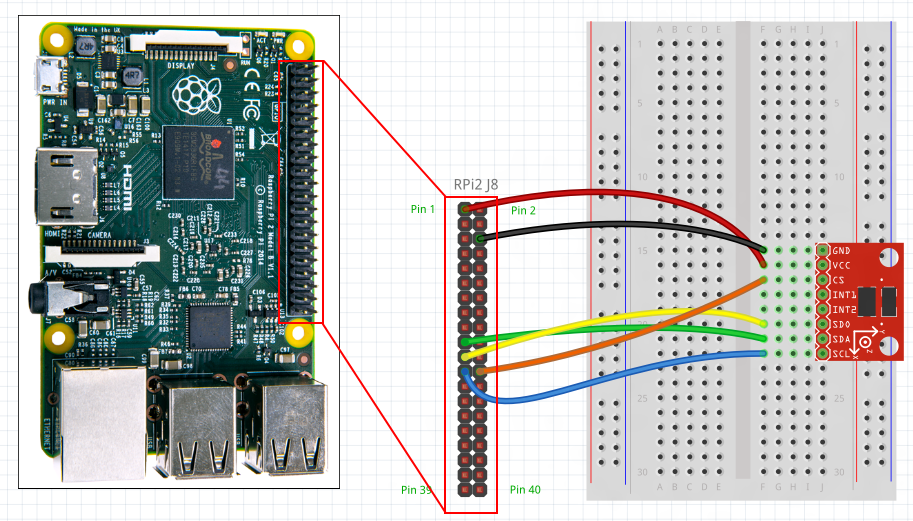
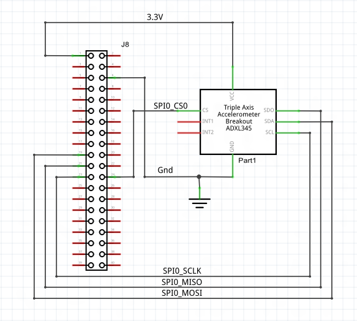
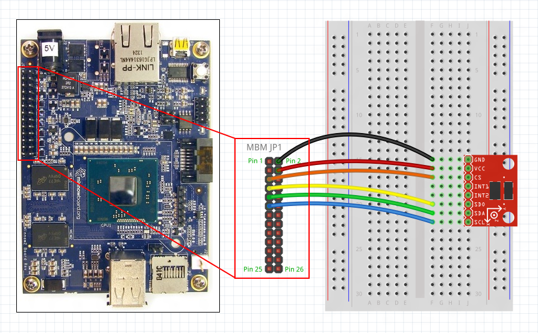
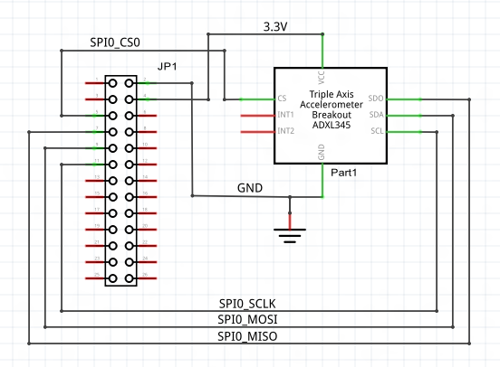
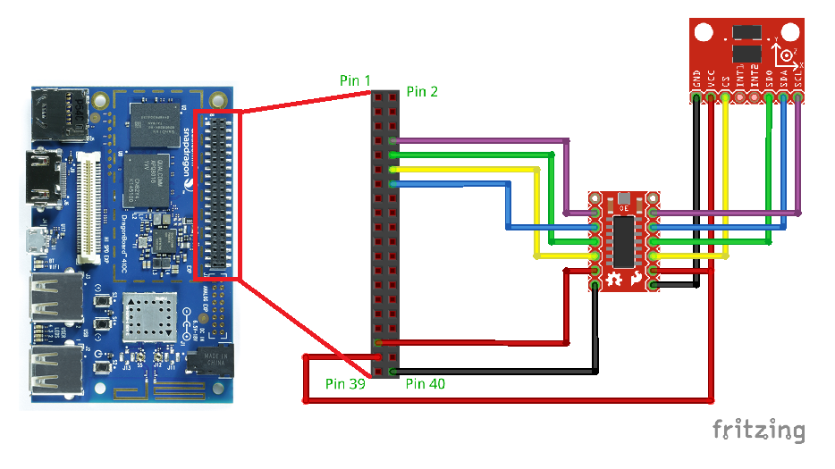
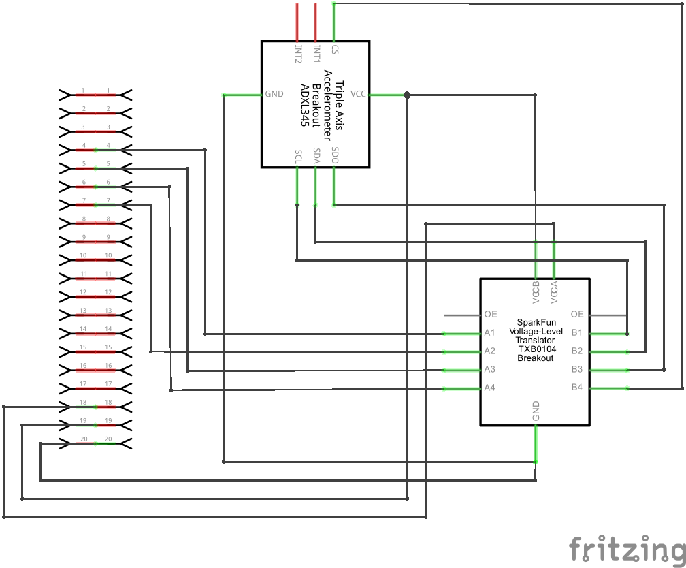

# SPI Accelerometer

We'll connect an SPI accelerometer to your Raspberry Pi 2 or 3, Up Squared*, or DragonBoard 410c and create a simple app to read data from it. We'll walk you through step-by-step, so no background knowledge of SPI is needed.
However, if you're curious, SparkFun provides a great [tutorial on SPI](https://learn.sparkfun.com/tutorials/serial-peripheral-interface-spi).

*The Up Squared should be used in place of the Minnowboard Max. We are in the process of updating our documentation to reflect this change.   

This is a headed sample.  To better understand what headed mode is and how to configure your device to be headed, follow the instructions [here](/Docs/HeadlessMode).

### Load the project in Visual Studio

You can find the source code for this sample by downloading a zip of all of our samples [here](https://github.com/Microsoft/Windows-iotcore-samples/archive/master.zip) and navigating to the `samples-develop\Accelerometer`.  Make a copy of the folder on your disk and open the project from Visual Studio.

### Connect the SPI Accelerometer to your device

You'll need a few components:

* <a name="SPI_Accelerometer"></a>an [ADXL345 accelerometer board from Sparkfun](https://www.sparkfun.com/products/9836) with pin headers soldered on

* a breadboard and a couple of male-to-female connector wires

Visit the **Raspberry Pi 2 or 3/MinnowBoard Max** sections below depending on which device you have:



#### Raspberry Pi 2 or 3
If you have a Raspberry Pi 2 or 3, we need to hook up power, ground, and the SPI lines to the accelerometer.
 See the [Raspberry Pi 2 and 3 pin mapping page](https://docs.microsoft.com/en-us/windows/iot-core/learn-about-hardware/pinmappings/pinmappingsrpi) for more details on the RPi2 and RPi3 IO pins.

**Note: Make sure to power off the RPi2 or RPi3 when connecting your circuit. This is good practice to reduce the chance of an accidental short circuit during construction.**

The ADXL345 breakout board has 8 IO pins, connect them as follows:

1. **GND:**  Connect to ground on the RPi2 or RPi3 (Pin 6)
2. **VCC:**  Connect to 3.3V on the RPi2 or RPi3 (Pin 1)
3. **CS:**   Connect to SPI0 CS0 on the RPi2 or RPi3 (Pin 24). This is the chip-select line for the SPI bus.
4. **INT1:** Leave unconnected, we're not using this pin
5. **INT2:** Leave unconnected, we're not using this pin
6. **SDO:**  Connect to SPI0 MISO on the RPi2 or RPi3 (Pin 21)
7. **SDA:**  Connect to SPI0 MOSI on the RPi2 or RPi3 (Pin 19)
8. **SCL:**  Connect to SPI0 SCLK on the RPi2 or RPi3 (Pin 23). This is the clock line for the SPI bus.

Here are the connections shown on a breadboard:



<sub>*Image made with [Fritzing](http://fritzing.org/)*</sub>

Here are the schematics:



#### MinnowBoard Max
If you have a MinnowBoard Max, we need to hook up power, ground, and the SPI lines to the accelerometer.
 See the [MBM pin mapping page](https://docs.microsoft.com/en-us/windows/iot-core/learn-about-hardware/pinmappings/pinmappingsmbm) for more details on the MBM IO pins.

**Note: Make sure to power off the MBM when connecting your circuit. This is good practice to reduce the chance of an accidental short circuit during construction.**

The ADXL345 breakout board has 8 IO pins, connect them as follows:

1. **GND:**  Connect to ground on the MBM (Pin 2)
2. **VCC:**  Connect to 3.3V on the MBM (Pin 4)
3. **CS:**   Connect to SPI0 CS0 on the MBM (Pin 5)
4. **INT1:** Leave unconnected, we're not using this pin
5. **INT2:** Leave unconnected, we're not using this pin
6. **SDO:**  Connect to SPI0 MISO on the RPi2 or RPi3 (Pin 7)
7. **SDA:**  Connect to SPI0 MOSI on the RPi2 or RPi3 (Pin 9)
8. **SCL:**  Connect to SPI0 SCLK on the RPi2 or RPi3 (Pin 11). This is the clock line for the SPI bus.

Here are the connections shown on a breadboard:



<sub>*Image made with [Fritzing](http://fritzing.org/)*</sub>

Here are the schematics:



#### DragonBoard 410c

For the DragonBoard 410c, you will require a [Voltage-Level Translator Breakout](https://www.sparkfun.com/products/11771). The connections need to be made from the single board computer to the power, ground, and SPI lines of the accelerometer via the Voltage-Level Translator.

**NOTE:  Make sure to power off the DragonBoard when connecting your circuit.  This is good practice to reduce the chance of an accidental short circuit during construction.**

The ADXL345 breakout board has 8 IO pins that are connected to the Voltage-Level Translator as follows:

1.  **GND:**  Connect the ground to GND
2.  **VCC:**  Connect the power to VccB
3.  **CS:**   Connect the chip select to B4
4.  **INT1:** The interrupt output 1 is _unused_
5.  **INT2:** The interrupt output 2 is _unused_
6.  **SDO:**  Connect the serial data output to B3
7.  **SDA:**  Connect the serial data input to B2
8.  **SCL:**  Connect the serial communications clock to B1

The Voltage-Level Translator breakout board pins are connected to the DragonBoard as follows:

1.  **GND:**  Connect the ground to pin 40
2.  **VccA:**  Connect the lower power to pin 35 (1.8V)
3.  **VccB:**  Connect the higher power to pin 37 (5V)
4.  **A1**  Connect to pin 8 (SPI0_CLK)
5.  **A2**  Connect to pin 14(SPI0_MOSI)
6.  **A3**  Connect to pin 10(SPI0_MISO)
7.  **A4**  Connect to pin 12(SPI0_CS)

The following diagram shows what your breadboard might resemble with the circuit assembled:



A schematic for the circuit is:



### Deploy and run the app

When everything is set up, power your device back on, and open up the sample app in Visual Studio. Open the file **MainPage.xaml.cs** and change the following line from **Protocol.NONE** to **Protocol.SPI**:

```csharp
public sealed partial class MainPage : Page
{
    /* Important! Change this to either Protocol.I2C or Protocol.SPI based on how your accelerometer is wired   */
    private Protocol HW_PROTOCOL = Protocol.SPI; 
    // ...
}
```  

Follow the instructions to [setup remote debugging and deploy the app](https://docs.microsoft.com/en-us/windows/iot-core/develop-your-app/appdeployment). The SPIAccelerometer app will deploy and start, and you should see accelerometer data show up on screen.
 If you have your accelerometer flat on a surface, the Z axis should read close to 1.000G, while X and Y are close to 0.000G. The values will fluctuate a little even if the device is standing still.
 This is normal and is due to minute vibrations and electrical noise. If you tilt or shake the sensor, you should see the values change in response. Note that this sample configures the device in 4G mode,
so you wont be able to see G readings higher than 4Gs.


Congratulations! You've connected an SPI accelerometer.

### Let's look at the code
The code in this sample performs two main tasks:

1. First the code initializes the SPI bus and the accelerometer

2. Secondly, we read from the accelerometer at defined intervals and update the display

Let's start by digging into the initializations.

### Initialize the SPI bus
To use the accelerometer, we need to initialize the SPI bus first. Here is the C# code.

```csharp
using Windows.Devices.Enumeration;
using Windows.Devices.Spi;

/* Initialization for SPI accelerometer */
private async void InitSPIAccel()
{
    try {
        var settings = new SpiConnectionSettings(SPI_CHIP_SELECT_LINE);
        settings.ClockFrequency = 5000000;                              /* 5MHz is the rated speed of the ADXL345 accelerometer                     */
        settings.Mode = SpiMode.Mode3;                                  /* The accelerometer expects an idle-high clock polarity, we use Mode3    
                                                                         * to set the clock polarity and phase to: CPOL = 1, CPHA = 1         
                                                                         */

        string aqs = SpiDevice.GetDeviceSelector();                     /* Get a selector string that will return all SPI controllers on the system */
        var dis = await DeviceInformation.FindAllAsync(aqs);            /* Find the SPI bus controller devices with our selector string             */
        SPIAccel = await SpiDevice.FromIdAsync(dis[0].Id, settings);    /* Create an SpiDevice with our bus controller and SPI settings             */
        if (SPIAccel == null)
        {
            Text_Status.Text = string.Format(
                "SPI Controller {0} is currently in use by " +
                "another application. Please ensure that no other applications are using SPI.",
                dis[0].Id);
            return;
        }
    }

    // ...
}
```

Here's an overview of what's happening:

* First, we create an **SpiConnectionSettings** object and set the clock speed, clock polarity, and chip-select line.

* Next, we get the selector strings for all SPI controllers on the device, and use that find all the SPI bus controllers on the system.

* Finally, we create a new **SpiDevice** from the first SPI controller on the system (**dis[0]**) and check that it's available for use.

### Initialize the accelerometer

Now that we have the **SpiDevice** accelerometer instance, we're done with the SPI bus initialization. We can now write data over SPI to start up the accelerometer. We do this with the **Write()** function.
For this particular accelerometer, there are two internal registers we need to configure before we can start using the device: The data format register, and the power control register.

1. We first write a 0x01 to the data format register. This configures the device range into +-4G mode. If you consult the [datasheet](https://www.sparkfun.com/datasheets/Sensors/Accelerometer/ADXL345.pdf){:target="_blank"}, you'll see that the device can be configured in a variety of measurement modes ranging from 2G to 16G.
Higher G settings provide you with greater range at the expense of reduced resolution. We choose 4G as a reasonable trade off between the two.

2. We write a 0x08 to the power control register, which wakes the device from standby and starts measuring acceleration. Again, the [datasheet](https://www.sparkfun.com/datasheets/Sensors/Accelerometer/ADXL345.pdf){:target="_blank"} contains additional information about the device settings and capabilities.

```csharp
private async void InitSPIAccel()
{
    // ...

    /* 
     * Initialize the accelerometer:
     *
     * For this device, we create 2-byte write buffers:
     * The first byte is the register address we want to write to.
     * The second byte is the contents that we want to write to the register. 
     */
    byte[] WriteBuf_DataFormat = new byte[] { ACCEL_REG_DATA_FORMAT, 0x01 };        /* 0x01 sets range to +- 4Gs                         */
    byte[] WriteBuf_PowerControl = new byte[] { ACCEL_REG_POWER_CONTROL, 0x08 };    /* 0x08 puts the accelerometer into measurement mode */

    /* Write the register settings */
    try
    {  
        SPIAccel.Write(WriteBuf_DataFormat);
        SPIAccel.Write(WriteBuf_PowerControl);
    }
    /* If the write fails display the error and stop running */
    catch (Exception ex)
    {
        Text_Status.Text = "Failed to communicate with device: " + ex.Message;
        return;
    }

    // ...
}
```

### Timer code
After all the initializations are complete, we start a timer to read from the accelerometer periodically. Here is how you set up the timer to trigger every 100mS.
```csharp
private async void InitSPIAccel()
{
    // ...

    /* Now that everything is initialized, create a timer so we read data every 100mS */
    periodicTimer = new Timer(this.TimerCallback, null, 0, 100);

    // ...
}

private void TimerCallback(object state)
{
    string xText, yText, zText;
    string statusText;
    
    /* Read and format accelerometer data */
    try
    {
        Acceleration accel = ReadAccel();
        xText = String.Format("X Axis: {0:F3}G", accel.X);
        yText = String.Format("Y Axis: {0:F3}G", accel.Y);
        zText = String.Format("Z Axis: {0:F3}G", accel.Z);
        statusText = "Status: Running";
    }
    
    // ...
}
```

### Read data from the accelerometer
With the SPI bus and accelerometer initialized, we can start reading data from the accelerometer. Our **ReadAccel()** function gets called every 100mS by the timer:

```csharp
private Acceleration ReadAccel()
{
    const int ACCEL_RES = 1024;         /* The ADXL345 has 10 bit resolution giving 1024 unique values                     */
    const int ACCEL_DYN_RANGE_G = 8;    /* The ADXL345 had a total dynamic range of 8G, since we're configuring it to +-4G */
    const int UNITS_PER_G = ACCEL_RES / ACCEL_DYN_RANGE_G;  /* Ratio of raw int values to G units                          */

    byte[] ReadBuf;                 
    byte[] RegAddrBuf;

    /* 
     * Read from the accelerometer 
     * We first write the address of the X-Axis register, then read all 3 axes into ReadBuf
     */
    switch (HW_PROTOCOL)
    {
        case Protocol.SPI:
            ReadBuf = new byte[6 + 1];      /* Read buffer of size 6 bytes (2 bytes * 3 axes) + 1 byte padding */
            RegAddrBuf = new byte[1 + 6];   /* Register address buffer of size 1 byte + 6 bytes padding        */
            /* Register address we want to read from with read and multi-byte bit set                          */
            RegAddrBuf[0] =  ACCEL_REG_X | ACCEL_SPI_RW_BIT | ACCEL_SPI_MB_BIT ;
            SPIAccel.TransferFullDuplex(RegAddrBuf, ReadBuf);
            Array.Copy(ReadBuf, 1, ReadBuf, 0, 6);  /* Discard first dummy byte from read                      */
            break;
        case Protocol.I2C:
            // ...
        default:    /* Code should never get here */
            // ...
    }
    
    // ...
    
    /* In order to get the raw 16-bit data values, we need to concatenate two 8-bit bytes for each axis */
    short AccelerationRawX = BitConverter.ToInt16(ReadBuf, 0);
    short AccelerationRawY = BitConverter.ToInt16(ReadBuf, 2);
    short AccelerationRawZ = BitConverter.ToInt16(ReadBuf, 4);

    /* Convert raw values to G's */
    Acceleration accel;
    accel.X = (double)AccelerationRawX / UNITS_PER_G;
    accel.Y = (double)AccelerationRawY / UNITS_PER_G;
    accel.Z = (double)AccelerationRawZ / UNITS_PER_G;

    return accel;
}
```
Here's how this works:

* We begin by reading data from the accelerometer with the **TransferFullDuplex()** function. This function performs a SPI write and SPI read simultaneously in the same transaction.

* The initial write specifies the register address we want to read from (which in this case is the X-Axis data register). This write ensures that a subsequent read will start from this register address.
We provide the function with a one-byte byte array representing the register address we want to write (plus padding bytes). We also set the read and multi-byte bits so that the accelerometer knows we're reading multiple bytes.

* Next we provide the function with a read buffer of size 6 so we read 6 bytes over SPI (plus padding bytes). Since this device supports multi-byte reads,
**and** the X, Y, and Z data registers are next to each other, reading 6 bytes give us all of our data in one go. This ensures acceleration values don't change between reads as well.

* We get back 6 bytes of data from our read. These represent the data in the X, Y, and Z data registers respectively.
We separate out the data into their respective axes and concatenate the bytes using **BitConverter.ToInt16()**.

* The raw data is formatted as a 16-bit integer, which contains 10-bit data from the accelerometer. It can take on values ranging from -512 to 511. A reading of -512 corresponds to -4G while 511 is +4G.
 To convert this to G units, we divide by the ratio of full-scale range (8G) to the resolution (1024)

* Now that we have the G unit values, we can display the data on screen. This process is repeated every 100mS so the information is constantly updated.
