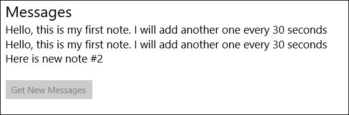

# Using an app service with multiple clients
We’ll create a simple notepad [app service](https://docs.microsoft.com/en-us/windows/uwp/launch-resume/how-to-create-and-consume-an-app-service).  We'll also create two simple app service clients. One that writes to the notepad service and one that reads from the notepad service.

## Load the projects in Visual Studio
___

You can find the source code for this sample by downloading a zip of all of our samples [here](https://github.com/Microsoft/Windows-iotcore-samples/archive/master.zip) and navigating to the `samples-develop\AppServiceSharedNotepad`.  Make a copy of the folder on your disk and open the projects from Visual Studio.  NotepadService.sln implements the app service and must be started first.  NotepadClientBackgroundApplication.sln implements a client that writes messages to the app service.  NotepadServiceClientApp.sln implements a windows that retrieves messages from the client and displays them.

Once the project is open and builds, the next step is to [deploy](https://github.com/MicrosoftDocs/windows-iotcore-docs/blob/master/windows-iotcore/develop-your-app/AppDeployment.md) the application to your device.

When everything is set up, you should be able to press F5 from each instance of Visual Studio.  The NotepadService app will deploy and start on the Windows IoT device, and you should see the package family name printed the debug output window on Visual Studio.  Before pressing F5 for NotepadClientBackgroundApplication and NotepadServiceClientApp projects verify that the value of connection.PackageFamilyName in StartupTask.cs and MainPage.xaml.cs matches the value output in the output window by BlinkyService.  Next start NotepadServiceClientApp and then NotepadServiceClientApp.

When you run the client app you should see


After a 30 seconds or so the text in the button should change to black from gray.  Clicking the button will show the messages from the clipboard service.


## Let's look at the code
___
The code is in 3 projects NotepadService, NotepadClientBackgroundApplication and NotepadServiceClientApp.  First we'll look at NotepadService.

## Adding an app service
___
To add an appservice to our background application first we need to open appxmanifest.xml in a text editor and add an extension with Category="windows.AppService"

``` xml
<Extensions>
  <Extension Category="windows.backgroundTasks" EntryPoint="NotepadService.StartupTask">
    <BackgroundTasks>
      <Task Type="pushNotification" />
      <iot:Task Type="startup" />
    </BackgroundTasks>
  </Extension>
  <uap:Extension Category="windows.appService" EntryPoint="NotepadService.StartupTask">
    <uap:AppService Name="NotepadService" />
  </uap:Extension>
</Extensions>
```

Next we'll add a check in the StartupTask::Run method to see if the application is being started as an appservice

```csharp
//Check to determine whether this activation was caused by an incoming app service connection
var appServiceTrigger = taskInstance.TriggerDetails as AppServiceTriggerDetails;
if (appServiceTrigger != null)
{
    if (appServiceTrigger.Name.Equals("NotepadService"))
    {
        appServiceConnection = appServiceTrigger.AppServiceConnection;
        appServiceConnection.RequestReceived += AppServiceConnection_RequestReceived;
        appServiceConnection.ServiceClosed += AppServiceConnection_ServiceClosed;
        notePad.NoteAdded += NotePad_NoteAdded;
    }
    else
    {
        serviceDeferral.Complete();
    }
}
```

At the beginning of NotepadService's StartupTask::Run get the deferral object and set up a Canceled event handler to clean up the deferral on exit.

```csharp
serviceDeferral = taskInstance.GetDeferral();
taskInstance.Canceled += TaskInstance_Canceled;
```

When the Canceled event handler is called Complete the deferral for this instance of the app service if one exists.  If the deferral is not completed then the app service process will be killed by the operating system even if other clients still have connections open to the app service.

```csharp
private void TaskInstance_Canceled(IBackgroundTaskInstance sender, BackgroundTaskCancellationReason reason)
{
    if (deferral != null)
    {
        deferral.Complete();
        deferral = null;
    }
}
```

Finally we need to handle service requests:

```csharp
// This AppService supports recieving two types of request: "postNote" and "getMessages"
// When a note is sent from the clients the service will pass it to the shared notepad
// and send a confirmation response to the client.
// When the client requests messages the repsonse will contain a string[] of all the messages on the notepad
private async void AppServiceConnection_RequestReceived(AppServiceConnection sender, AppServiceRequestReceivedEventArgs args)
{
    var messageDefferal = args.GetDeferral();
    var message = args.Request.Message;
    string operation = (string)message["operation"];
    if (operation.Equals("postNote"))
    {
        await notePad.AddNote((message["newNote"].ToString()));
        ValueSet returnMessage = new ValueSet();
        returnMessage.Add("Result", "Note Added");
        var responseStatus = await args.Request.SendResponseAsync(returnMessage);
        System.Diagnostics.Debug.WriteLine("New note posted: " + message["newNote"].ToString());
    }
    else if (operation.Equals("getMessages"))
    {
        var notes = notePad.GetNotes();
        ValueSet returnMessage = new ValueSet();
        returnMessage.Add("notes", notes.ToArray());
        var responseStatus = await args.Request.SendResponseAsync(returnMessage);
    }

    messageDefferal.Complete();
}
```

## Writing messages in NotepadClientBackgroundApplication
___
When the client starts it opens a connection to the client.  The string assigned to connection.PackageFamilyName uniquely identifies the service we want to connect to.

```csharp
AppServiceConnection connection;
BackgroundTaskDeferral deferral;
ThreadPoolTimer timer;
string requestedPinValue;

public async void Run(IBackgroundTaskInstance taskInstance)
{
    deferral = taskInstance.GetDeferral();
    taskInstance.Canceled += TaskInstance_Canceled;

    connection = new AppServiceConnection();
    connection.AppServiceName = "NotepadService";
    connection.PackageFamilyName = "NotepadService-uwp_2yx4q2bk84nj4";
    AppServiceConnectionStatus status = await connection.OpenAsync();
    if (status != AppServiceConnectionStatus.Success)
    {
        return;
    }

    var message = new ValueSet();

    //Send a message with an operation type of "postNote" and the desired "newNote"
    //Then, if successful, start a timer and send a new message periodically
    message.Add("operation", "postNote");
    message.Add("newNote", "Hello, this is my first note. I will add another one every 30 seconds");
    AppServiceResponse response = await connection.SendMessageAsync(message);
    if (response.Status == AppServiceResponseStatus.Success)
    {
        var result = response.Message["Result"].ToString();
        timer = ThreadPoolTimer.CreatePeriodicTimer(this.Tick, TimeSpan.FromSeconds(30));
        System.Diagnostics.Debug.WriteLine(result);
    }
}

private void TaskInstance_Canceled(IBackgroundTaskInstance sender, BackgroundTaskCancellationReason reason)
{
    if (deferral != null)
    {
        deferral.Complete();
        deferral = null;
    }
}
```

If everything connects without an error then the timer callback will post a new note every 30 seconds.

```csharp
public async void Tick(ThreadPoolTimer sender)
{
    count++;
    var message = new ValueSet();
    message.Add("operation", "postNote");
    message.Add("newNote", "Here is new note #" + count.ToString());
    AppServiceResponse response = await connection.SendMessageAsync(message);
    if (response.Status == AppServiceResponseStatus.Success)
    {
        var result = response.Message["Result"].ToString();
        System.Diagnostics.Debug.WriteLine(result);
    }
}
```

## Receiving new message notificiations and showing messages in NotepadServiceClient
___
In the NotepadServiceClient application add a TextBlock named **Messages** to contain the messages from the NotepadService.
Also, add a button called **GetNewMessagesButton** to get messages from NotepadServiceClient and store them in the **Messages** TextBlock.

``` xml
    <Grid Background="{ThemeResource ApplicationPageBackgroundThemeBrush}">
        <StackPanel Orientation="Vertical">
            <TextBlock FontSize="26">Messages</TextBlock>
            <TextBlock Name="Messages" FontSize="18.667"></TextBlock>
            <StackPanel>
                <Button Name="GetNewMessagesButton">Get New Messages</Button>
            </StackPanel>
        </StackPanel>
    </Grid>
```

In the **MainPage** constructor add an event handler for the **Loaded** event.  In the **Loaded** event handler connect to the **NotepadService** app service.

```csharp
AppServiceConnection connection;

public MainPage()
{
    this.InitializeComponent();
    this.Loaded += MainPage_Loaded;
}


//For more details about basic AppServices, see the "AppServiceBlinky" sample
//This app allows the user to request messages from the NotepadService
//The "GetNewMessagesButton" is only enabled when there are new messages with the service
private async void MainPage_Loaded(object sender, RoutedEventArgs e)
{
    GetNewMessagesButton.IsEnabled = false;
    connection = new AppServiceConnection();
    connection.AppServiceName = "NotepadService";
    connection.PackageFamilyName = "NotepadService-uwp_2yx4q2bk84nj4";
    AppServiceConnectionStatus status = await connection.OpenAsync();
    if (status != AppServiceConnectionStatus.Success)
    {
        Messages.Text = "Could not connnect to Notepad Service";
    }
    else
    {
        connection.RequestReceived += Connection_RequestReceived;
        GetNewMessagesButton.Click += GetNewMessagesButton_Click;
    }

}
```

When the NotepadService receives a new message it will call the connection's  **RequestReceived** event handler to notify the client application.  When a new message is received enable  **GetNewMessagesButton**.

```csharp
//When the service notifies us of new messages, enable the button to allow the user to request messages
private async void Connection_RequestReceived(AppServiceConnection sender, AppServiceRequestReceivedEventArgs args)
{
    ValueSet message = args.Request.Message;
    if (message["operation"].Equals("newMessagesAdded"))
    {
        //Incoming messages come in on a background thread and so you need to go through the dispatcher to modify the button on the UI thread
        var dispatcher = GetNewMessagesButton.Dispatcher;
        await dispatcher.RunAsync(CoreDispatcherPriority.Normal, () =>
        {
            GetNewMessagesButton.IsEnabled = true;
        });

    }

}
```

When the **GetNewMessagesButton** is clicked request the message from **NotepadService** and display them in the **Messages** TextBlock.

```csharp
//When the user requests new messages, send a request to the server and print them out
private async void GetNewMessagesButton_Click(object sender, RoutedEventArgs e)
{
    var message = new ValueSet();
    message.Add("operation", "getMessages");
    var result = await connection.SendMessageAsync(message);
    if (result.Status == AppServiceResponseStatus.Success)
    {
        var response = result.Message;
        string[] notes = (string[])response["notes"];
        foreach (string note in notes)
        {
            Messages.Text += note + "\n";
        }
    }
    else
    {
        Messages.Text = "Could not connect to Notepad service";
    }
    GetNewMessagesButton.IsEnabled = false;
}
```
