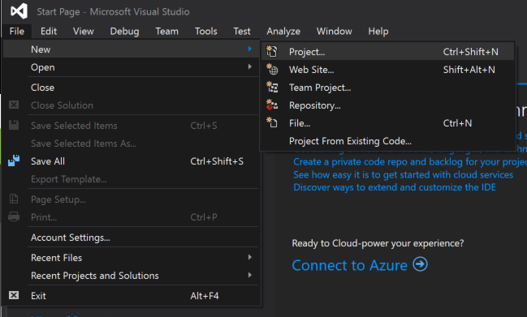
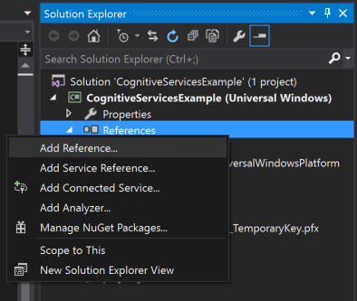
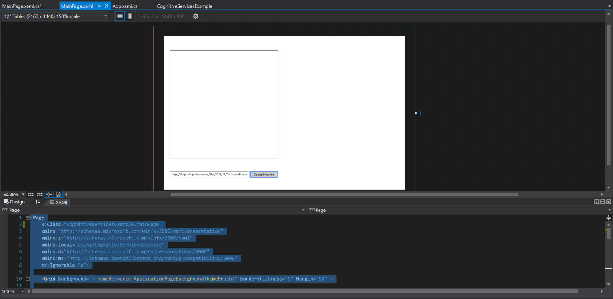
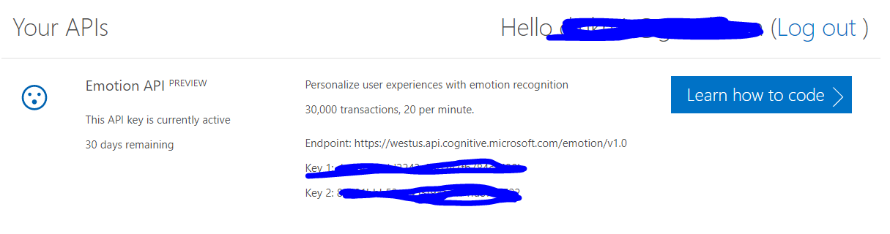
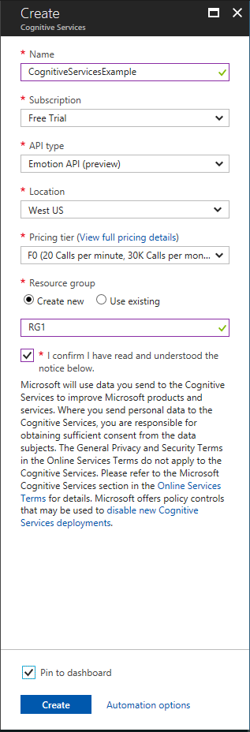
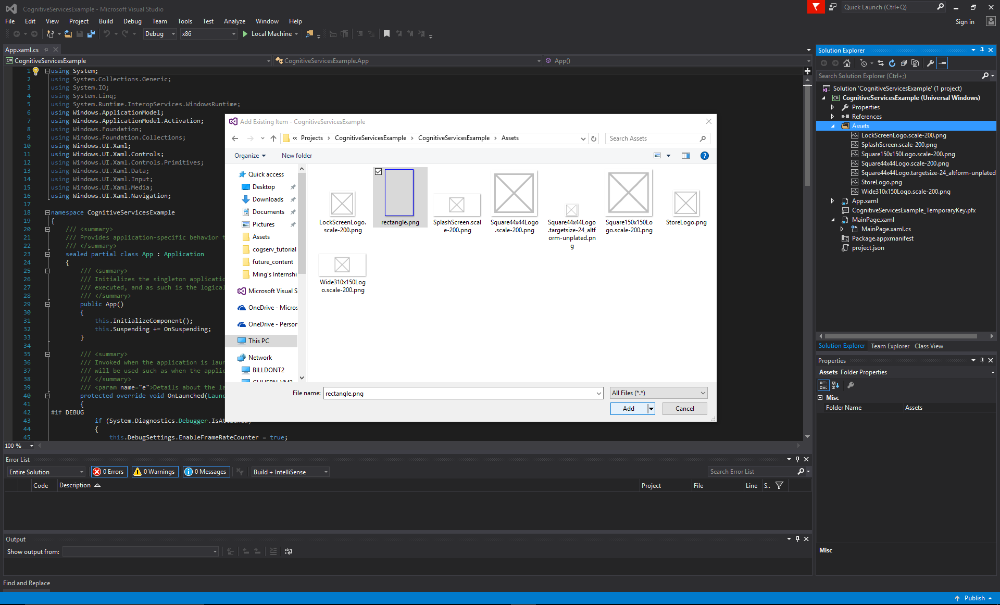
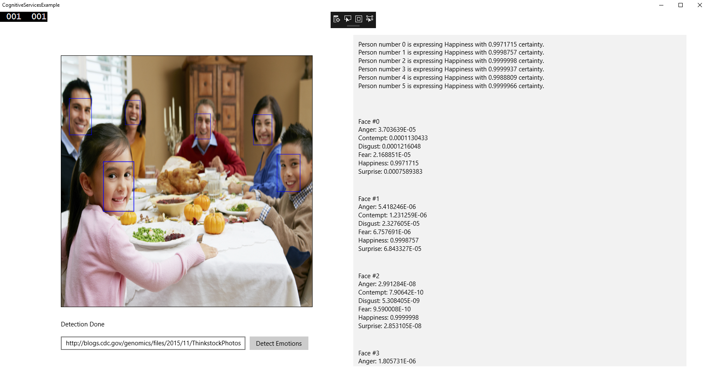
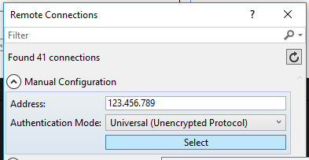
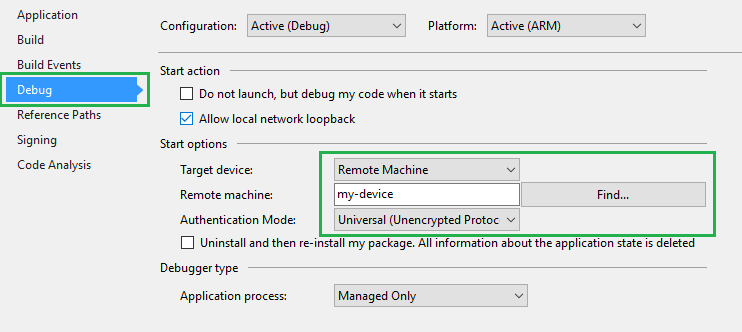

# Cognitive Services

Create a UWP app that identifies faces in a photo and determine the emotions in those photos using Microsoft's Cognitive Services API.

## Create a new UWP App
___
All of the sample code is available to download, but as an exercise, this tutorial will take you through the complete steps to create this app from scratch.

Make sure your device is running and set up and you have Visual Studio installed. See our [get started page](https://developer.microsoft.com/en-us/windows/iot/GetStarted.htm) to set up your device.

You will need your device's IP address when connecting to it remotely.

1.  Start Visual Studio 2017
2.  Create a new project with **(File \| New Project...)**

    In the **New Project** dialog, navigate to **Universal** as shown below (in the left pane in the dialog: Templates \| Visual C# \| Windows Universal).

3.  Select the template **Blank App (Universal Windows)**

    Note that we call the app CogntiveServicesExample. You can name it something different, but you will have to adjust sample code that references CognitiveServicesExample as well.

    

    If this is the first project you create, Visual Studio will likely prompt you to enable [developer mode for Windows 10](https://msdn.microsoft.com/library/windows/apps/xaml/dn706236.aspx)

    


## Add a reference to the Windows IoT extension SDK
___
Since the IoT extension SDK is not added to projects by default, we'll need to add a reference so that namespaces like **Windows.Devices.Gpio** will be available in the project.  To do so, right-click on the References entry under the project, select "Add Reference" then navigate the resulting dialog to **Universal Windows->Extensions->Windows IoT Extensions for the UWP**. Check the box and click OK.

## Add the NuGet Packages
___
1.  Open the NuGet Package Manager

    In Solution Explorer, right click your project and then click "Manage NuGet Packages".

2.  Install the Packages

    In the NuGet Package Manager window, select nuget.org as your Package Source and search for **Newtonsoft.Json, Microsoft.ProjectOxford.Common, and Microsoft.ProjectOxford.Emotion,**. Install all three packages. When using a Cognitive Services API, you need to add the corresponding NuGet package.

## Set up the User Interface
___

### Add in the XAML

Open MainPage.xaml and replace the existing code with the following code to create the window UI:

```
<Page
  x:Class="CognitiveServicesExample.MainPage"
  xmlns="http://schemas.microsoft.com/winfx/2006/xaml/presentation"
  xmlns:x="http://schemas.microsoft.com/winfx/2006/xaml"
  xmlns:local="using:CognitiveServicesExample"
  xmlns:d="http://schemas.microsoft.com/expression/blend/2008"
  xmlns:mc="http://schemas.openxmlformats.org/markup-compatibility/2006"
  mc:Ignorable="d">

  <Grid Background="{ThemeResource ApplicationPageBackgroundThemeBrush}" BorderThickness="5" Margin="50" >

    <Grid.ColumnDefinitions>
      <ColumnDefinition Width="*" />
      <ColumnDefinition Width="*" />
    </Grid.ColumnDefinitions>


    <StackPanel Grid.Column="0" VerticalAlignment="Center">

      <Border BorderBrush="Black" BorderThickness="1" Margin="20" Width="600" Height="600">
        <Canvas x:Name="ImageCanvas" Width="598" Height="598"/>
        <!-- <Image x:Name="SampleImage" Stretch="Uniform" Width="600" Height="550" Margin="10"/> -->
      </Border>
      <TextBlock Grid.Row="1" x:Name="detectionStatus" Width="600" HorizontalAlignment="Center" Margin="10"/>
      <StackPanel Orientation="Horizontal" HorizontalAlignment="Center" Width="600" Margin="10">
        <TextBox x:Name="ImageURL" Width="440" HorizontalAlignment="Left" Margin="0,0,10,0" Text="http://blogs.cdc.gov/genomics/files/2015/11/ThinkstockPhotos-177826416.jpg"/>
        <Button Content="Detect Emotions" Width="140" HorizontalAlignment="Left" Click="button_Clicked"/>
      </StackPanel>
    </StackPanel>

    <Grid Grid.Column="1" VerticalAlignment="Center">
      <ListBox x:Name="ResultBox" HorizontalAlignment="Stretch" VerticalAlignment="Stretch"/>
    </Grid>

  </Grid>
</Page>
```

To view the entire UI, change the dropdown in the top left corner from '5\" Phone' to '12\" Tablet'.


### Generate the button event handler

In the UI mock up, double click on the "Detect Emotions" button. You will see a "Click="button_Clicked" added into the button in your XAML code. You will also be redirected to the .xaml.cs file with a new function called "button_Clicked()" created for you. This function will handle the Cognitive Services calls after a user presses the button.



## Get the Emotion API Key
___
1.  Free Trial
    
    Visit the [Azure Cognitive Services Page](https://azure.microsoft.com/en-us/try/cognitive-services/?api=computer-vision) and click on "Get API Key" next to the Emotion API label; use your Microsoft account to sign in. 

    You should now see two API keys available for use for 30 days.
    
    

2.  Azure Subscription

    If you already used the Emotion API's free trial, you can still use the APIs for free with an Azure account. [Sign up for one](https://portal.azure.com/), then head to the [Azure Portal](https://portal.azure.com/) and create a new Cognitive Services Resource with the fields as shown below. 
    
    After it deploys, click on the **"Show access keys..."** link under the "Essentials" window to see your access keys.


    


## Add the C# Code
___

### Add in the namespaces

Open MainPage.xaml.cs. At the top of the , directly under the "using" statements and before the "namespace CognitiveServicesExample" line, add the following Cognitive Services namespaces.

``` C#
using Windows.Graphics.Imaging;
using Microsoft.ProjectOxford.Emotion;
using Microsoft.ProjectOxford.Emotion.Contract;
using System.Threading.Tasks;
using System.Diagnostics;
using Windows.UI.Xaml.Media.Imaging;
using Windows.UI.Xaml.Shapes;
using Windows.UI;
using Windows.UI.Popups;
using Windows.Storage.Streams;
```

These allow us to use the Cognitive Services APIs in our code, along with some other necessary imaging libraries.

### Add in Global Variables

Add the following global variables to the MainPage class (as below)

```C#
public sealed partial class MainPage : Page
{
  // add these in after the above statement
  private string _subscriptionKey = "your_key_here";
  BitmapImage bitMapImage;
  //...
}
```

The subscriptionKey allows your application to call the Emotion API on Cognitive Services, and the BitmapImage stores the image that your application will upload.

### Add in the API-calling method

Add the following method to the same class:

``` C#
public sealed partial class MainPage : Page
{
  //...
  private async Task<Emotion[]> UploadAndDetectEmotions(string url)
  {
    Debug.WriteLine("EmotionServiceClient is created");

    //
    // Create Project Oxford Emotion API Service client
    //
    EmotionServiceClient emotionServiceClient = new EmotionServiceClient(_subscriptionKey);

    Debug.WriteLine("Calling EmotionServiceClient.RecognizeAsync()...");
    try
    {
      //
      // Detect the emotions in the URL
      //
      Emotion[] emotionResult = await emotionServiceClient.RecognizeAsync(url);
      return emotionResult;
    }
    catch (Exception exception)
    {
      Debug.WriteLine("Detection failed. Please make sure that you have the right subscription key and proper URL to detect.");
      Debug.WriteLine(exception.ToString());
      return null;
    }
  }
  //...
}
```

This function instantiates an instance of the Emotion API and attempts to open the URL passed as an argument (an image URL), scanning it for faces. It searches the faces it finds for emotions and returns the resulting Emotion objects. These contain detailed results, including the likelihood of each emotion and the bounding box of the face. See the [documentation](https://www.microsoft.com/cognitive-services/en-us/emotion-api) for more details.

### Add in the button event handler code

Add the **async** keyword to the button_Clicked method Visual Studio created for you. Then, add the following code to that function:

``` C#
public sealed partial class MainPage : Page
{
  //...
  private async void button_Clicked(object sender, RoutedEventArgs e)
  {

    ImageCanvas.Children.Clear();

    string urlString = ImageURL.Text;
    Uri uri;
    try
    {
      uri = new Uri(urlString, UriKind.Absolute);
    }
    catch (UriFormatException ex)
    {
      Debug.WriteLine(ex.Message);

      var dialog = new MessageDialog("URL is not correct");

      await dialog.ShowAsync();

      return;
    }

    //Load image from URL
    bitMapImage = new BitmapImage();
    bitMapImage.UriSource = uri;

    ImageBrush imageBrush = new ImageBrush();
    imageBrush.ImageSource = bitMapImage;

    //Load image to UI
    ImageCanvas.Background = imageBrush;

    detectionStatus.Text = "Detecting...";

    //urlString = "http://blogs.cdc.gov/genomics/files/2015/11/ThinkstockPhotos-177826416.jpg"

    Emotion[] emotionResult = await UploadAndDetectEmotions(urlString);

    detectionStatus.Text = "Detection Done";

    displayParsedResults(emotionResult);
    displayAllResults(emotionResult);
    DrawFaceRectangle(emotionResult, bitMapImage, urlString);

  }
  //...
}
```

This code reads the string from the text input box on the form and makes sure it's a URL. It retrieves the image from that URL, pastes it in the canvas, and gets the detected emotions from the image using the UploadAndDetectEmotions method defined previously. It then calls a few helper functions to output the results of the Cognitive Services analysis.

### Add in the helper functions

You'll notice that the above code has errors, since we have not added those helper functions yet. Let's add them in:

``` C#
public sealed partial class MainPage : Page
{
  //...
  private void displayAllResults(Emotion[] resultList)
  {
    int index = 0;
    foreach (Emotion emotion in resultList)
    {
      ResultBox.Items.Add("\nFace #" + index
      + "\nAnger: " + emotion.Scores.Anger
      + "\nContempt: " + emotion.Scores.Contempt
      + "\nDisgust: " + emotion.Scores.Disgust
      + "\nFear: " + emotion.Scores.Fear
      + "\nHappiness: " + emotion.Scores.Happiness
      + "\nSurprise: " + emotion.Scores.Surprise);

      index++;
    }
  }

  private async void displayParsedResults(Emotion[] resultList)
  {
    int index = 0;
    string textToDisplay = "";
    foreach (Emotion emotion in resultList)
    {
      string emotionString = parseResults(emotion);
      textToDisplay += "Person number " + index.ToString() + " " + emotionString + "\n";
      index++;
    }
    ResultBox.Items.Add(textToDisplay);
  }

  private string parseResults(Emotion emotion)
  {
    float topScore = 0.0f;
    string topEmotion = "";
    string retString = "";
    //anger
    topScore = emotion.Scores.Anger;
    topEmotion = "Anger";
    // contempt
    if (topScore < emotion.Scores.Contempt)
    {
      topScore = emotion.Scores.Contempt;
      topEmotion = "Contempt";
    }
    // disgust
    if (topScore < emotion.Scores.Disgust)
    {
      topScore = emotion.Scores.Disgust;
      topEmotion = "Disgust";
    }
    // fear
    if (topScore < emotion.Scores.Fear)
    {
      topScore = emotion.Scores.Fear;
      topEmotion = "Fear";
    }
    // happiness
    if (topScore < emotion.Scores.Happiness)
    {
      topScore = emotion.Scores.Happiness;
      topEmotion = "Happiness";
    }
    // surprise
    if (topScore < emotion.Scores.Surprise)
    {
      topScore = emotion.Scores.Surprise;
      topEmotion = "Surprise";
    }

    retString = "is expressing " + topEmotion + " with " + topScore.ToString() + " certainty.";
    return retString;
  }


  public async void DrawFaceRectangle(Emotion[] emotionResult, BitmapImage bitMapImage, String urlString)
  {


    if (emotionResult != null && emotionResult.Length > 0)
    {
      Windows.Storage.Streams.IRandomAccessStream stream = await Windows.Storage.Streams.RandomAccessStreamReference.CreateFromUri(new Uri(urlString)).OpenReadAsync();


      BitmapDecoder decoder = await BitmapDecoder.CreateAsync(stream);


      double resizeFactorH = ImageCanvas.Height / decoder.PixelHeight;
      double resizeFactorW = ImageCanvas.Width / decoder.PixelWidth;


      foreach (var emotion in emotionResult)
      {

        Microsoft.ProjectOxford.Common.Rectangle faceRect = emotion.FaceRectangle;

        Image Img = new Image();
        BitmapImage BitImg = new BitmapImage();
        // open the rectangle image, this will be our face box
        Windows.Storage.Streams.IRandomAccessStream box = await Windows.Storage.Streams.RandomAccessStreamReference.CreateFromUri(new Uri("ms-appx:///Assets/rectangle.png", UriKind.Absolute)).OpenReadAsync();

        BitImg.SetSource(box);

        //rescale each facebox based on the API's face rectangle
        var maxWidth = faceRect.Width * resizeFactorW;
        var maxHeight = faceRect.Height * resizeFactorH;

        var origHeight = BitImg.PixelHeight;
        var origWidth = BitImg.PixelWidth;


        var ratioX = maxWidth / (float)origWidth;
        var ratioY = maxHeight / (float)origHeight;
        var ratio = Math.Min(ratioX, ratioY);
        var newHeight = (int)(origHeight * ratio);
        var newWidth = (int)(origWidth * ratio);

        BitImg.DecodePixelWidth = newWidth;
        BitImg.DecodePixelHeight = newHeight;

        // set the starting x and y coordiantes for each face box
        Thickness margin = Img.Margin;

        margin.Left = faceRect.Left * resizeFactorW;
        margin.Top = faceRect.Top * resizeFactorH;

        Img.Margin = margin;

        Img.Source = BitImg;
        ImageCanvas.Children.Add(Img);
      }
    }
  }
  //...
}
```

The first method outputs the score for all emotions Cognitive Services can detect. Each score falls between 0 and 1 and represents the probability that the face detected is expressing that emotion.

The second and third method determines which emotion is most prevalent. It then outputs these results as a string to a Panel next to the image.

The fourth method places a rectangle around each face detected in the image. Since UWP does not allow apps to draw shapes yet, it uses a blue rectangle in the Assets folder with a transparent background instead. The app places each rectangle image at the starting coordinates of the Rectangle provided by Cognitive Services and scales it to the approximate size of the Cognitive Services rectangle.

### Add in the rectangle resource

Download the face rectangle and add it to your Assets folder within your project



## Build and Test your app locally
___
1.  Make sure the app builds correctly by invoking the **Build \| Build** Solution menu command.

2.  Since this is a Universal Windows Platform (UWP) application, you can test the app on your Visual Studio machine as well: Press F5, and the app will run inside your machine.

Change the URL for a different image, or just click "Detect Emotion" to run the Emotion Recognizer with the default image. After a few seconds, the results should appear in your app window as expected: the image with rectangles on it on the left and more detailed emotion output for each face on the right.




In this case, the order is based on depth: **faces closer to the front will be first, and faces farther away will be last in the list.**

Close your app after you're done validating it

## Deploy the app to your Windows 10 IoT Core device
___
1.  To deploy our app to our IoT Core device, you need to provide your machine with the device's identifier. In the [PowerShell](https://docs.microsoft.com/en-us/windows/iot-core/connect-your-device/powershell) documentation, you can find instructions to chose a unique name for your IoT Core device. In this sample, we'll use that name (though you can use your IP address as well) in the 'Remote Machine Debugging' settings in Visual Studio.

    If you're building for Minnowboard Max, select **x86** in the Visual Studio toolbar architecture dropdown.  If you're building for Raspberry Pi 2 or 3 or the DragonBoard, select **ARM**.

    In the Visual Studio toolbar, click on the **Local Machine** dropdown and select **Remote Machine**<br/>

2.  At this point, Visual Studio will present the 'Remote Connections' dialog. Put the IP address or name of your IoT Core device (in this example, we're using 'my-device') and select **Universal (Unencrypted Protocol)** for Authentication Mode. Click **Select**.

    

    > Couple of notes:
    >
    > 1. You can use the IP address instead of the IoT Core device name.
    >
    > 2. You can verify and/or modify these values navigating to the project properties (select 'Properties' in the Solution Explorer) and choose the 'Debug' tab on the left:
    >
    > 

3.  Now you're ready to deploy to the remote IoT Core device. Press F5 (or select **Debug \| Start Debugging**) to start debugging our app. You should see the app come up in IoT Core device screen, and you should be able to perform the same functions you did locally. To stop the app, press on the 'Stop Debugging' button (or select Debug \| Stop Debugging).

4.  Congratulations! Your app should now be working!
