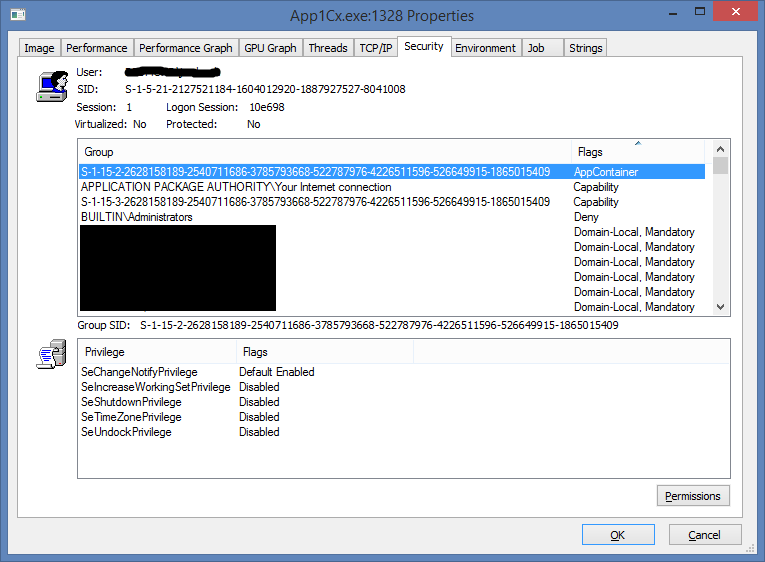

# Custom Device Accessor

This sample shows how to access devices from UWP applications using familiar win32 APIs like CreateFile(), ReadFile(), WriteFile(), and DeviceIoControl(). Some reasons you may want to do this are:

 - You have existing code that uses CreateFile()/DeviceIoControl()
 - You prefer the programming model of the win32 APIs to Windows.Devices.Custom
 - Your application needs the performance of the win32 APIs
 - You need to open the device synchronously, because the device driver requires it, or you need to leverage FastIO

While you will be able to debug and deploy this app on devices you own by sideloading the application, you will not be able to upload an app that uses unsupported APIs to the Windows Store.

The high level steps involved are:

 1. Create a C++/CX UWP application
 2. Set an msbuild property named `_NoWinAPIFamilyApp` to `true` in the vcxproj file
 3. Use CreateFile/ReadFile/WriteFile/DeviceIoControl in your code
 4. Make the device accessible to appcontainer processes

This walkthrough uses the COM port on MinnowBoardMax as the example device. MinnowBoardMax has 3 COM ports - two high-speed UARTs on the 26-pin header, and a conventional COM port controlled by serial.sys on a separate 6-pin header. The two high speed UARTs are already exposed to UWP applications, but the COM port is not. This walkthrough shows you how to access the COM port from UWP applications.

## Exposing the COM port to usermode

Before we can access the COM port, we need to add the `PortName` registry value under the device's hardware key so that serial.sys will create a device interface and symbolic link. On desktop flavors of Windows, this is handled by the ports class coinstaller (msports.dll), but since coinstallers are not supported on onecore-based editions, we need to add this reg key manually.

    Reg add "HKLM\SYSTEM\ControlSet001\Enum\ACPI\PNP0501\1\Device Parameters" /v PortName /t REG_SZ /d COM1
    Devcon restart acpi\pnp0501

If you now run `mincomm -list`, you should see ACPI\PNP0501\1 in the list of COM ports. Mincomm is available at [here](https://github.com/ms-iot/samples/tree/develop/MinComm).

## Enabling access to desktop APIs in a C++/CX UWP Application

Create a new project by going to File -> New -> Project -> Visual C++ -> Windows-> Universal -> Blank App (Universal Windows), and click OK.

Open the .vcxproj file in a text editor and add the `<_NoWinAPIFamilyAPP>` element to the first PropertyGroup element:

<pre>
&lt;PropertyGroup Label="Globals"&gt;
    &lt;ProjectGuid&gt;...&lt;/ProjectGuid&gt;
    ...
    &lt;!-- Add the following property to make desktop APIs visible at compile time. --&gt;
    <b>&lt;_NoWinAPIFamilyApp&gt;true&lt;/_NoWinAPIFamilyApp&gt;</b>
&lt;/PropertyGroup&gt;
</pre>

When you define `_NoWinAPIFamilyApp`, it causes `WINAPI_FAMILY` to be left undefined, instead of defined to `WINAPI_FAMILY_APP`. If `WINAPI_FAMILY` is not defined, it will default to `WINAPI_FAMILY_DESKTOP_APP`, which makes desktop APIs visible at compile time. The `_NoWinAPIFamilyApp` property is referenced as follows by C:\Program Files (x86)\MSBuild\Microsoft.Cpp\v4.0\V140\Microsoft.Cpp.AppContainerApplication.props:

    <PreprocessorDefinitions Condition="'$(_NoWinAPIFamilyApp)' != 'true'">%(PreprocessorDefinitions);WINAPI_FAMILY=WINAPI_FAMILY_APP</PreprocessorDefinitions>

For more information on API families, see winapifamily.h from the SDK.

We also need to link against onecoreuap.lib, which exports all symbols available on OnecoreUAP-based editions. Add an `AdditionalDependencies` element containing onecoreuap.lib just after the PropertyGroup that contains the `PackageCertificateKeyFile` element.

<pre>
&lt;PropertyGroup&gt;
    &lt;PackageCertificateKeyFile&gt;CustomDeviceAccessorUWP_TemporaryKey.pfx&lt;/PackageCertificateKeyFile&gt;
&lt;/PropertyGroup&gt;
<b>&lt;!-- Link against onecoreuap.lib so we can use CreateFile() and friends. --&gt;
&lt;ItemDefinitionGroup&gt;
    &lt;Link&gt;
        &lt;AdditionalDependencies&gt;onecoreuap.lib;%(AdditionalDependencies)&lt;/AdditionalDependencies&gt;
    &lt;/Link&gt;
&lt;/ItemDefinitionGroup&gt;</b>
</pre>

## Use CreateFile/DeviceIoControl in your Application

Add the following code to pch.h:

``` C++

    #include <strsafe.h>
    #include <winioctl.h>

    // Undefine symbols to avoid collision with ntddser.h
    #undef SERIAL_LSRMST_ESCAPE
    #undef SERIAL_LSRMST_LSR_DATA
    #undef SERIAL_LSRMST_LSR_NODATA
    #undef SERIAL_LSRMST_MST
    #undef SERIAL_IOC_FCR_FIFO_ENABLE
    #undef SERIAL_IOC_FCR_RCVR_RESET
    #undef SERIAL_IOC_FCR_XMIT_RESET
    #undef SERIAL_IOC_FCR_DMA_MODE
    #undef SERIAL_IOC_FCR_RES1
    #undef SERIAL_IOC_FCR_RES2
    #undef SERIAL_IOC_FCR_RCVR_TRIGGER_LSB
    #undef SERIAL_IOC_FCR_RCVR_TRIGGER_MSB
    #undef SERIAL_IOC_MCR_DTR
    #undef SERIAL_IOC_MCR_RTS
    #undef SERIAL_IOC_MCR_OUT1
    #undef SERIAL_IOC_MCR_OUT2
    #undef SERIAL_IOC_MCR_LOOP

    #include <ntddser.h>
    #include <wrl.h>

```

Add the following code to Mainpage.xaml.cpp:

``` C++
    void AccessComPort ()
    {
        using namespace Microsoft::WRL::Wrappers;

        // Open the COM port synchronously for simplicity.
        // You'll almost always want to use FILE_FLAG_OVERLAPPED
        // for COM ports.
        FileHandle fileHandle(CreateFile(
            L"\\\\.\\COM1",
            GENERIC_READ | GENERIC_WRITE,
            0,
            nullptr,
            OPEN_EXISTING,
            FILE_ATTRIBUTE_NORMAL /*FILE_FLAG_OVERLAPPED*/,
            nullptr));

        if (!fileHandle.IsValid()) {
            DWORD lastError = GetLastError();
            throw ref new Exception(                // set a breakpoint here
                HRESULT_FROM_WIN32(lastError),
                L"Failed to open COM port.");
        }

        DWORD information;
        SERIAL_BAUD_RATE inputBuffer = { 115200 };
        if (!DeviceIoControl(
                fileHandle.Get(),
                IOCTL_SERIAL_SET_BAUD_RATE,
                &inputBuffer,
                sizeof(inputBuffer),
                nullptr,
                0,
                &information,
                nullptr)) {

            throw ref new Exception(
                HRESULT_FROM_WIN32(GetLastError()),
                L"Failed to set baud rate.");
        }

        const char message[] = "Hello serial!\n";
        if (!WriteFile(
                fileHandle.Get(),
                message,
                sizeof(message),
                &information,
                nullptr)) {

            throw ref new Exception(
                HRESULT_FROM_WIN32(GetLastError()),
                L"Failed to write data to COM port.");
        }
    }
```

Add a call to `AccessComPort()` in the MainPage constructor:

``` C++
    MainPage::MainPage()
    {
        InitializeComponent();
        AccessComPort();
    }
```

Build the project, which should succeed because we made desktop APIs visible at compile time.

Set a breakpoint on the `throw` statement after the file handle validity check, as indicated in the source code above.

Debug the application on MinnowBoardMax. The breakpoint should get hit. Inspect the `lastError` variable in the debugger, which should equal 5 (Access Denied). We need to set a proper security descriptor on the device object so it can be accessed by UWP applications.

## Granting Access to AppContainer Processes

Every device object in the system has an associated security descriptor. The security descriptor determines who has what access to a device object. Security descriptors have a binary representation which is used by the system to compute access to objects, and a human readable form called an SDDL string. Some examples of SDDL strings are:

<table>
<thead>
<tr>
    <td>SDDL String</td>
    <td>Description</td>
    <td>Wdmsec.h constant</td>
</tr>
</thead>
<tbody>
<tr>
    <td>"D:P"</td>
    <td>Denies access to all, except other kernel-mode clients.</td>    <td>SDDL_DEVOBJ_KERNEL_ONLY</td>
</tr>
<tr>
    <td>"D:P(A;;GA;;;SY)"</td>
    <td>Denies access to all, except kernel mode code, and usermode clients running under the SYSTEM account.</td>
    <td>SDDL_DEVOBJ_SYS_ALL</td>
</tr>
<tr>
    <td>"D:P(A;;GA;;;SY)(A;;GRGWGX;;;BA)(A;;GR;;;WD)"</td>
    <td>Grants full access to kernel mode clients and the SYSTEM account, grants read, write, execute to built-in Administrators, and grants read-only access to everyone else.</td>
    <td>SDDL_DEVOBJ_SYS_ALL_ADM_RWX_WORLD_R</td>
</tr>
</tbody>
</table>

A number of common security descriptor strings are defined in wdmsec.h.

To make a device accessible to UWP applications, you need to grant access to the All Application Packages security principle, which is represented by the SID string "AC".  The following SDDL will grant GENERIC_ALL permissions to SYSTEM, built-in administrators, authenticated users, and appcontainer applications:

    "D:P(A;;GA;;;SY)(A;;GA;;;BA)(A;;GA;;;AU)(A;;GA;;;AC)"

If you control the code of the driver you wish to access, you can programatically assign an SDDL string to a device object using the [IoCreateDeviceObjectSecure()](https://msdn.microsoft.com/en-us/library/windows/hardware/ff548407(v=vs.85).aspx) routine in WDM drivers, or the [WdfDeviceInitAssignSDDLString()](https://msdn.microsoft.com/en-us/library/windows/hardware/ff546035(v=vs.85).aspx) routine in WDF drivers.

If you do not control the driver code for your device, you can override the SDDL for any device using the registry. If a registry value named "Security" is present in the hardware registry key for a device, the system will use the specified security descriptor instead of the one supplied by the driver. We will override the security descriptor for the COM port with one that grants access to all appcontainer applications.

First, we need to convert the SDDL string to its binary representation. We can do this with [PowerShell](http://blogs.technet.com/b/heyscriptingguy/archive/2011/08/09/use-powershell-to-convert-sddl-to-binary-format.aspx). Open a PowerShell prompt and run the following commands:

```csharp
    $a = ([wmiclass]"Win32_SecurityDescriptorHelper").SDDLToBinarySD("D:P(A;;GA;;;SY)(A;;GA;;;BA)(A;;GA;;;AU)(A;;GA;;;AC)").BinarySD | % { '{0:X}' -f $_ }
    $a -join ','
```

The output will be a long string of comma-separated numbers that we will paste into a registry file. Create a file named deviceac.reg with the following contents:

    Windows Registry Editor Version 5.00

    [HKEY_LOCAL_MACHINE\SYSTEM\ControlSet001\Enum\ACPI\PNP0501\1]
    "Security"=hex:1,0,4,90,0,0,0,0,0,0,0,0,0,0,0,0,14,0,0,0,2,0,60,0,4,0,0,0,0,0,14,0,0,0,0,10,1,1,0,0,0,0,0,5,12,0,0,0,0,0,18,0,0,0,0,10,1,2,0,0,0,0,0,5,20,0,0,0,20,2,0,0,0,0,14,0,0,0,0,10,1,1,0,0,0,0,0,5,B,0,0,0,0,0,18,0,0,0,0,10,1,2,0,0,0,0,0,F,2,0,0,0,1,0,0,0

Copy this file to c:\data on your MBM and run:

    schtasks /create /RU SYSTEM /SC ONCE /TN DeviceAC /TR "reg import c:\data\deviceac.reg" /ST 00:00
    schtasks /run /tn DeviceAC
    schtasks /delete /tn DeviceAC /f

We use schtasks to run the reg import operation as SYSTEM, because only the SYSTEM account has permission to change registry keys under the enum key.

Verify that the Security registry value was created by running:

    reg query HKEY_LOCAL_MACHINE\SYSTEM\ControlSet001\Enum\ACPI\PNP0501\1 /v Security

If you don't see the Security value, something went wrong in the previous steps. If the Security value was created successfully, restart the device so the new security settings take effect:

    Devcon restart acpi\pnp0501

Now, debug the universal application again. The COM port should be opened successfully and the breakpoint above should not be hit.

Congratulations, you have successfully opened a device and sent an IOCTL to it!

## Granting Access to a Specific Application

The security identifier "AC" identifies all application packages, and will grant all apps access to the device. If you want to grant access to a specific application only, you can replace "AC" in the SDDL above with the app-specific SID of the application you'd like to target. You can inspect the app-specific SID with [process explorer](https://technet.microsoft.com/en-us/sysinternals/bb896653).

Launch the app and launch process explorer. Open the properties dialog box for the process in process explorer and go to the Security tab. There you will see all of the security identifiers associated with the process's token. The SID with the AppContainer flag set is the app-specific SID.



You can replace "AC" with this SID in the above SDDL to generate an SDDL that grants access to that specific application only. For example, the following SDDL would grant access only to the application shown above:

    "D:P(A;;GA;;;SY)(A;;GA;;;BA)(A;;GA;;;AU)(A;;GA;;;S-1-15-3-2628158189-2540711686-3785793668-522787976-4226511596-526649915-1865015409)"

SIDs are generated at application install time so can only be determined after the application has been installed on the target machine.

For more information about app containers, see [Windows 8 App Container Security Notes - Part 1](http://recxltd.blogspot.com/2012/03/windows-8-app-container-security-notes.html).
