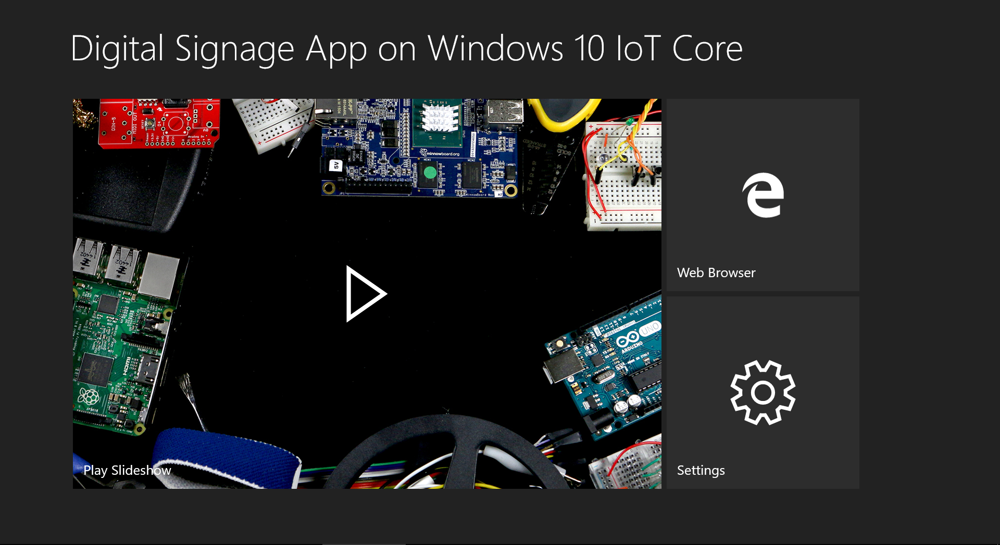
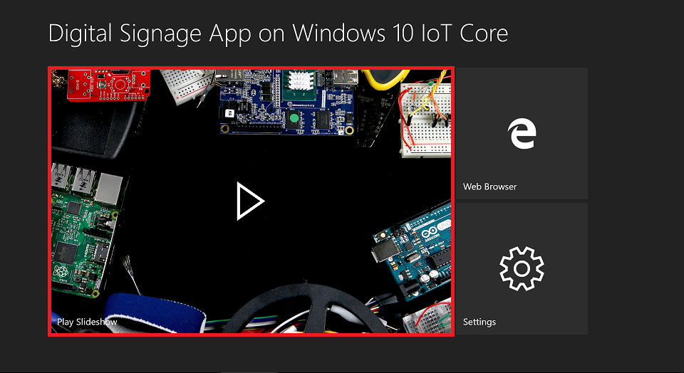
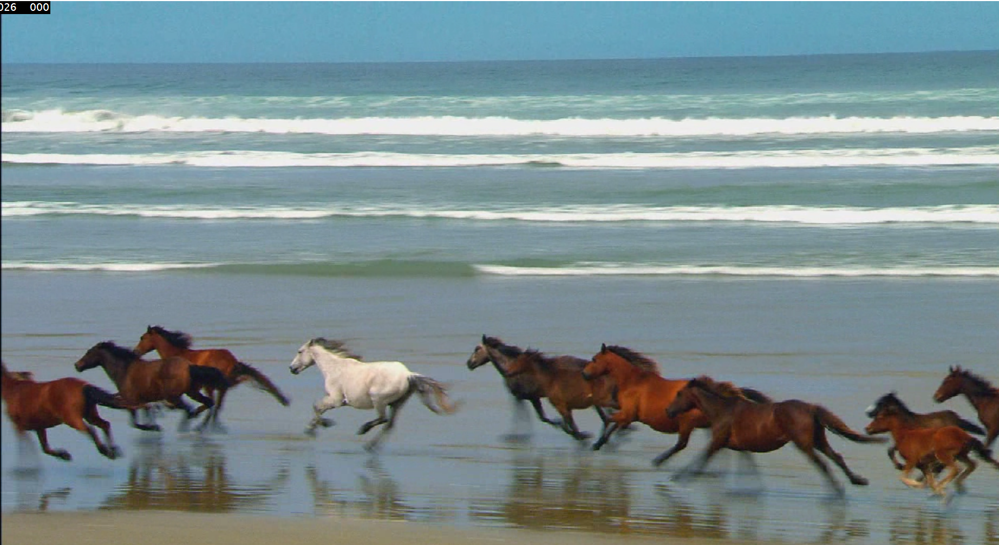
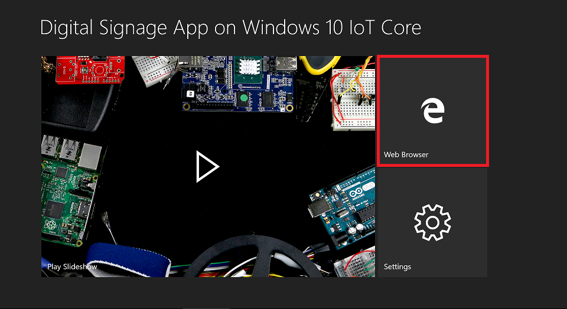
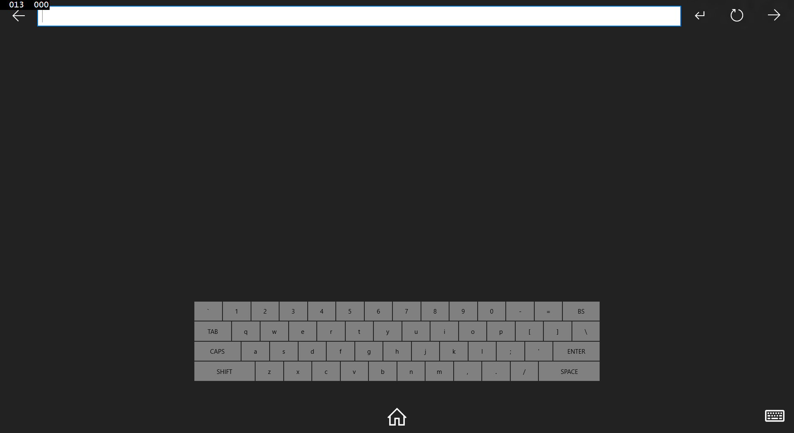
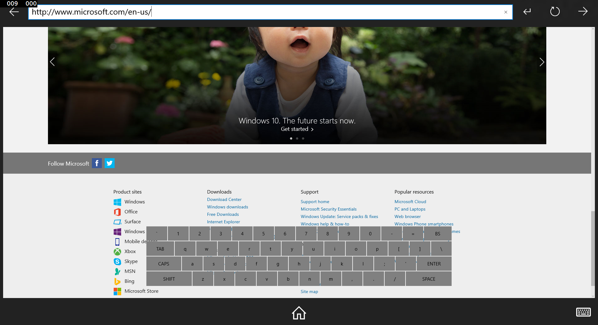
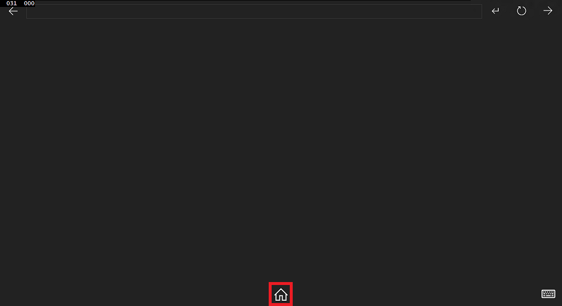
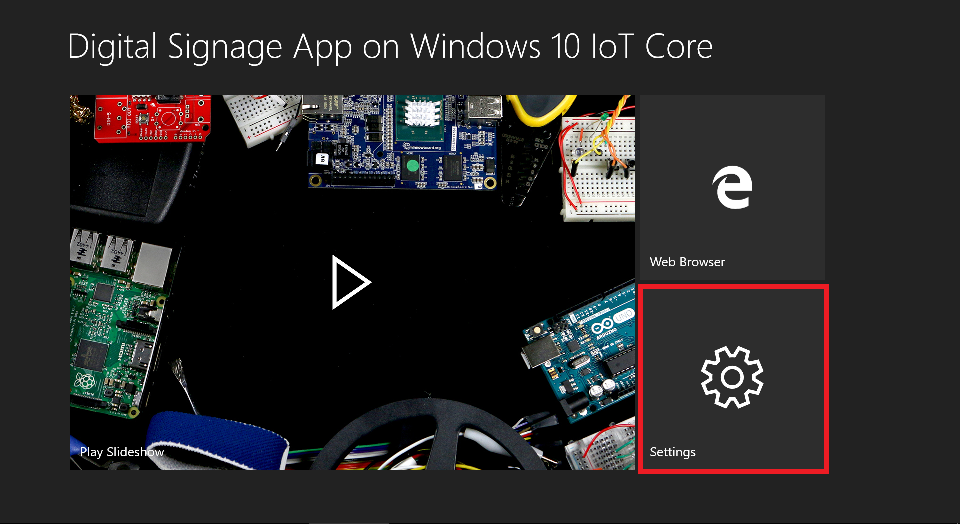
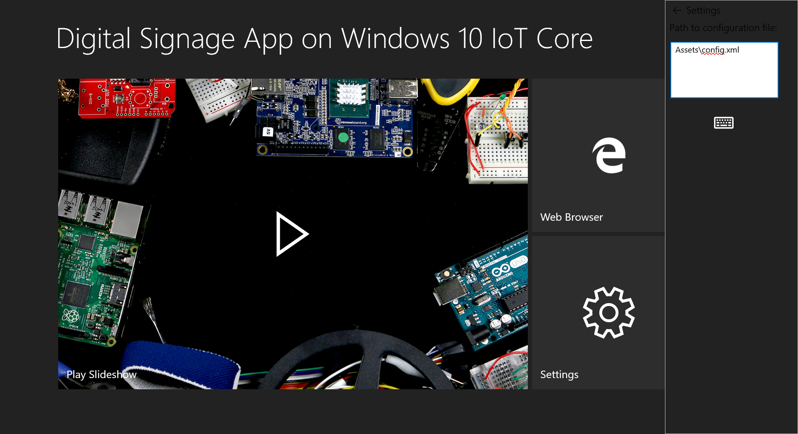

# Digital sign

This sample showcases a Digital Sign UWP running on Windows IoT Core. Here we will demonstrate how the app receives content in different multimedia forms - e.g. video, audio, image, slideshow - from an XML file stored online and displays this content to the user. The digital sign in this sample is interactive and allows web browsing as well as allowing for touch input. 

### Prerequisites

* Device running Windows IoT Core build 10240 or greater. 
* Mouse
* Keyboard
* Display monitor
  -  Optional: monitor with touch capabilities.

## Load the project in Visual Studio

You can find the source code for this sample by downloading a zip of all of our samples [here](https://github.com/Microsoft/Windows-iotcore-samples/archive/master.zip).

Make a copy of the DigitalSignageUAP folder on your disk and open the project from Visual Studio.

Make sure you set the 'Remote Debugging' setting to point to your Windows IoT device.

## Deploy your app

If you're building for Minnowboard Max, select `x86` in the architecture dropdown.  If you're building for Raspberry Pi 2 or 3, select `ARM`.

When everything is set up, you should be able to press F5 from Visual Studio.  The Digital Signage app will deploy and start on the Windows IoT device, and you should see the main view page as displayed below:

### Slideshow

The app's slideshow can be likened to a screensaver which displays while the app is idle and ends upon user input.

1. From the Main page, click (or tap, if your monitor is touch-enabled) "Play Slideshow". 

2. Slideshow begins - various content is displayed, including ads and screensaver visuals with audio.

3. End the slideshow by either a) moving your mouse, b) pressing any key or c) tap anywhere on the screen. The main page will return to the screen.

### Web Browser

1. From the Main page, click (or tap, if your monitor is touch-enabled) "Internet Explorer". 

2. Tap or click the Address Bar at the top of the page.

3. Type "www.microsoft.com" into the address bar using either the physical or on-screen keyboard.

 When using the on-screen keyboard, you may click characters with your mouse or tap to type if your monitor is touch-enabled.
 

 
 4. Click or tap the "Go" button. This navigates the browser to the Microsoft home page
 
 

 5. Navigate to other pages in the browser or return to the main screen by tapping or clicking the "Home" icon on the screen
 
 

## Exploring the Code

Here we will walk though the code used to exercise the slideshow scenario.

### Slideshow

Navigate to Slideshow.xaml.cs. Observe that the imageExtensions variable maintains a list of expected image types

    public sealed partial class SlideshowPage : Page
    {
        // ...
          List<string> imageExtensions = new List<string>(new string[] { ".bmp", ".gif", ".ico", ".jpg", ".png", ".wdp",".tiff" }); // MSDN
        // ...
     }

An XML file is used to specify which webpages, images and videos that we view during the slideshow. The media elements found in this file will be stored in a "Slideshow" list which loops as long as the slideshow plays.

    readonly string defaultConfigFilePath = @"Assets\config.xml";
          
The configuration file used by this sample, config.xml, can be found in the project's Assets directory. You may use this as a template to create your own personalized config file.

        <?xml version="1.0" encoding="UTF-8"?>
          -<DigitalSignageConfig>
            <!--audio does not require duration attribute. It will be played back in a loop end to end-->
            -<Audio>
              <file path="http://iot-digisign01/ds/Fhol.wav"/>
              <file path="http://iot-digisign01/ds/midnightvoyage_48k_320.mp3"/>
            </Audio>
            -<Display>
              <!--Video does not require duration attribute. It will be played back in a loop end to end-->
              <!--<file path="http://iot-digisign01/ds/grb.mpg"/>-->
              <file path="http://iot-digisign01/ds/BlackBerry.mp4"/>
              <file path="http://iot-digisign01/ds/IoTVision.wmv"/>
              <!--image and webpage do require duration attribute so we know how long to show them-->
              <file path="http://iot-digisign01/ds/mad_men_poster.jpg" duration="30"/>
              <file path="http://iot-digisign01/ds/mandelbrot.png" duration="30"/>
              <file path="http://iot-digisign01/ds/MARBLES.BMP" duration="30"/>
              <!--Webpage requires a special attribute type and its value to be webpage-->
              <!--webpage URLs have to be XML escaped, e.g. below URL, & is replaced to &amp;. Not including the dot.Otherwise it will be considered as malformatted XML-->
              <!-- <file type="webpage" path="http://insights/Report?id=2b66e943-ed71-4a4d-a006-56da5008429b&amp;isPublished=true#_tab=0" duration="30"/> <file path="http://10.125.148.230/test/display/3.wmv"/> <file path="http://10.125.148.230/test/display/4.png"/> <file path="http://10.125.148.230/test/display/5.mp4"/> <file path="http://10.125.148.230/test/display/6.BMP"/> -->
            </Display>
        </DigitalSignageConfig>
        
Starting the slide show reads in the sample config file and begins displaying the slideshow. 

        public async void StartSlideShow()
        {
            await GetConfigAndParse();
            DisplayNext();
        }

In the GetConfigAndParse() method, the config file is parsed. Each media element is then represented as a file which is copied to your Windows 10 IoT Core device. These are used to create our slideshow playlist.

    public async Task GetConfigAndParse()
    {
      // ....
      
      DisplayObject DO = new DisplayObject();
      string filename = fileElement.Attribute("path").Value.Substring(fileElement.Attribute("path").Value.LastIndexOf('/') + 1);
      StorageFile file = await tmp.CreateFileAsync(filename, CreationCollisionOption.ReplaceExisting);
      byte[] bytes = File.ReadAllBytes(filename);
      await FileIO.WriteBufferAsync(file, WindowsRuntimeBufferExtensions.AsBuffer(bytes));
      
      if (fileElement.Attribute("duration") != null) // this is an image
        DO.duration = Convert.ToInt32(fileElement.Attribute("duration").Value);
        
      DO.file = file;
      
      tmpList.Add(DO);
      
      // ...
                      
      }
In the DisplayNext() method, we traverse through our list of media files obtained from the config, handling the various file types accordingly (audio files, video, webpage).

        async void DisplayNext()
        {
           // ...
           
            DisplayObject currentDO = (DisplayObject) displayList[currentIndexOfDisplay];
            
            if (currentDO.uri != null) // we're dealing with a WEB Page, show the WebView instance
            {
                videoInstance.Stop();
                
                // ...
                
                DisplayImageWEBTimer.Interval = new TimeSpan(0, 0, currentDO.duration);
                DisplayImageWEBTimer.Start();
                PlayAudio();
            }
            else // it must be StorageFile, i.e. image or video
            {
                if (imageExtensions.Contains(currentDO.file.FileType.ToLower()))
                {
                   // ...
                   
                    imageInstance.Visibility = Windows.UI.Xaml.Visibility.Visible;
                    imageSource = new BitmapImage(new Uri(currentDO.file.Path));
                    imageInstance.Width = imageSource.DecodePixelHeight = (int)this.ActualWidth;
                    imageInstance.Source = imageSource;
                    DisplayImageWEBTimer.Interval = new TimeSpan(0, 0, currentDO.duration);
                    DisplayImageWEBTimer.Start();
                    PlayAudio();
                }
                else // video
                {
                    // ...
                    
                    videoInstance.Source = new Uri(currentDO.file.Path);
                    videoInstance.Visibility = Windows.UI.Xaml.Visibility.Visible;
                    
                    // ... 
                    
                    videoInstance.Play();
                }
            }
            currentIndexOfDisplay = (++currentIndexOfDisplay) % displayList.Count; // make the index in a loop
        }
        
  NOTE: You may navigate to the Settings menu in the app to change the config file to another of your choosing.
  
  1. From the Main page, click (or tap, if your monitor is touch-enabled) "Settings". 

 2. Using the physical keyboard or touch screen, you may specify a new config file to read from at the location you specify.

