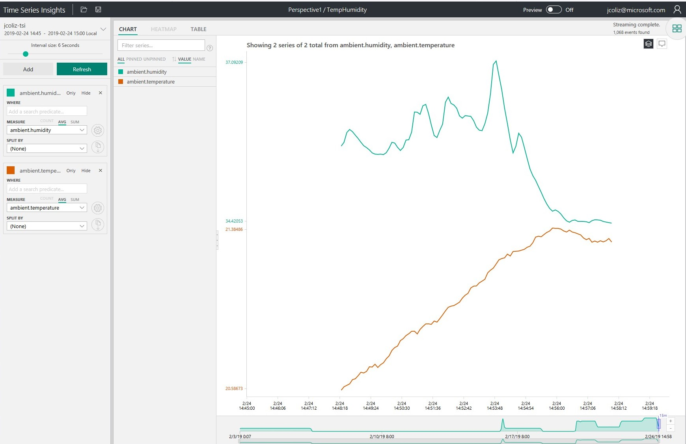

# I2C Access to sensor device in Azure IoT Edge on Windows

This sample will demonstrate how to create a module for Azure IoT Edge on Windows 10 IoT Core which accesses a temperature and humidity sensor connected via the I2C bus.

## Note about container base image

Currently, this sample uses an [IoT Core container](https://hub.docker.com/_/microsoft-windows-iotcore) base image, because the current release of [Nano Server](https://hub.docker.com/_/microsoft-windows-nanoserver) does not support I2C device access. 
A future release of Nano Server will have this capability added, at which time I'll update the sample to base on Nano Server.

## Prerequisites

### Target Machine

* A [Minnowboard Turbot](https://minnowboard.org/minnowboard-turbot/) running [Windows 10 IoT Core - Build 17763](https://developer.microsoft.com/en-us/windows/iot). Currently, the sample runs only on x64 architecture. Future releases will include support for arm32 architecture.
* [Azure IoT Edge for Windows - 1.0.6 or higher](https://docs.microsoft.com/en-us/azure/iot-edge/) 

### Peripheral Hardware

* Obtain an [Si7021 Temperature & Humidity Sensor Breakout Board](https://www.adafruit.com/product/3251). 
* Connect this to your IoT core device. For example, on Minnowboard Turbot, you would connect it to the [Low Speed Expansion Header](https://minnowboard.org/tutorials/connecting-device-sensor-low-speed-expansion-lse-header).
* Please refer to the [Data Sheet](https://www.silabs.com/documents/public/data-sheets/Si7021-A20.pdf) for technical details on this device.

### Azure Subscription

* [Azure IoT Hub](https://docs.microsoft.com/en-us/azure/iot-hub/iot-hub-create-through-portal). This is your Cloud gateway which is needed to manage your IoT Edge devices. All deployments to Edge devices are made through an IoT Hub. You can use the free sku for this sample.
* [Azure Container Registry](https://docs.microsoft.com/en-us/azure/container-registry/container-registry-get-started-portal). This is where you host your containers (e.g. IoT Edge modules). Deployment manifests refer to this container registry for the IoT Edge devices to download their images.You can use the free sku for this sample.

### Development Machine

* [Visual Studio Code with Azure IoT Edge extension](https://docs.microsoft.com/en-us/azure/iot-edge/how-to-deploy-modules-vscode). The IoT Edge development environment, including the extension that connects to your IoT Hub and lets you manage your IoT Devices and IoT Edge Devices right from VS Code.
* [Windows 10 - Build 17763 or higher](https://www.microsoft.com/en-us/software-download/windowsinsiderpreviewiso) to build the solution.
* [Windows SDK - Build 17763 or higher](https://www.microsoft.com/en-us/software-download/windowsinsiderpreviewSDK)

### Working with docker

Azure IoT Edge installs a custom build of the moby (aka docker) container engine. In order to use the docker command line as described in this sample, you'll have some additional setup to do.

* Download a recent docker command line tool from dockerproject.org. Put this somewhere on your path. It's available at [https://master.dockerproject.org/windows/x86_64/docker.exe](https://master.dockerproject.org/windows/x86_64/docker.exe). This is required because the command line tool distributed with Azure IoT Edge does not yet include the '--device' option, as of the time of this writing. 
* Set the DOCKER_HOST environment variable to "npipe:////./pipe/iotedge_moby_engine". This will ensure the docker command line tool is communicating with the correct docker engine.

In order to verify your configuration, run the 'docker version' command. Then compare with the below:

```
PS C:\Windows-iotcore-samples\Samples\EdgeModules\SqueezeNetObjectDetection\cs> docker version
Client:
 Version:           master-dockerproject-2019-02-12
 API version:       1.40
 Go version:        go1.11.5
 Git commit:        7f612bfc
 Built:             Tue Feb 12 23:42:34 2019
 OS/Arch:           windows/amd64
 Experimental:      false

Server:
 Engine:
  Version:          3.0.3
  API version:      1.40 (minimum version 1.24)
  Go version:       go1.11.4
  Git commit:       5ec3138
  Built:            Thu Jan 24 17:16:18 2019
  OS/Arch:          windows/amd64
  Experimental:     false
```

The server should be version 3.0.3 or higher, built Jan 24 2019 or later. The client should be built Feb 12 2019 or later.

## Build the sample

To get access to Windows.Devices.I2c namespace and various other Windows classes an assembly reference needs to be added for Windows.winmd
For this project the assembly reference is parametrized by the environment variable WINDOWS_WINMD, so you need to set this environment variable before building.
The file path for the Windows.winmd file may be: ```C:\Program Files (x86)\Windows Kits\10\UnionMetadata\[version]\Windows.winmd```

1. If you download the samples ZIP, be sure to unzip the entire archive, not just the folder with the sample you want to build.
2. Open a PowerShell window.
3. Change directory to the folder where you unzipped the samples, go to the **Samples** subfolder, then the subfolder for this sample (**I2CTempHumidity**).
3. Build and publish the sample using dotnet command line:

```
PS D:\Windows-iotcore-samples\Samples\EdgeModules\I2CTempHumidity\CS> dotnet publish -r win-x64
Microsoft (R) Build Engine version 15.8.166+gd4e8d81a88 for .NET Core
Copyright (C) Microsoft Corporation. All rights reserved.

  Restore completed in 53.44 ms for D:\Windows-iotcore-samples\Samples\EdgeModules\I2CTempHumidity\CS\I2CTempHumidity.csproj.
  I2CTempHumidity -> D:\Windows-iotcore-samples\Samples\EdgeModules\I2CTempHumidity\CS\bin\Debug\netcoreapp2.2\win-x64\I2CTempHumidity.dll
  I2CTempHumidity -> D:\Windows-iotcore-samples\Samples\EdgeModules\I2CTempHumidity\CS\bin\Debug\netcoreapp2.2\win-x64\publish\
```

## Copy published files to target device

IoT Core container images must be built on an IoT Core device. To enable this, we will copy the 'publish' folder over to our device. 
In this case, I have mapped the Q: drive on my development PC to the C: drive on my IoT Core device.

```
PS C:\Windows-iotcore-samples\Samples\EdgeModules\I2CTempHumidity\cs> robocopy bin\Debug\netcoreapp2.2\win-x64\publish\ q:\data\modules\i2ctemp

-------------------------------------------------------------------------------
   ROBOCOPY     ::     Robust File Copy for Windows
-------------------------------------------------------------------------------

  Started : Friday, December 21, 2018 4:20:48 PM
   Source : C:\Windows-iotcore-samples\Samples\EdgeModules\I2CTempHumidity\cs\bin\Debug\netcoreapp2.2\win-x64\publish\
     Dest : q:\data\modules\i2ctemp\

    Files : *.*

  Options : *.* /DCOPY:DA /COPY:DAT /R:1000000 /W:30

------------------------------------------------------------------------------
```

## Test the sample on the target device

Run the app on the target device to ensure the sensor is connected correctly.

```
[192.168.1.120]: PS C:\data\modules\i2ctemp> .\I2CTempHumidity.exe
2/23/2019 10:16:05 PM: Model: Si7021
2/23/2019 10:16:05 PM: Serial Number: 976CD8F615FFFFFF
2/23/2019 10:16:05 PM: Firmware Rev: 2.0
2/23/2019 10:16:07 PM: SendEvent: [{"ambient":{"temperature":14.250881347656247,"humidity":44.952911376953125},"timeCreated":"2019-02-23T22:16:05.7389087-08:00"}]
2/23/2019 10:16:08 PM: SendEvent: [{"ambient":{"temperature":14.207980957031246,"humidity":44.914764404296875},"timeCreated":"2019-02-23T22:16:08.4231257-08:00"}]
2/23/2019 10:16:09 PM: SendEvent: [{"ambient":{"temperature":14.207980957031246,"humidity":44.907135009765625},"timeCreated":"2019-02-23T22:16:09.4591574-08:00"}]
2/23/2019 10:16:10 PM: SendEvent: [{"ambient":{"temperature":14.218706054687502,"humidity":44.922393798828125},"timeCreated":"2019-02-23T22:16:10.4870947-08:00"}]
2/23/2019 10:16:11 PM: SendEvent: [{"ambient":{"temperature":14.240156249999998,"humidity":44.914764404296875},"timeCreated":"2019-02-23T22:16:11.5437647-08:00"}]
```

## Create a personal container repository

In order to deploy modules to your device, you will need access to a container respository. 
Refer to [Quickstart: Create a private container registry using the Azure portal](https://docs.microsoft.com/en-us/azure/container-registry/container-registry-get-started-portal).

When following the sample, replace any "{ACR_*}" values with the correct values for your container repository.

Be sure to log into the container respository from your target device. If you are using the Azure command line tools, you can use "az acr login" as described in the article above. Alternately, you can do it directly with the docker command line:

```
[192.168.1.120]: PS C:\data\modules\i2ctemp> docker login {ACR_NAME}.azurecr.io -u {ACR_USER} -p {ACR_PASSWORD}
```

## Containerize the sample app

Build the container on the device. For the remainder of this sample, we will use the environment variable $Container
to refer to the address of our container.


```
[192.168.1.120]: PS C:\data\modules\i2ctemp> $Container = "{ACR_NAME}.azurecr.io/i2ctemp:1.0.0-x64"

[192.168.1.120]: PS C:\data\modules\i2ctemp> docker build . -t $Container
Sending build context to Docker daemon   82.7MB

Step 1/5 : FROM mcr.microsoft.com/windows/iotcore:1809
 ---> b292a83fe7c1
Step 2/5 : ARG EXE_DIR=.
 ---> Running in 2eee7136dc29
Removing intermediate container 2eee7136dc29
 ---> cccdd52d4b4f
Step 3/5 : WORKDIR /app
 ---> Running in 6baefc13e4a8
Removing intermediate container 6baefc13e4a8
 ---> 3e071099a8a8
Step 4/5 : COPY $EXE_DIR/ ./
 ---> eb256a087fbf
Step 5/5 : CMD [ "I2CTempHumidity.exe", "-e" ]
 ---> Running in 987ca3fe7aaf
Removing intermediate container 987ca3fe7aaf
 ---> 02c4909eecd7
Successfully built 02c4909eecd7
Successfully tagged {ACR_NAME}.azurecr.io/i2ctemp:1.0.0-x64
```

## Test the sample app within the container

At this point, we'll want to run the container locally to ensure that it is able to find and talk to our peripheral.
Adding the --device parameter to the docker tool with the class GUID shown below is needed to expose the I2C bus 
from the host through to the container.

```
[192.168.1.120]: PS C:\data\modules\i2ctemp> docker run --device "class/A11EE3C6-8421-4202-A3E7-B91FF90188E4" --isolation process $Container I2CTempHumidity.exe
2/23/2019 10:32:17 PM: Model: Si7021
2/23/2019 10:32:18 PM: Serial Number: 976CD8F615FFFFFF
2/23/2019 10:32:18 PM: Firmware Rev: 2.0
2/23/2019 10:32:25 PM: SendEvent: [{"ambient":{"temperature":13.532299804687497,"humidity":47.058624267578125},"timeCreated":"2019-02-23T22:32:18.8278813-08:00"}]
2/23/2019 10:32:27 PM: SendEvent: [{"ambient":{"temperature":13.521574707031249,"humidity":46.974700927734375},"timeCreated":"2019-02-23T22:32:27.0996504-08:00"}]
2/23/2019 10:32:28 PM: SendEvent: [{"ambient":{"temperature":13.532299804687497,"humidity":46.913665771484375},"timeCreated":"2019-02-23T22:32:28.1248409-08:00"}]
2/23/2019 10:32:29 PM: SendEvent: [{"ambient":{"temperature":13.521574707031249,"humidity":46.913665771484375},"timeCreated":"2019-02-23T22:32:29.399887-08:00"}]
2/23/2019 10:32:30 PM: SendEvent: [{"ambient":{"temperature":13.521574707031249,"humidity":46.890777587890625},"timeCreated":"2019-02-23T22:32:30.4836842-08:00"}]
```

## Push the container

Now that we are sure the app is working correctly within the container, we will push it to our repository.

```
[192.168.1.120]: PS C:\data\modules\i2ctemp> docker push $Container
The push refers to repository [{ACR_NAME}.azurecr.io/i2ctemp]
4a3b345f5109: Preparing
cdf9c040948d: Preparing
b7f45a54f179: Preparing
6bd44acbda1a: Preparing
13e7d127b442: Preparing
13e7d127b442: Skipped foreign layer
4a3b345f5109: Pushed
b7f45a54f179: Pushed
6bd44acbda1a: Pushed
cdf9c040948d: Pushed
1.0.0-x64: digest: sha256:d82b0ad89d772404c8aa1177cf1197e149cf805facffec135b07bf05e68bb693 size: 1465
```

## Edit the deployment.json file

In the repo, you will find a sample deployment.json file. 
Fill in the details for your container image.
Search for "{ACR_*}" and replace those values with the correct values for your container repository.
The ACR_IMAGE must exactly match what you pushed, e.g. jcoliz.azurecr.io/squeezenet:1.0.0-x64

If you're writing your own deployment.json file, be sure to exactly follow the createOptions line from below.

```
    "$edgeAgent": {
      "properties.desired": {
        "runtime": {
          "settings": {
            "registryCredentials": {
              "{ACR_NAME}": {
                "username": "{ACR_USER}",
                "password": "{ACR_PASSWORD}",
                "address": "{ACR_NAME}.azurecr.io"
              }
            }
          }
        }
...
                "modules": {
                    "i2ctemp": {
                        "version": "1.0",
                        "type": "docker",
                        "status": "running",
                        "restartPolicy": "always",
                        "settings": {
                            "image": "{ACR_NAME}.azurecr.io/i2ctemp:1.0.0-x64",
                            "createOptions": "{\"HostConfig\":{\"Devices\":[{\"CgroupPermissions\":\"\",\"PathInContainer\":\"\",\"PathOnHost\":\"class/A11EE3C6-8421-4202-A3E7-B91FF90188E4\"}],\"Isolation\":\"Process\"}}"
                        }
                    }
                }
```

## Deploy edge modules to device

Back on your development machine, you can now deploy this deployment.json file to your device.
For reference, please see [Deploy Azure IoT Edge modules from Visual Studio Code](https://docs.microsoft.com/en-us/azure/iot-edge/how-to-deploy-modules-vscode)

## Verify device messages

Using the Azure IoT Edge extension for Visual Studio Code, you can select your device and choose "Start Monitoring D2C Message". You should see lines like this:

```
[IoTHubMonitor] Start monitoring D2C message for [jcoliz-17763-M] ...
[IoTHubMonitor] Created partition receiver [0] for consumerGroup [$Default]
[IoTHubMonitor] Created partition receiver [1] for consumerGroup [$Default]
[IoTHubMonitor] [2:49:43 PM] Message received from [jcoliz-17763-M/i2ctemp]:
{
  "ambient": {
    "temperature": 20.70739013671875,
    "humidity": 35.568756103515625
  },
  "timeCreated": "2019-02-24T14:49:42.9344522-08:00"
}
[IoTHubMonitor] [2:49:44 PM] Message received from [jcoliz-17763-M/i2ctemp]:
{
  "ambient": {
    "temperature": 20.696665039062502,
    "humidity": 35.545867919921875
  },
  "timeCreated": "2019-02-24T14:49:44.003313-08:00"
}
```

From a command prompt on the device, you can also check the logs for the module itself.

First, list the modules

```
[192.168.1.120]: PS C:\data\modules\i2ctemp> iotedge list
NAME             STATUS           DESCRIPTION      CONFIG
edgeAgent        running          Up 2 minutes     mcr.microsoft.com/azureiotedge-agent:1.0.6
i2ctemp          running          Up 2 minutes     {ACR_NAME}.azurecr.io/i2ctemp:1.0.0-x64
edgeHub          running          Up 17 hours      mcr.microsoft.com/azureiotedge-hub:1.0.6
```

Second, view the logs from the custom module

```
[192.168.1.120]: PS C:\data\modules\i2ctemp> iotedge logs --tail 5 i2ctemp
2/24/2019 2:52:41 PM: SendEvent: [{"ambient":{"temperature":21.050593261718753,"humidity":36.171478271484375},"timeCreated":"2019-02-24T14:52:41.0148808-08:00"}]
2/24/2019 2:52:42 PM: SendEvent: [{"ambient":{"temperature":21.039868164062504,"humidity":36.179107666015625},"timeCreated":"2019-02-24T14:52:42.1367603-08:00"}]
2/24/2019 2:52:43 PM: SendEvent: [{"ambient":{"temperature":21.050593261718753,"humidity":36.186737060546875},"timeCreated":"2019-02-24T14:52:43.2330756-08:00"}]
2/24/2019 2:52:44 PM: SendEvent: [{"ambient":{"temperature":21.050593261718753,"humidity":36.194366455078125},"timeCreated":"2019-02-24T14:52:44.3068765-08:00"}]
2/24/2019 2:52:45 PM: SendEvent: [{"ambient":{"temperature":21.061318359375,"humidity":36.194366455078125},"timeCreated":"2019-02-24T14:52:45.3725409-08:00"}]
```

## Next step: Visualize your data

Congratulations! You now have an I2C temperature and humidity sensor successfully passing data to the Azure cloud via Azure IoT Edge.
Now you can use Time Series Insights to visualize it. 

1. [Add an IoT hub event source to your Time Series Insights environment](https://docs.microsoft.com/en-us/azure/time-series-insights/time-series-insights-how-to-add-an-event-source-iothub).
2. Access your environment in the [Azure Time Series Insights explorer](https://docs.microsoft.com/en-us/azure/time-series-insights/time-series-insights-explorer).
3. Create a chart query, with two data series: ambient.humidity and ambient.temperature.


