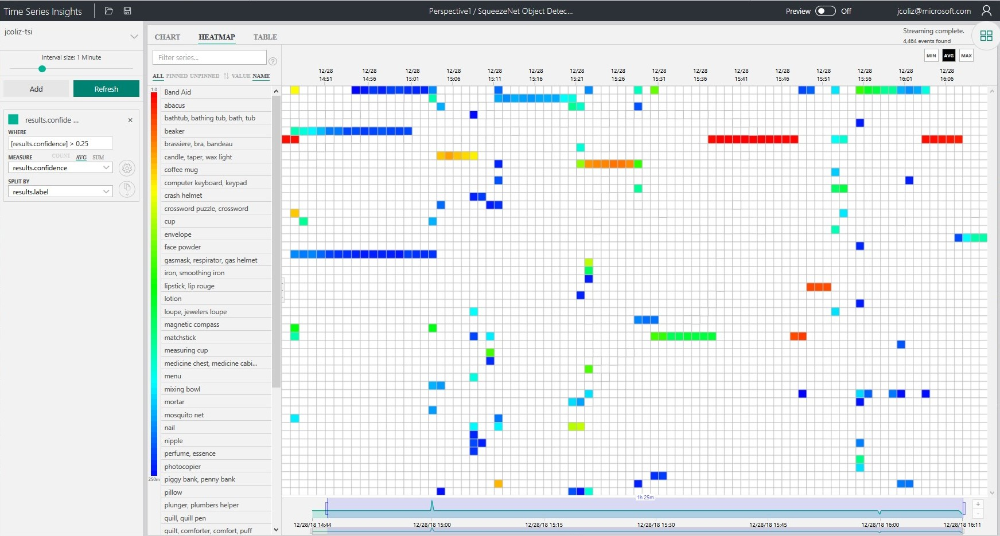

# SqueezeNet Object Detection Module

This is a sample module showing how to run Windows ML inferencing in an Azure IoT Edge module running on Windows. 
Images are supplied by a connected camera, inferenced against the SqueezeNet model, and sent to IoT Hub.

It is derived from the 
[NetCore SqueezeNetObjectDetection](https://github.com/Microsoft/Windows-Machine-Learning/tree/master/Samples/SqueezeNetObjectDetection/NETCore/cs) sample published in the [Windows ML Repo](https://github.com/Microsoft/Windows-Machine-Learning).

## Prerequisites

### Target Hardware

* A [Minnowboard Turbot](https://minnowboard.org/minnowboard-turbot/) running [Windows 10 IoT Core - Build 17763](https://developer.microsoft.com/en-us/windows/iot). Currently, the sample runs only on Windows IoT Core harware, and only on x64 architecture. Future releases will include support for IoT Enterprise OS, and arm32 architecture.
* A USB camera. I recommend a [LifeCam Cinema](https://www.microsoft.com/accessories/en-us/webcams).
* [Azure IoT Edge for Windows - 1.0.5 or higher](https://docs.microsoft.com/en-us/azure/iot-edge/) 

### Azure Subscription

* [IoT Hub](https://docs.microsoft.com/en-us/azure/iot-hub/iot-hub-create-through-portal)
* [Private container registry](https://docs.microsoft.com/en-us/azure/container-registry/container-registry-get-started-portal)

### Development Machine

* [Visual Studio Code with Azure IoT Edge extension](https://docs.microsoft.com/en-us/azure/iot-edge/how-to-deploy-modules-vscode)
* [Windows 10 - Build 17763 or higher](https://www.microsoft.com/en-us/software-download/windowsinsiderpreviewiso) to build the solution
* [Windows SDK - Build 17763 or higher](https://www.microsoft.com/en-us/software-download/windowsinsiderpreviewSDK)

### Insider Knowledge

Unfortunately, this sample cannot be reproduced using publicly released tools, until the following PR's are upstreamed and released:

* [IoT Edge PR 670](https://github.com/Azure/iotedge/pull/670). Without this change, IoT Edge fills up the very small MainOS partition on IoT Core devices. To work around, I have installed docker manually, and reconfigured Edge to use this manually-installed docker.
* [Moby Cli PR 1290](https://github.com/docker/cli/pull/1290). Without this change, docker.exe will not take the --device parameter. Thus, every case below where the cli is called with --device, will fail. To work around, we use an internally-built moby cli.

## Build the sample

To get access to Windows.AI.MachineLearning and various other Windows classes an assembly reference needs to be added for Windows.winmd
For this project the assembly reference is parametrized by the environment variable WINDOWS_WINMD, so you need to set this environment variable before building.
The file path for the Windows.winmd file may be: ```C:\Program Files (x86)\Windows Kits\10\UnionMetadata\[version]\Windows.winmd```

1. If you download the samples ZIP, be sure to unzip the entire archive, not just the folder with the sample you want to build.
2. Open a PowerShell window.
3. Change directory to the folder where you unzipped the samples, go to the **Samples** subfolder, then the subfolder for this sample (**SqueezeNetObjectDetection**).
3. Build and publish the sample using dotnet command line:

```
PS C:\Windows-iotcore-samples\Samples\EdgeModules\SqueezeNetObjectDetection\cs> dotnet publish -r win-x64

Microsoft (R) Build Engine version 15.8.169+g1ccb72aefa for .NET Core
Copyright (C) Microsoft Corporation. All rights reserved.

  Restore completed in 34.7 ms for C:\Windows-iotcore-samples\Samples\EdgeModules\SqueezeNetObjectDetection\cs\SqueezeNetObjectDetection.csproj.
  SqueezeNetObjectDetection -> C:\Windows-iotcore-samples\Samples\EdgeModules\SqueezeNetObjectDetection\cs\bin\Debug\netcoreapp2.1\win-x64\SqueezeNetObjectDetection.dll
  SqueezeNetObjectDetection -> C:\Windows-iotcore-samples\Samples\EdgeModules\SqueezeNetObjectDetection\cs\bin\Debug\netcoreapp2.1\win-x64\publish\
```

## Run the sample on your development machine

As a first initial step, you can run the sample natively on your development machine to ensure it's working.

First, run the app with the "--list" parameter to show the cameras on your PC:

```
PS C:\Windows-iotcore-samples\Samples\EdgeModules\SqueezeNetObjectDetection\cs> dotnet run -- --list

Found 5 Cameras
Microsoft Camera Rear
Microsoft IR Camera Front
Microsoft Camera Front
Microsoftr LifeCam Studio(TM)
IntelIRCameraSensorGroup
```

From this list, we will choose the camera to use as input, as pass that into the next call with the --device parameter, along with the model using the --model parameter.

```
PS C:\Windows-iotcore-samples\Samples\EdgeModules\SqueezeNetObjectDetection\cs> dotnet run -- --model=SqueezeNet.onnx --device=LifeCam

Loading modelfile 'SqueezeNet.onnx' on the 'default' device...
...OK 2484 ticks
Retrieving image from camera...
...OK 828 ticks
Running the model...
...OK 938 ticks
12/28/2018 12:13:05 PM Sending: {"results":[{"label":"coffee mug","confidence":0.960289478302002},{"label":"cup","confidence":0.035979188978672028},{"label":"water jug","confidence":6.35452670394443E-05}]}
```

Here we can see that the sample is successfully running on the development machine, found the camera, and recognized that the camera was probably
looking at a coffee mug. (It was.)

## Copy published files to target device

Currently, the container image must be built on an IoT Core device. To enable this, we will copy the 'publish' folder over to our device. 
In this case, I have mapped the Q: drive on my development PC to the C: drive on my IoT Core device.

```
PS C:\Windows-iotcore-samples\Samples\EdgeModules\SqueezeNetObjectDetection\cs> robocopy bin\Debug\netcoreapp2.1\win-x64\publish\ q:\data\modules\squeezenet

-------------------------------------------------------------------------------
   ROBOCOPY     ::     Robust File Copy for Windows
-------------------------------------------------------------------------------

  Started : Friday, December 21, 2018 4:20:48 PM
   Source : C:\Windows-iotcore-samples\Samples\EdgeModules\SqueezeNetObjectDetection\cs\bin\Debug\netcoreapp2.1\win-x64\publish\
     Dest : q:\data\modules\squeezenet\

    Files : *.*

  Options : *.* /DCOPY:DA /COPY:DAT /R:1000000 /W:30

------------------------------------------------------------------------------
```

## Run the sample on the target device

Following the same approach as above, run the app on the target device to ensure you have the correct camera there, and it's working on that device.

```
[192.168.1.120]: PS C:\data\modules\squeezenet> .\SqueezeNetObjectDetection.exe --list
Found 1 Cameras
Microsoft® LifeCam Studio(TM)

[192.168.1.120]: PS C:\data\modules\squeezenet> .\SqueezeNetObjectDetection.exe --model=SqueezeNet.onnx --device=LifeCam
Loading modelfile 'SqueezeNet.onnx' on the 'default' device...
...OK 1079 ticks
Retrieving image from camera...
...OK 766 ticks
Running the model...
...OK 625 ticks
12/28/2018 12:13:05 PM Sending: {"results":[{"label":"coffee mug","confidence":0.99733692407608032},{"label":"cup","confidence":0.0024446924217045307},{"label":"water jug","confidence":8.2805654528783634E-06}]}
```

## Create a personal container repository

In order to deploy modules to your device, you will need access to a container respository. 
Refer to [Quickstart: Create a private container registry using the Azure portal](https://docs.microsoft.com/en-us/azure/container-registry/container-registry-get-started-portal).

When following the sample, replace any "{ACR_*}" values with the correct values for your container repository.

Be sure to log into the container respository from the device where you will be building the containers.

```
[192.168.1.120]: PS C:\Data\modules\squeezenet> docker login {ACR_NAME}.azurecr.io {ACR_USER} {ACR_PASSWORD}
```

## Containerize the sample app

Build the container on the device. For the remainder of this sample, we will use the environment variable $Container
to refer to the address of our container.

```
[192.168.1.120]: PS C:\Data\modules\squeezenet> $Container = "{ACR_NAME}.azurecr.io/squeezenet:1.0.0-x64"

[192.168.1.120]: PS C:\Data\modules\squeezenet> docker build . -f Dockerfile.iotcore -t $Container
Sending build context to Docker daemon  81.63MB

Step 1/5 : FROM mcr.microsoft.com/windows/iotcore:1809
 ---> 2d0e5d769eb2
Step 2/5 : ARG EXE_DIR=.
 ---> Using cache
 ---> e56aef21bf6c
Step 3/5 : WORKDIR /app
 ---> Using cache
 ---> 5b66e01e041a
Step 4/5 : COPY $EXE_DIR/ ./
 ---> 3798927f4eaa
Step 5/5 : CMD [ "SqueezeNetObjectDetection.exe", "-mSqueezeNet.onnx", "-dLifeCam", "-ef" ]
 ---> Running in c4f09d9edc5b
Removing intermediate container c4f09d9edc5b
 ---> e7ab7ea5bd16
Successfully built e7ab7ea5bd16
Successfully tagged {ACR_NAME}.azurecr.io/squeezenet:1.0.0-x64
```

## Run the app in the container

One more test to ensure that the app is able to see the camera through the container.

```
[192.168.1.120]: PS C:\Data\modules\squeezenet> docker run --isolation process --device "class/E5323777-F976-4f5b-9B55-B94699C46E44" $Container SqueezeNetObjectDetection.exe --list
Found 1 Cameras
Microsoft® LifeCam Studio(TM)

[192.168.1.120]: PS C:\Data\modules\squeezenet> docker run --isolation process --device "class/5B45201D-F2F2-4F3B-85BB-30FF1F953599"  --device "class/E5323777-F976-4f5b-9B55-B94699C46E44" $Container SqueezeNetObjectDetection.exe --device=LifeCam --model=SqueezeNet.onnx
Loading modelfile 'SqueezeNet.onnx' on the 'default' device...
...OK 2484 ticks
Retrieving image from camera...
...OK 828 ticks
Running the model...
...OK 938 ticks
12/28/2018 12:13:05 PM Sending: {"results":[{"label":"coffee mug","confidence":0.960289478302002},{"label":"cup","confidence":0.035979188978672028},{"label":"water jug","confidence":6.35452670394443E-05}]}
```

## Push the container

Now that we are sure the app is working correctly within the container, we will push it to our repository.

```
[192.168.1.120]: PS C:\Data\modules\squeezenet> docker push $Container
The push refers to repository [{ACR_NAME}.azurecr.io/squeezenet]
60afb1c1d301: Preparing
02e3d8daa5bb: Preparing
1f97445a0771: Preparing
994bd29f895d: Preparing
1d7265923a7e: Preparing
1d7265923a7e: Skipped foreign layer
994bd29f895d: Layer already exists
1f97445a0771: Layer already exists
60afb1c1d301: Pushed
02e3d8daa5bb: Pushed
1.0.1-x64: digest: sha256:d39e6cdc78c1ebe34b50603c0ff74d6dea7f95015da229f8066a1c141ab22118 size: 1465
```

## Edit the deployment.json file

In the repo, you will find separate deployment.{arch}.json files for each architecture.
Choose the deployment file corresponding to your deployment atchitecture, then fill in the details for your container image.
Search for "{ACR_*}" and replace those values with the correct values for your container repository.
The ACR_IMAGE must exactly match what you pushed, e.g. jcoliz.azurecr.io/squeezenet:1.0.0-x64

```
    "$edgeAgent": {
      "properties.desired": {
        "runtime": {
          "settings": {
            "registryCredentials": {
              "{ACR_NAME}": {
                "username": "{ACR_USER}",
                "password": "{ACR_PASSWORD}",
                "address": "{ACR_NAME}.azurecr.io"
              }
            }
          }
        }
...
        "modules": {
            "squeezenet": {
            "settings": {
              "image": "{ACR_IMAGE}",
              "createOptions": "{\"HostConfig\":{\"Devices\":[{\"CgroupPermissions\":\"\",\"PathInContainer\":\"\",\"PathOnHost\":\"class/E5323777-F976-4f5b-9B55-B94699C46E44\"},{\"CgroupPermissions\":\"\",\"PathInContainer\":\"\",\"PathOnHost\":\"class/5B45201D-F2F2-4F3B-85BB-30FF1F953599\"}],\"Isolation\":\"Process\"}}"
            }
          }
```

## Deploy edge modules to device

Back on your development machine, you can now deploy this deployment.json file to your device.
For reference, please see [Deploy Azure IoT Edge modules from Visual Studio Code](https://docs.microsoft.com/en-us/azure/iot-edge/how-to-deploy-modules-vscode)

## Verify device messages

Using the Azure IoT Edge extension for Visual Studio Code, you can select your device and choose "Start Monitoring D2C Message". You should see lines like this:

```
[IoTHubMonitor] [4:23:39 PM] Message received from [jcoliz-17763-M/squeezenet]:
{
  "results": [
    {
      "label": "magnetic compass",
      "confidence": 0.33018141984939575
    },
    {
      "label": "teapot",
      "confidence": 0.0806143507361412
    },
    {
      "label": "abacus",
      "confidence": 0.07737095654010773
    }
  ]
}
```

From a command prompt on the device, you can also check the logs for the module itself.

First, find the module container:

```
[192.168.1.120]: PS C:\Data> docker ps

CONTAINER ID        IMAGE                                      COMMAND                  CREATED             STATUS              PORTS                                                                  NAMES
a7e9af84e551        {ACR_NAME}.azurecr.io/squeezenet:1.0.3-x64 "SqueezeNetObjectDet…"   7 minutes ago       Up 6 minutes                                                                               squeezenet
cd5f1d7873d6        mcr.microsoft.com/azureiotedge-hub:1.0     "dotnet Microsoft.Az…"   31 minutes ago      Up 6 minutes        0.0.0.0:443->443/tcp, 0.0.0.0:5671->5671/tcp, 0.0.0.0:8883->8883/tcp   edgeHub
73964eeb52cf        mcr.microsoft.com/azureiotedge-agent:1.0   "dotnet Microsoft.Az…"   35 minutes ago      Up 7 minutes                                                                               edgeAgent
```

Then, use the ID for the squeezenet container to check the logs

```
[192.168.1.120]: PS C:\Data> docker logs b4107d30a29d
Loading modelfile 'SqueezeNet.onnx' on the 'default' device...
...OK 2484 ticks
Retrieving image from camera...
...OK 828 ticks
Running the model...
...OK 938 ticks
12/28/2018 12:13:05 PM Sending: {"results":[{"label":"coffee mug","confidence":0.960289478302002},{"label":"cup","confidence":0.035979188978672028},{"label":"water jug","confidence":6.35452670394443E-05}]}
Retrieving image from camera...
...OK 828 ticks
Running the model...
...OK 938 ticks
12/28/2018 12:13:05 PM Sending: {"results":[{"label":"coffee mug","confidence":0.960289478302002},{"label":"cup","confidence":0.035979188978672028},{"label":"water jug","confidence":6.35452670394443E-05}]}
Retrieving image from camera...
...OK 828 ticks
Running the model...
...OK 938 ticks
12/28/2018 12:13:05 PM Sending: {"results":[{"label":"coffee mug","confidence":0.960289478302002},{"label":"cup","confidence":0.035979188978672028},{"label":"water jug","confidence":6.35452670394443E-05}]}
```

## Next step: Visualize your data

Now that your object recognition data is flowing into the Azure cloud, you can use Time Series Insights to visualize it. 

1. [Add an IoT hub event source to your Time Series Insights environment](https://docs.microsoft.com/en-us/azure/time-series-insights/time-series-insights-how-to-add-an-event-source-iothub).
2. Access your environment in the [Azure Time Series Insights explorer](https://docs.microsoft.com/en-us/azure/time-series-insights/time-series-insights-explorer).
3. Create a query to measure results.confidence, split by results.label.
4. Use the heatmap view for best results.

As you experiment with different objects, you can visualize them over time by adjusting the timeframe and interval size. Be sure to refresh the data after changing objects!



## Advanced topics: Bring your own model!

In this sample, we've shown how to do object detection using the standard SqueezeNet model. You can do the same thing with any AI model which can be converted to ONNX.

Read more to learn how!
* [ONNX and Azure Machine Learning: Create and deploy interoperable AI models](https://docs.microsoft.com/en-us/azure/machine-learning/service/how-to-build-deploy-onnx)
* [Convert ML models to ONNX with WinMLTools](https://docs.microsoft.com/en-us/windows/ai/convert-model-winmltools)
* [Tutorial: Use an ONNX model from Custom Vision with Windows ML (preview)](https://docs.microsoft.com/en-us/azure/cognitive-services/custom-vision-service/custom-vision-onnx-windows-ml)

Once you have an ONNX model, you'll need to make some changes to the sample.

First, generate a Scoring file, using the [MLGen](https://docs.microsoft.com/en-us/windows/ai/mlgen) tool. This creates an interface with wrapper classes that call the Windows ML API for you, allowing you to easily load, bind, and evaluate a model in your project.

```
PS C:\Windows-iotcore-samples\Samples\EdgeModules\SqueezeNetObjectDetection\cs> $mlgen="C:\Program Files (x86)\Windows Kits\10\bin\10.0.17763.0\x64\mlgen.exe"
PS C:\Windows-iotcore-samples\Samples\EdgeModules\SqueezeNetObjectDetection\cs> 
& $mlgen -i C:\\Windows-Machine-Learning\SharedContent\models\SqueezeNet.onnx -l cs -n SqueezeNetObjectDetection -p Scoring -o Scoring.cs
```

Second, depending on the outputs of your model, make the necessary changes to the ResultsToMessage method in Program.cs. Here, you translate the output of your model into a JSON object suitable for transmission to Edge.