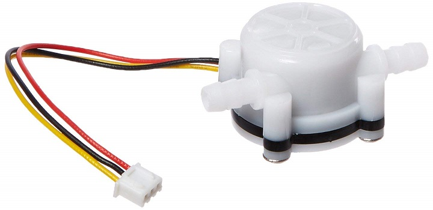
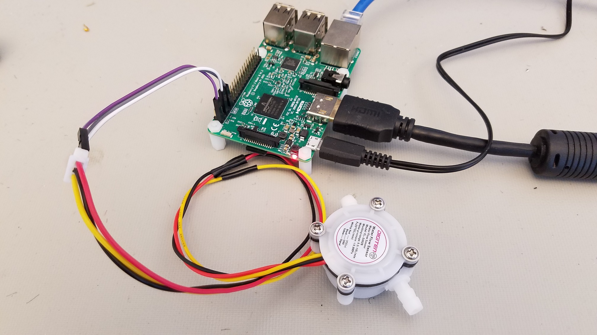
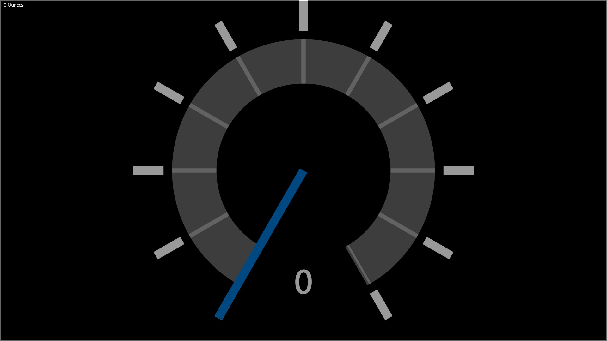

# Flow Volume

In this sample, we will demonstrate how to use a relatively inexpensive device and a Raspberry Pi to measure the volume of liquid flowing through a hose.

Keep in mind that the GPIO APIs are only available on Windows 10 IoT Core, so this sample cannot run on your desktop.

## Set up your hardware
___
The hardware setup for this sample is relatively simple.

You’ll need a few components:

*   a Hall-effect flow sensor (we used a FL-S402B flow meter by DIGITEN)



*   a microcontroller board running Windows IoT Core (we used a Raspberry Pi 3) with a free GPIO pin



### For Raspberry Pi 2 or 3 (RPi2 or RPi3)

1.  Connect the red wire to 3.3V (pin 1 on the expansion header) on the RPi3.
2.  Connect the black wire to ground (pin 9).
3.  Connect the yellow wire, the data pin, to the GPIO-3 pin that we will read from (we used pin 5 for convenience, since it is right there between pins 1 and 9).
4.  Attach to the network using the ethernet or wifi connection, as desired (we used ethernet to connect to our PC on the local network).
5.  Connect the monitor to your device (we used an HDMI cable to connect our Raspberry Pi 3 to a standard monitor).

For reference, here is the pinout of the RPi2 and RPi3:


## Deploy your app

1.  With the application open in Visual Studio, set the architecture in the toolbar dropdown. We use `ARM` since we used the Raspberry Pi, but if you’re building for MinnowBoard Max, remember to select `x86`.

2.  Next, in the Visual Studio toolbar, click on the `Local Machine` dropdown and select `Remote Machine`

    

3.  At this point, Visual Studio will present the **Remote Connections** dialog. If you previously used [PowerShell](https://docs.microsoft.com/en-us/windows/iot-core/connect-your-device/powershell) to set a unique name for your device, you can enter it here (in this example, we’re using **my-device**). Otherwise, use the IP address of your Windows IoT Core device. After entering the device name/IP select `Universal` for Windows Authentication, then click **Select**.

    

4.  You can verify or modify these values by navigating to the project properties (select **Properties** in the Solution Explorer) and choosing the `Debug` tab on the left:

    

When everything is set up, you should be able to press F5 from Visual Studio. If there are any missing packages that you did not install during setup, Visual Studio may prompt you to acquire those now. The app will deploy and start on the Windows IoT device, and you should see a gauge control fill the screen.



The easiest way to test is to gently blow in one end of the flow meter.  The application listens for data coming from the device and the gauge should move up and back down as the flow rises and then stops.

Congratulations! You just measured the flow going through the sensor from your Windows IoT device.

## Let’s look at the code

The code for this sample is made easier by using a class to interface with such devices, found in Flow.cs.  This, in turn, is dependent upon a reusable class called Measurement, which is found in Models/Measurement.cs.

In order to understand how the code works, an explanation of the sensor device will help.  The device is based on the principle that a small wheel spins as there is flow through the sensor, which results in a certain number of pulses generated on the data pin.
By counting the number of pulses and multiplying by a factor, the volume flowing through the sensor can be calculated.  Because of variations in fluid density, and other subtle factors, it is important to calibrate the factor for your application.

### Timer code

Here is how you set up the application to use the Flow object in C#:

```csharp
public MainPage()
{
    this.InitializeComponent();

    // to change the calibration numbers, do it here to override the defaults within the code
    var calibration = new Dictionary<string, object>();
    calibration[Flow.FlowCalibrationFactorSetting] = "0.045";
    calibration[Flow.FlowCalibrationOffsetSetting] = "0";

    _flow = new Flow(calibration);
    _flow.FlowChanged += OnFlowChange;
    //_flow.Initialize();  // start without a timer, or ...
    _flow.Initialize(1000, 500); // start with a timer

    LastMeasurement = new Keg.DAL.Models.Measurement(0, Keg.DAL.Models.Measurement.UnitsOfMeasure.Ounces);
    LastMeasurement.PropertyChanged += OnAmountChange;
}
```
As you can see, we use a Dictionary object and add to it the values we want to use to calibrate the sensor's reported values.  Then we pass the Dictionary to the Flow object's constructor.  Finally, we call Initialize to allow the object
to setup internally.  Then we simply attach method references to the OnFlowChange event so that we get notified when readings are taken from the sensor.  The event provides to us a value that continues to increase that 
represents the cumulative volume measured by the sensor.  Since our user interface was implemented to display sort of a rolling average of the value of the sensor, we calculate the amount added since the last event and pass
that to the radial gauge control for display.

## Additional resources
* [Windows 10 IoT Core home page](https://developer.microsoft.com/en-us/windows/iot/)
* [Documentation for all samples](https://developer.microsoft.com/en-us/windows/iot/samples)

This project has adopted the Microsoft Open Source Code of Conduct. For more information see the Code of Conduct FAQ or contact <opencode@microsoft.com> with any additional questions or comments.
