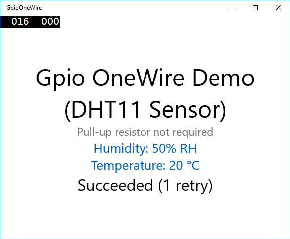
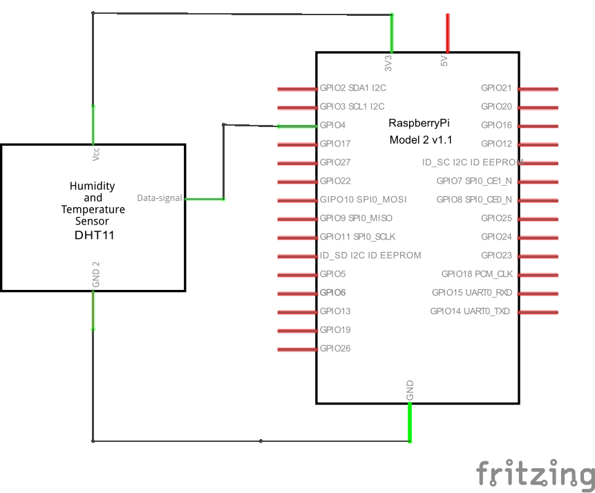
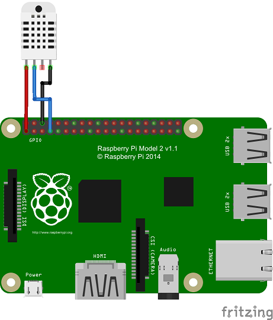

# GPIO OneWire DHT11 reader

Note what follows below is a bit out of date-  the latest version on Github is a 2 wire operation requiring pin4 as input and pin 5 as output.

This sample shows how to read from the [DHT11](https://www.adafruit.com/product/386)
from a Universal Windows Application. The DHT11 is a low cost temperature and
humidity sensor that uses a single wire to interface to the host controller.
This wire is used by the host to request a sample from the DHT11 and
by the DHT11 to transmit data back to the host.

The DHT11 is right on the edge performance-wise of what the GPIO APIs can
handle. If there is background activity such as network, USB, filesystem, or
graphics activity, it can prevent the sample from successfully sampling
from the DHT11.

For a description of the protocol used by the DHT11, see
[this article](http://embedded-lab.com/blog/?p=4333). The datasheet is [here](http://akizukidenshi.com/download/ds/aosong/DHT11.pdf).



### Requirements

{:.table.table-bordered}
| Minimum supported build | 10.0.10556                      |
|-------------------------|---------------------------------|
| Supported Hardware      | Raspberry Pi 2 or 3<br />Dragonboard 410C |

### Hardware Setup

You will need the following hardware to run this demo:

 * A [DHT11](https://www.adafruit.com/product/386) or [DHT22](http://www.adafruit.com/products/385) sensor
 * A couple of female-to-female connector wires

Connect the components as shown in the following diagram:




### Running the Demo

 1. Clone the [Microsoft/Windows-iotcore-samples git repository](https://github.com/microsoft/Windows-iotcore-samples/tree/master/Samples/GpioOneWire).
    and open GpioOneWire/GpioOneWire.vcxproj in Visual Studio 2017.
 1. Right click on the project in the solution explorer, and click `Properties`.
 1. In the project properties dialog, select the `Debugging` tab.
 1. Enter the IP address of your device in the `Machine Name` field.
 1. Set `Authentication Type` to `Universal (Unencrypted Protocol)`
 1. Hit `F5` to build, deploy, and debug the project. You should see temperature
    and humidity samples updated on the screen every 2 seconds.

### How it works

The logic that interacts with the DHT11 is contained in the Dht11::Sample()
method. Since the 1s and 0s that the DHT11 sends back are encoded as pulse
widths, we need a way to precisely measure the time difference between
falling edges. We use [QueryPerformanceCounter()](https://msdn.microsoft.com/en-us/library/windows/desktop/ms644904(v=vs.85).aspx)
for this purpose. The units of QueryPerformanceCounter are platform-dependent,
so we must call [QueryPerformanceFrequency()](https://msdn.microsoft.com/en-us/library/windows/desktop/ms644905(v=vs.85).aspx)
to determine the resolution of the counter.

A difference of 76 microseconds between falling edges denotes a '0', while a
difference of 120 microseconds between falling edges denotes a '1'.
We choose 110 microseconds as a reasonable threshold above which we will
consider bits to be 1s, while we will consider pulses shorter
than this threshold to be 0s. We convert 110 microseconds to
QueryPerformanceCounter (QPC) units to be used later.

```csharp
	HRESULT GpioOneWire::Dht11::Sample (GpioOneWire::Dht11Reading& Reading)
	{
		Reading = Dht11Reading();

		LARGE_INTEGER qpf;
		QueryPerformanceFrequency(&qpf);

		// This is the threshold used to determine whether a bit is a '0' or a '1'.
		// A '0' has a pulse time of 76 microseconds, while a '1' has a
		// pulse time of 120 microseconds. 110 is chosen as a reasonable threshold.
		// We convert the value to QPF units for later use.
		const unsigned int oneThreshold = static_cast<unsigned int>(
			110LL * qpf.QuadPart / 1000000LL);
``` 

Next, we send the sequence required to activate the sensor. The GPIO signal
is normally pulled high while the device is idle, and we must pull it low
for 18 milliseconds to request a sample. We latch a low value to the pin
and set it as an output, driving the GPIO pin low.

```csharp
    // Latch low value onto pin
    this->pin->Write(GpioPinValue::Low);

    // Set pin as output
    this->pin->SetDriveMode(GpioPinDriveMode::Output);

    // Wait for at least 18 ms
    Sleep(SAMPLE_HOLD_LOW_MILLIS);
```

We then revert the pin to an input which causes it to go high, and wait for
the DHT11 to pull the pin low, then high again.

```csharp
    // Set pin back to input
    this->pin->SetDriveMode(this->inputDriveMode);

    GpioPinValue previousValue = this->pin->Read();

    // catch the first rising edge
    const ULONG initialRisingEdgeTimeoutMillis = 1;
    ULONGLONG endTickCount = GetTickCount64() + initialRisingEdgeTimeoutMillis;
    for (;;) {
        if (GetTickCount64() > endTickCount) {
            return HRESULT_FROM_WIN32(ERROR_TIMEOUT);
        }

        GpioPinValue value = this->pin->Read();
        if (value != previousValue) {
            // rising edgue?
            if (value == GpioPinValue::High) {
                break;
            }
            previousValue = value;
        }
    }
```

After receiving the first rising edge, we catch all of the falling edges
and measure the time difference between them to determine whether the bit
is a 0 or 1.

```csharp
    LARGE_INTEGER prevTime = { 0 };

    const ULONG sampleTimeoutMillis = 10;
    endTickCount = GetTickCount64() + sampleTimeoutMillis;

    // capture every falling edge until all bits are received or
    // timeout occurs
    for (unsigned int i = 0; i < (Reading.bits.size() + 1);) {
        if (GetTickCount64() > endTickCount) {
            return HRESULT_FROM_WIN32(ERROR_TIMEOUT);
        }

        GpioPinValue value = this->pin->Read();
        if ((previousValue == GpioPinValue::High) && (value == GpioPinValue::Low)) {
            // A falling edge was detected
            LARGE_INTEGER now;
            QueryPerformanceCounter(&now);

            if (i != 0) {
                unsigned int difference = static_cast<unsigned int>(
                    now.QuadPart - prevTime.QuadPart);
                Reading.bits[Reading.bits.size() - i] =
                    difference > oneThreshold;
            }

            prevTime = now;
            ++i;
        }

        previousValue = value;
    }
```

After all bits have been received, we validate the checksum to make sure the
received data is valid. The data is returned through the `Reading` reference
parameter.

```csharp
    if (!Reading.IsValid()) {
        // checksum mismatch
        return HRESULT_FROM_WIN32(ERROR_INVALID_DATA);
    }

    return S_OK;
```
