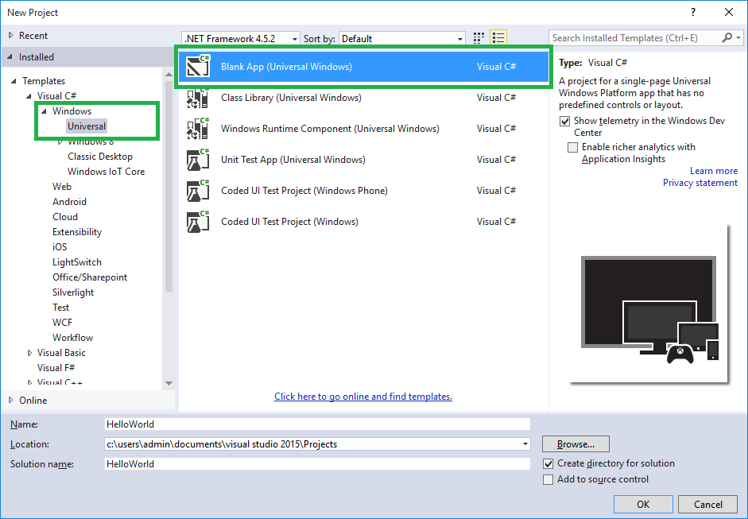
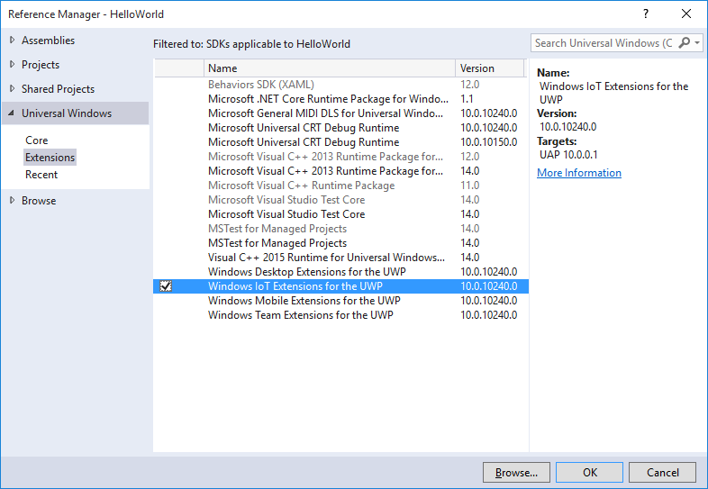
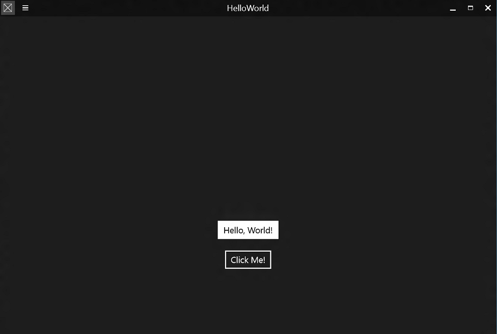

# 'Hello, world!' 

In this sample, we will create and deploy the proverbial 1st app, "Hello, world!" to any device running Windows 10 IoT Core.

## Create a new C# project
___
All of the sample code is available to download, but as an exercise, this tutorial will take you through the complete steps to create this app from scratch. 
You need to make sure you have installed the Windows 10 IoT Core Project Templates from [here](https://go.microsoft.com/fwlink/?linkid=847472). 

1. Start Visual Studio 2017.
2. Create a new project with **(File \| New Project...)**.

    In the **New Project** dialog, navigate to **Universal** as shown below (in the left pane in the dialog: Templates \| Visual C# \| Windows \| Universal).

3. Select the template **Blank App (Windows Universal)**.

    Remember to give a good name to your first app! In this example, we called the project 'HelloWorld'.

    

If this is the first project you create, Visual Studio will likely prompt you to enable [developer mode for Windows 10](https://msdn.microsoft.com/library/windows/apps/xaml/dn706236.aspx).
     


## Add a reference to the Windows IoT extension SDK
___
Since the IoT extension SDK is not added to projects by default, we'll need to add a reference so that namespaces like **Windows.Devices.Gpio** will be available in the project.  To do so, just right-click on the References entry under the project, Select "Add Reference" then navigate the resulting dialog to **Universal Windows->Extensions->Windows IoT Extensions for the UWP**, check the box, and click OK.



### Add content to MainPage.xaml
___
Let's add some content to the MainPage. From Solution Explorer, select the **MainPage.xaml** file. We want to add a TextBox and a Button, to show some interaction. So we will edit the XAML file to add these elements. Locate the **&lt;Grid&gt;** tag in the XAML section of the designer, and add the following markup.  

``` xml
<Grid Background="{ThemeResource ApplicationPageBackgroundThemeBrush}">
    <StackPanel HorizontalAlignment="Center" VerticalAlignment="Center">
    <TextBox x:Name="HelloMessage" Text="Hello, World!" Margin="10" IsReadOnly="True"/>
    <Button x:Name="ClickMe" Content="Click Me!"  Margin="10" HorizontalAlignment="Center"/>
    </StackPanel>
</Grid>
```

Now that we have a TextBox and a Button, we can add some code which will be executed when the Button is pressed. Double click on the Button in the design surface: Visual Studio will add a **Click** property to the Button XAML tag and generate the **ClickMe_Click** method in **MainPage.xaml.cs**. Let's add a simple line of code in this method.

*MainPage.xaml:*
``` xml
<Button x:Name="ClickMe" Content="Click Me!"  Margin="10" HorizontalAlignment="Center" Click="ClickMe_Click"/>
```
  
*MainPage.xaml.cs:*
```csharp
private void ClickMe_Click(object sender, RoutedEventArgs e)
{
    this.HelloMessage.Text = "Hello, Windows 10 IoT Core!";
}
```

## Build and test the app locally
___
1. Make sure the app builds correctly by invoking the **Build \| Build** Solution menu command.

1. Since this is a Universal Windows Platform (UWP) application, you can test the app on your Visual Studio machine as well: Just press F5, and the app will run inside your machine. You should see something like this:

    

    Close the app after you're done validating it.
    
    > If you would like to learn more about Universal Windows Platform applications, click [here](https://msdn.microsoft.com/library/windows/apps/dn894631.aspx){:target="_blank"}.

## Deploy the app to your Windows IoT Core device
1. Of course, we want to deploy our first app to our IoT Core device. It's easy. In the [PowerShell](/Docs/PowerShell) documentation, you can find instructions to chose a unique name for your IoT Core device. In this sample, we'll use that name (though you can use your IP address as well) in the 'Remote Machine Debugging' settings in Visual Studio.

    If you're building for Minnowboard Max, select **x86** in the Visual Studio toolbar architecture dropdown.  If you're building for Raspberry Pi 2 or 3 or the DragonBoard, select **ARM**.

    Next, in the Visual Studio toolbar, click on the **Local Machine** dropdown and select **Remote Machine**<br/>

    

1. At this point, Visual Studio will present the 'Remote Connections' dialog. Put the IP address or name of your IoT Core device (in this example, we're using 'my-device') and select **Universal (Unencrypted Protocol)** for Authentication Mode. Then click **Select**.

    

    > Couple of notes:
    >
    > 1. You can use the IP address instead of the IoT Core device name.
    >
    > 2. You can verify and/or modify these values navigating to the project properties (select 'Properties' in the Solution Explorer) and choose the 'Debug' tab on the left:
    >
    > 

1. Now we're ready to deploy to the remote IoT Core device. Simply press F5 (or select **Debug \| Start Debugging**) to start debugging our app. You should see the app come up in IoT Core device screen, and you should be able to click on the button.

1. You can set breakpoints, see variable values, etc. To stop the app, press on the 'Stop Debugging' button (or select Debug \| Stop Debugging).

1. Having successfully deployed and debugged your first UWP application, create a Release version by simply changing the Visual Studio toolbar configuration dropdown from **Debug** to **Release**.  You can now build and deploy your app to your device by selecting **Build \| Rebuild Solution and Build \| Deploy Solution**.

1. Congratulations! You just deployed your first UWP application to a device running IoT Core!


