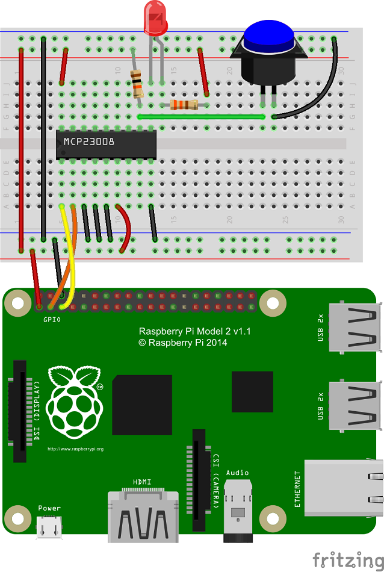
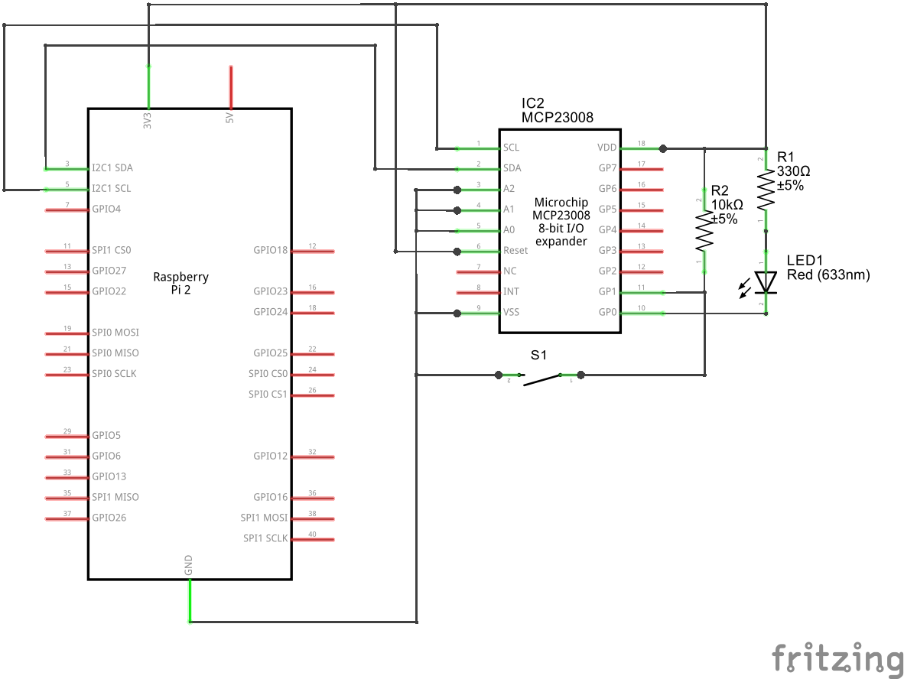
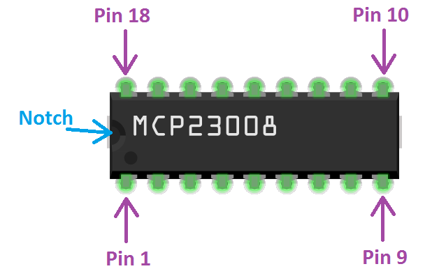
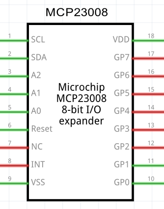
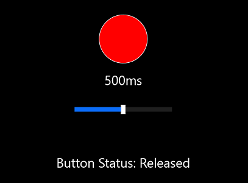

# I2C port expander 


In this sample, we'll connect an I2C port expander to your Raspberry Pi 2 or 3 and create a simple app that uses the port expander to read the status of a tactile switch and control an LED. No background knowledge of I2C or port expanders is needed.
If you want to know more about I2C, SparkFun provides a great [tutorial on I2C](https://learn.sparkfun.com/tutorials/i2c).

This is a headed sample, so please ensure that your device is in headed
mode by running this command: `setbootoption.exe headed` (changing the headed/headless state will require a reboot).

### Connect the I2C Port Expander to your device

You will need the following components:

* 1 Raspberry Pi 2 or 3

* <a name="I2C_PortExpander"></a>1 [MCP23008 8-bit I/O Port Expander](http://www.digikey.com/product-detail/en/MCP23008-E%2FP/MCP23008-E%2FP-ND/735951) in PDIP package

* 1 [red LED](http://www.digikey.com/product-detail/en/C5SMF-RJS-CT0W0BB1/C5SMF-RJS-CT0W0BB1-ND/2341832)

* 1 [tactile switch](http://www.digikey.com/product-detail/en/320.02E11.08BLK/EG1311-ND/101397)

* 1 [330 &#x2126; resistor](http://www.digikey.com/product-detail/en/CFR-25JB-52-330R/330QBK-ND/1636)

* 1 [10k &#x2126; resistor](http://www.digikey.com/product-detail/en/CFR-25JB-52-10K/10KQBK-ND/338)

* An HDMI monitor

* A breadboard and several male-to-female and male-to-male connector wires

Let's start by wiring up the components on the breadboard as shown in the diagram below.

**Note: Make sure to power off the RPi2 or RPi3 when connecting your circuit. This is good practice to reduce the chance of an accidental short circuit during construction.**



*Image made with [Fritzing](http://fritzing.org/)*


Here is the schematic:



*Image made with [Fritzing](http://fritzing.org/)*


#### Connecting the MCP23008 Port Expander

Place the MCP23008 Port Expander on your breadboard such that it straddles the center gap of the breadboard.


*Image made with [Fritzing](http://fritzing.org/)*


 Locate pin 1 of the port expander by finding the notch on the IC. If you orient the IC so that the end with the notch is facing left, pin 1 will be the first pin in the lower left below the notch.



*Image made with [Fritzing](http://fritzing.org/)*

The pinout of the MCP23008 is shown below and can be found in the [datasheet](http://ww1.microchip.com/downloads/en/DeviceDoc/21919e.pdf).



*Image made with [Fritzing](http://fritzing.org/)*


Make the following connections on the MCP23008 Port Expander:

* Pin 1  **SCL**: Connect to **I2C1 SCL** (Pin 5) on the RPi2 or RPi3 (pin mapping is below)

* Pin 2  **SDA**: Connect to **I2C1 SDA** (Pin 3) on the RPi2 or RPi3

* Pin 3  **A2**:  Connect to the ground rail on the side of the breadboard (blue stripe)

* Pin 4  **A1**:  Connect to the ground rail on the side of the breadboard

* Pin 5  **A0**:  Connect to the ground rail on the side of the breadboard

* Pin 6  **Reset**: Connect to the voltage supply rail on the side of the breadboard (red stripe)

* Pin 9  **VSS**: Connect to the ground rail on the side of the breadboard

* Pin 10 **GP0**: Connect to the cathode (the shorter leg) of the LED

* Pin 11 **GP1**: Connect to one lead of the 10k &#x2126; resistor and one pin of the tactile switch

* Pin 18 **VDD**: Connect to the voltage supply rail on the side of the breadboard

Leave the remaining pins on the MCP23008 unconnected.


#### Connecting the LED

* If not already connected, connect the cathode (the shorter leg) of the LED to Pin 10 of the MCP23008 Port Expander

* Connect the anode (the longer leg) of the LED to one lead of the 330 &#x2126; resistor

* Connect the other end of the 330 &#x2126; resistor to the voltage supply rail on the side of the breadboard (red stripe)


#### Connecting the Tactile Switch

* If not already connected, connect one lead of the 10k &#x2126; resistor to Pin 11 of the MCP23008 Port Expander

* Connect the other end of the 10k &#x2126; resistor to the voltage supply rail on the side of the breadboard (red stripe)

* If not already connected, connect one pin of the tactile switch to Pin 11 of the MCP23008 Port Expander

* Connect the other pin of the tactile switch to the ground rail on the side of the breadboard (blue stripe)


#### Connecting the Raspberry Pi 2 or 3

We need to hook up power, ground, and the I2C lines from on the Raspberry Pi 2 or 3 to the MCP23008 Port Expander and the breadboard.


* Pin 1 **3.3V PWR** Connect to the voltage supply rail on the side of the breadboard (red stripe)

* Pin 3 **I2C1 SDA** If not already connected, connect to Pin 2 of the MCP23008 Port Expander

* Pin 5 **I2C1 SCL** If not already connected, connect to pin 1 of the MCP23008 Port Expander

* Pin 6 **GND** Connect to the ground rail on the side of the breadboard (blue stripe)

The I2C bus requires pull-up resistors on the SDA and SCL lines. However, the Raspberry Pi 2 and 3 SDA and SCL pins we are using in this sample already have pull-up resistors connected on the RPi2 or RPi3, so we don't need to add any additional external pull-ups.
 See the [Raspberry Pi 2 or 3 pin mapping page]({{site.baseurl}}/{{page.lang}}/Samples/PinMappingsRPi2) for more details on the RPi2 and RPi3 IO pins.

### Create the sample app

When everything is set up, power your device back on. You can find the source code for this sample by downloading a zip of all of our samples [here](https://github.com/ms-iot/samples/archive/develop.zip) and navigating to the `samples-develop\I2CPortExpander`, 
but as an exercise, this tutorial will take you through the complete steps to create this app from scratch. 
Open up Visual Studio and create a new C# Windows Universal Blank App. Click **File -> New -> Project** then select **Templates -> Visual C# -> Windows -> Universal -> Blank App (Universal Windows)**. 
For this sample, we named ours **I2cPortExpanderLedSample**.

The code in this sample does several things:

1. Initializes the I2C bus and the port expander

2. Communicates over I2C with the port expander to turn the LED on and off at regular intervals

3. Communicates over I2C with the port expander to check the status of the tactile switch (is it pressed or not) at regular intervals

4. Displays the LED on/off status and the tactile switch pressed/released status to the display attached to the Raspberry Pi 2 or 3

5. Stops flashing the LED when the tactile switch is pressed and restarts flashing the LED when the tactile switch is released

6. Checks if the user has changed the LED flash frequency and updates the LED flash frequency as needed

#### Add content to MainPage.xaml

Let's add some content to the MainPage which will be displayed on a screen connected to the Raspberry Pi 2 or 3. We want to add a Circle, a couple TextBoxes and a Slider. The circle will emulate the on/off status of the LED. The Slider allows the user to control the frequency that the LED flashes. The Textboxes will provide info about the slider and report the tactile button status.

* From Solution Explorer, select the MainPage.xaml file.

* Locate the `<Grid>` tag in the XAML section of the designer, and add the following markup:

```csharp
<Grid Background="Black">
    <StackPanel HorizontalAlignment="Center" VerticalAlignment="Center">
        <Ellipse x:Name="Led" Fill="LightGray" Stroke="White" Width="100" Height="100" Margin="10"/>
        <TextBlock x:Name="DelayText" Text="500ms" Margin="10" TextAlignment="Center" FontSize="26.667" />
        <Slider x:Name="Delay" Width="200" Value="500" Maximum="1000" LargeChange="100" SmallChange="10" Margin="10" ValueChanged="Delay_ValueChanged" StepFrequency="10"/>
        <TextBlock x:Name="ButtonStatusText" Text="Button Status: Initializing...." Margin="10,50,10,10" TextAlignment="Center" FontSize="26.667" />
    </StackPanel>
</Grid>
```

#### Add code to MainPage.xaml.cs

Before we add any code to MainPage.xaml.cs, we need to add a reference to the Windows IoT Extension SDK.

 * In Solution Explorer, right-click on **References** and select **Add Reference...**

 * In the Reference Manager window, click the arrow next to **Windows Universal** then click on **Extensions**

 * Place a check mark in the box next to **Windows IoT Extension SDK** and click **OK**

 * Open MainPage.xaml.cs from Solution Explorer (you may need to click on the arrow next to MainPage.xaml first)

 * Add the following lines at the top of MainPage.xaml.cs

```csharp
using Windows.Devices.Enumeration;
using Windows.Devices.I2c;
```


With the references added, let's start adding code. The complete code we implemented for MainPage.xaml.cs is located at end of this section. Below are some key parts of the code with explanations


Variables and Constants

```csharp
// use these constants for controlling how the I2C bus is setup
private const string I2C_CONTROLLER_NAME = "I2C1"; //specific to RPi2 or RPi3
private const byte PORT_EXPANDER_I2C_ADDRESS = 0x20; // 7-bit I2C address of the port expander
private const byte PORT_EXPANDER_IODIR_REGISTER_ADDRESS = 0x00; // IODIR register controls the direction of the GPIO on the port expander
private const byte PORT_EXPANDER_GPIO_REGISTER_ADDRESS = 0x09; // GPIO register is used to read the pins input
private const byte PORT_EXPANDER_OLAT_REGISTER_ADDRESS = 0x0A; // Output Latch register is used to set the pins output high/low
private const double TIMER_INTERVAL = 500; // value is milliseconds and denotes the timer interval
private const double BUTTON_STATUS_CHECK_TIMER_INTERVAL = 50;

private byte LED_GPIO_PIN = 0x01; // using GPIO pin 0 on the port expander for the LED
private byte PUSHBUTTON_GPIO_PIN = 0x02; // using GPIO pin 1 on the port expander for reading the toggle button status

private byte iodirRegister; // local copy of I2C Port Expander IODIR register
private byte gpioRegister; // local copy of I2C Port Expander GPIO register
private byte olatRegister; // local copy of I2C Port Expander OLAT register

private I2cDevice i2cPortExpander;
private DispatcherTimer ledTimer;
private DispatcherTimer buttonStatusCheckTimer;

private bool isLedOn = false;
private bool isButtonPressed = false;

private SolidColorBrush redBrush = new SolidColorBrush(Windows.UI.Colors.Red);
private SolidColorBrush grayBrush = new SolidColorBrush(Windows.UI.Colors.LightGray);
```

Here are what some of these constants and variables represent

 * `I2C_CONTROLLER_NAME` holds the string constant `I2C1` which is the name of the I2C controller on the Raspberry Pi 2 or 3.

 * `PORT_EXPANDER_I2C_ADDRESS` is the I2C address of the port expander we are using. \*

 * `PORT_EXPANDER_IODIR_REGISTER_ADDRESS`, `PORT_EXPANDER_GPIO_REGISTER_ADDRESS`, `PORT_EXPANDER_OLAT_REGISTER_ADDRESS` are the register addresses in the port expander that correspond to the IODIR register, GPIO register and OLAT register.\*

 * `TIMER_INTERVAL` is the starting time interval in milliseconds between an LED on or off toggle.

 * `BUTTON_STATUS_CHECK_TIMER_INTERVAL` is the time interval in milliseconds between each check of the tactile switch status

 * `iodirRegister`, `gpioRegister` and `olatRegister` are our local copies of the values in the corresponding registers in the port expander.

\* See the [MCP23008 datasheet](http://ww1.microchip.com/downloads/en/DeviceDoc/21919e.pdf)for details.

The method `InitializeSystem()`

`InitializeSystem()` does the following:

 * Sets up the I2C communications on the Raspberry Pi 2 or 3

 * Configures the port expander to be able to turn the LED on and off and to get the tactile switch status

 * Initializes the local copies of the port expander registers IODIR, GPIO and OLAT

 * Sets up two timers - One for controlling the LED and another for checking the tactile switch status

When complete, the variable `i2cPortExpander` will be our handle to the Raspberry Pi 2 or 3 I2C bus.

```csharp
private async void InitializeSystem()
{
    byte[] i2CWriteBuffer;
    byte[] i2CReadBuffer;
    byte bitMask;

    // initialize I2C communications
    try
    {
        var i2cSettings = new I2cConnectionSettings(PORT_EXPANDER_I2C_ADDRESS);
        string deviceSelector = I2cDevice.GetDeviceSelector(I2C_CONTROLLER_NAME);
        var i2cDeviceControllers = await DeviceInformation.FindAllAsync(deviceSelector);
        i2cPortExpander = await I2cDevice.FromIdAsync(i2cDeviceControllers[0].Id, i2cSettings);
    }
    catch (Exception e)
    {
        System.Diagnostics.Debug.WriteLine("Exception: {0}", e.Message);
        return;
    }

    // initialize I2C Port Expander registers
    try
    {
        // initialize local copies of the IODIR, GPIO, and OLAT registers
        i2CReadBuffer = new byte[1];

        // read in each register value on register at a time (could do this all at once but
        // for example clarity purposes we do it this way)
        i2cPortExpander.WriteRead(new byte[] { PORT_EXPANDER_IODIR_REGISTER_ADDRESS }, i2CReadBuffer);
        iodirRegister = i2CReadBuffer[0];

        i2cPortExpander.WriteRead(new byte[] { PORT_EXPANDER_GPIO_REGISTER_ADDRESS }, i2CReadBuffer);
        gpioRegister = i2CReadBuffer[0];

        i2cPortExpander.WriteRead(new byte[] { PORT_EXPANDER_OLAT_REGISTER_ADDRESS }, i2CReadBuffer);
        olatRegister = i2CReadBuffer[0];

        // configure the LED pin output to be logic high, leave the other pins as they are.
        olatRegister |= LED_GPIO_PIN;
        i2CWriteBuffer = new byte[] { PORT_EXPANDER_OLAT_REGISTER_ADDRESS, olatRegister };
        i2cPortExpander.Write(i2CWriteBuffer);

        // configure only the LED pin to be an output and leave the other pins as they are.
        // input is logic low, output is logic high
        bitMask = (byte)(0xFF ^ LED_GPIO_PIN); // set the LED GPIO pin mask bit to '0', all other bits to '1'
        iodirRegister &= bitMask;
        i2CWriteBuffer = new byte[] { PORT_EXPANDER_IODIR_REGISTER_ADDRESS, iodirRegister };
        i2cPortExpander.Write(i2CWriteBuffer);

    }
    catch (Exception e)
    {
        System.Diagnostics.Debug.WriteLine("Exception: {0}", e.Message);
        return;
    }

    // setup our timers, one for the LED blink interval, the other for checking button status
    try
    {
        ledTimer = new DispatcherTimer();
        ledTimer.Interval = TimeSpan.FromMilliseconds(TIMER_INTERVAL);
        ledTimer.Tick += LedTimer_Tick;
        ledTimer.Start();

        buttonStatusCheckTimer = new DispatcherTimer();
        buttonStatusCheckTimer.Interval = TimeSpan.FromMilliseconds(BUTTON_STATUS_CHECK_TIMER_INTERVAL);
        buttonStatusCheckTimer.Tick += ButtonStatusCheckTimer_Tick;
        buttonStatusCheckTimer.Start();
    }
    catch (Exception e)
    {
        System.Diagnostics.Debug.WriteLine("Exception: {0}", e.Message);
        return;
    }
}
```

The method `FlipLED()`

`FlipLED()` is called by the ledTimer whenever the LED timer has reached the end of its interval length. Initially, this is 500 milliseconds but can be changed by a user via the slider displayed on a monitor connected to the RPi2 or RPi3.

 This method determines if the LED is currently on or off.

 * If the LED is currently off, it sends commands to the port expander to turn the LED on and sets the color of the circle on the display to red.

 * If the LED is currently on, it sends commands to the port expander to turn the LED off and sets the color of the circle on the display to gray.

```csharp
private void FlipLED()
{
    byte bitMask;
    if (isLedOn == true)
    {
        // turn off the LED
        isLedOn = false;
        olatRegister |= LED_GPIO_PIN;
        i2cPortExpander.Write(new byte[] { PORT_EXPANDER_OLAT_REGISTER_ADDRESS, olatRegister });
        Led.Fill = grayBrush;
    }
    else
    {
        // turn on the LED
        isLedOn = true;
        bitMask = (byte)(0xFF ^ LED_GPIO_PIN);
        olatRegister &= bitMask;
        i2cPortExpander.Write(new byte[] { PORT_EXPANDER_OLAT_REGISTER_ADDRESS, olatRegister });
        Led.Fill = redBrush;
    }
}
```

`CheckButtonStatus()` communicates with the port expander to get the tactile switch status. It reads the GPIO register on the port expander and checks the value of the second bit which corresponds to the status of the switch.

 * If the second bit of the GPIO register is '0' then the switch is currently pressed.

 * If the second bit of the GPIO register is '1' then the switch is currently released.

This method updates the text in Textbox displayed to the screen to reflect the status of the switch.

```csharp
private void CheckButtonStatus()
{
    byte[] readBuffer = new byte[1];
    i2cPortExpander.WriteRead(new byte[] { PORT_EXPANDER_GPIO_REGISTER_ADDRESS }, readBuffer);

    // a button press results in a logic low for the GPIO pin
    if ((byte)(readBuffer[0] & PUSHBUTTON_GPIO_PIN) == 0x00  )
    {
        ButtonStatusText.Text = "Button Status: Pressed";
        isButtonPressed = true;
    }
    else
    {
        ButtonStatusText.Text = "Button Status: Released";
        isButtonPressed = false;
    }
}
```

### Build, Deploy and Run the App

Let's build, deploy and run the app on our Raspberry Pi 2 or 3.

* If not already open, open in Visual Studio the app you created with the code above.

* Follow the instructions to [setup remote debugging and deploy the app]({{site.baseurl}}/{{page.lang}}/Docs/AppDeployment.htm#csharp).

After several moments, you will see the screen attached to the RPi2 or RPi3 change to show a circle, some text, and a slider. The LED on the breadboard will begin to turn on and off.



Congratulations! You've successfully connected an I2C port expander to your Raspberry Pi 2 or 3.

### The complete MainPage.xaml.cs code

```csharp
using System;
//using System.Diagnostics;
using System.Collections.Generic;
using System.IO;
using System.Linq;
using System.Runtime.InteropServices.WindowsRuntime;
using Windows.Foundation;
using Windows.Foundation.Collections;
using Windows.UI.Xaml;
using Windows.UI.Xaml.Controls;
using Windows.UI.Xaml.Controls.Primitives;
using Windows.UI.Xaml.Data;
using Windows.UI.Xaml.Input;
using Windows.UI.Xaml.Media;
using Windows.UI.Xaml.Navigation;
using Windows.Devices.Enumeration;
using Windows.Devices.I2c;

// The Blank Page item template is documented at http://go.microsoft.com/fwlink/?LinkId=402352&clcid=0x409

namespace I2cPortExpanderLedSample
{
    /// <summary>
    /// An empty page that can be used on its own or navigated to within a Frame.
    /// </summary>
    public sealed partial class MainPage : Page
    {
        // use these constants for controlling how the I2C bus is setup
        private const string I2C_CONTROLLER_NAME = "I2C1"; //specific to RPi2 or RPi3
        private const byte PORT_EXPANDER_I2C_ADDRESS = 0x20; // 7-bit I2C address of the port expander
        private const byte PORT_EXPANDER_IODIR_REGISTER_ADDRESS = 0x00; // IODIR register controls the direction of the GPIO on the port expander
        private const byte PORT_EXPANDER_GPIO_REGISTER_ADDRESS = 0x09; // GPIO register is used to read the pins input
        private const byte PORT_EXPANDER_OLAT_REGISTER_ADDRESS = 0x0A; // Output Latch register is used to set the pins output high/low
        private const double TIMER_INTERVAL = 500; // value is milliseconds and denotes the timer interval
        private const double BUTTON_STATUS_CHECK_TIMER_INTERVAL = 50;

        private byte LED_GPIO_PIN = 0x01; // using GPIO pin 0 on the port expander for the LED
        private byte PUSHBUTTON_GPIO_PIN = 0x02; // using GPIO pin 1 on the port expander for reading the toggle button status

        private byte iodirRegister; // local copy of I2C Port Expander IODIR register
        private byte gpioRegister; // local copy of I2C Port Expander GPIO register
        private byte olatRegister; // local copy of I2C Port Expander OLAT register

        private I2cDevice i2cPortExpander;
        private DispatcherTimer ledTimer;
        private DispatcherTimer buttonStatusCheckTimer;

        private bool isLedOn = false;
        private bool isButtonPressed = false;

        private SolidColorBrush redBrush = new SolidColorBrush(Windows.UI.Colors.Red);
        private SolidColorBrush grayBrush = new SolidColorBrush(Windows.UI.Colors.LightGray);

        public MainPage()
        {
            this.InitializeComponent();

            // Register for the unloaded event so we can clean up upon exit
            Unloaded += MainPage_Unloaded;

            InitializeSystem();
        }

        private async void InitializeSystem()
        {
            byte[] i2CWriteBuffer;
            byte[] i2CReadBuffer;
            byte bitMask;

            // initialize I2C communications
            try
            {
                var i2cSettings = new I2cConnectionSettings(PORT_EXPANDER_I2C_ADDRESS);
                i2cSettings.BusSpeed = I2cBusSpeed.FastMode;
                string deviceSelector = I2cDevice.GetDeviceSelector(I2C_CONTROLLER_NAME);
                var i2cDeviceControllers = await DeviceInformation.FindAllAsync(deviceSelector);
                i2cPortExpander = await I2cDevice.FromIdAsync(i2cDeviceControllers[0].Id, i2cSettings);
            }
            catch (Exception e)
            {
                System.Diagnostics.Debug.WriteLine("Exception: {0}", e.Message);
                return;
            }

            // initialize I2C Port Expander registers
            try
            {
                // initialize local copies of the IODIR, GPIO, and OLAT registers
                i2CReadBuffer = new byte[1];

                // read in each register value on register at a time (could do this all at once but
                // for example clarity purposes we do it this way)
                i2cPortExpander.WriteRead(new byte[] { PORT_EXPANDER_IODIR_REGISTER_ADDRESS }, i2CReadBuffer);
                iodirRegister = i2CReadBuffer[0];

                i2cPortExpander.WriteRead(new byte[] { PORT_EXPANDER_GPIO_REGISTER_ADDRESS }, i2CReadBuffer);
                gpioRegister = i2CReadBuffer[0];

                i2cPortExpander.WriteRead(new byte[] { PORT_EXPANDER_OLAT_REGISTER_ADDRESS }, i2CReadBuffer);
                olatRegister = i2CReadBuffer[0];

                // configure the LED pin output to be logic high, leave the other pins as they are.
                olatRegister |= LED_GPIO_PIN;
                i2CWriteBuffer = new byte[] { PORT_EXPANDER_OLAT_REGISTER_ADDRESS, olatRegister };
                i2cPortExpander.Write(i2CWriteBuffer);

                // configure only the LED pin to be an output and leave the other pins as they are.
                // input is logic low, output is logic high
                bitMask = (byte)(0xFF ^ LED_GPIO_PIN); // set the LED GPIO pin mask bit to '0', all other bits to '1'
                iodirRegister &= bitMask;
                i2CWriteBuffer = new byte[] { PORT_EXPANDER_IODIR_REGISTER_ADDRESS, iodirRegister };
                i2cPortExpander.Write(i2CWriteBuffer);

            }
            catch (Exception e)
            {
                System.Diagnostics.Debug.WriteLine("Exception: {0}", e.Message);
                return;
            }

            // setup our timers, one for the LED blink interval, the other for checking button status
            try
            {
                ledTimer = new DispatcherTimer();
                ledTimer.Interval = TimeSpan.FromMilliseconds(TIMER_INTERVAL);
                ledTimer.Tick += LedTimer_Tick;
                ledTimer.Start();

                buttonStatusCheckTimer = new DispatcherTimer();
                buttonStatusCheckTimer.Interval = TimeSpan.FromMilliseconds(BUTTON_STATUS_CHECK_TIMER_INTERVAL);
                buttonStatusCheckTimer.Tick += ButtonStatusCheckTimer_Tick;
                buttonStatusCheckTimer.Start();
            }
            catch (Exception e)
            {
                System.Diagnostics.Debug.WriteLine("Exception: {0}", e.Message);
                return;
            }
        }

        private void MainPage_Unloaded(object sender, object args)
        {
            /* Cleanup */
            i2cPortExpander.Dispose();
        }

        private void FlipLED()
        {
            byte bitMask;
            if (isLedOn == true)
            {
                // turn off the LED
                isLedOn = false;
                olatRegister |= LED_GPIO_PIN;
                i2cPortExpander.Write(new byte[] { PORT_EXPANDER_OLAT_REGISTER_ADDRESS, olatRegister });
                Led.Fill = grayBrush;
            }
            else
            {
                // turn on the LED
                isLedOn = true;
                bitMask = (byte)(0xFF ^ LED_GPIO_PIN);
                olatRegister &= bitMask;
                i2cPortExpander.Write(new byte[] { PORT_EXPANDER_OLAT_REGISTER_ADDRESS, olatRegister });
                Led.Fill = redBrush;
            }
        }

        private void TurnOffLED()
        {
            isLedOn = false;
            olatRegister |= LED_GPIO_PIN;
            i2cPortExpander.Write(new byte[] { PORT_EXPANDER_OLAT_REGISTER_ADDRESS, olatRegister });
            Led.Fill = grayBrush;
        }

        private void CheckButtonStatus()
        {
            byte[] readBuffer = new byte[1];
            i2cPortExpander.WriteRead(new byte[] { PORT_EXPANDER_GPIO_REGISTER_ADDRESS }, readBuffer);

            // a button press results in a logic low for the GPIO pin
            if ((byte)(readBuffer[0] & PUSHBUTTON_GPIO_PIN) == 0x00  )
            {
                ButtonStatusText.Text = "Button Status: Pressed";
                isButtonPressed = true;
            }
            else
            {
                ButtonStatusText.Text = "Button Status: Released";
                isButtonPressed = false;
            }
        }

        private void LedTimer_Tick(object sender, object e)
        {
            if (isButtonPressed == false)
            {
                FlipLED();
            }
        }

        private void ButtonStatusCheckTimer_Tick(object sender, object e)
        {
            CheckButtonStatus();
        }

        private void Delay_ValueChanged(object sender, RangeBaseValueChangedEventArgs e)
        {
            if (ledTimer == null)
            {
                return;
            }
            if (e.NewValue == Delay.Minimum)
            {
                DelayText.Text = "Stopped";
                ledTimer.Stop();
                TurnOffLED();
            }
            else
            {
                DelayText.Text = e.NewValue + "ms";
                ledTimer.Interval = TimeSpan.FromMilliseconds(e.NewValue);
                ledTimer.Start();
            }
        }
    }
}
```
