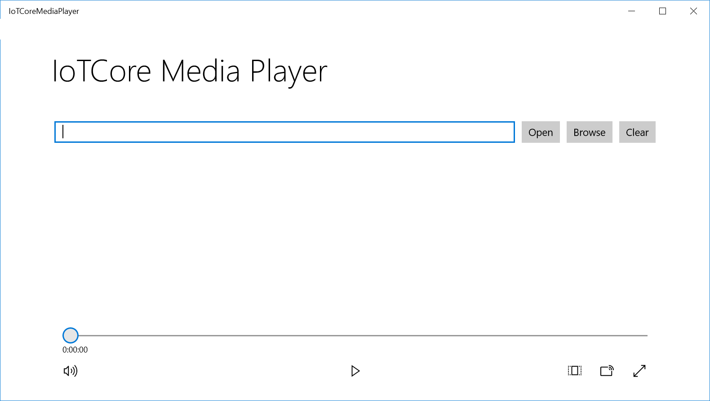

# IoT Core Media Player

In this sample, we'll create a UWP app to demonstrate how to play media files such as music from an IoT device.

## Load the project in Visual Studio

You can find the source code for this sample by downloading a zip of all of our samples [here](https://github.com/Microsoft/Windows-iotcore-samples/archive/master.zip) and navigating to the `Samples/IotCoreMediaPlayer` folder.  Make a copy of the folder on your disk and open the projects from Visual Studio.

Navigate to the IotCoreMediaPlayer project and open the project from Visual Studio.

## IoT Core Media Player contents

The IoT Core Media Player solution contains the Universal Windows Application project that displays a graphical user interface for finding and opening media files on the device.

Right-click on **IotCoreMediaPlayer** project and select **'Set as StartUp Project'** from the pop up menu displayed.

When everything is set up, you should be able to press F5 from Visual Studio.  The IoT Core Media Player app will deploy and start on the Windows IoT device.

## How It Works

When the sample is built and executed, the app will look like this on the screen:



The sample utilizes the MediaElement object to specify what media to play, and also to start and stop playback of the media, which is found in MainPage.xaml:

``` HTML
    <MediaElement x:Name="mediaElement" Grid.Row="2" Grid.Column="1" Margin="0,20" AreTransportControlsEnabled="True" />
```
The user is able to browse for a media file stored on the device by clicking on the Browse button.  For more information about transferring media files to the storage of the device, see [File Transfer Protocol](https://docs.microsoft.com/en-us/windows/iot-core/connect-your-device/FTP) documentation.

Once a media file is selected, the sample sets the media using this instruction in MainPage.xaml.cs:

```csharp
	mediaElement.SetSource(stream, Picker_SelectedFile.ContentType);
```
For more information and documentation about the MediaElement object, see [MediaElement Class](https://docs.microsoft.com/en-us/uwp/api/Windows.UI.Xaml.Controls.MediaElement) documentation.


