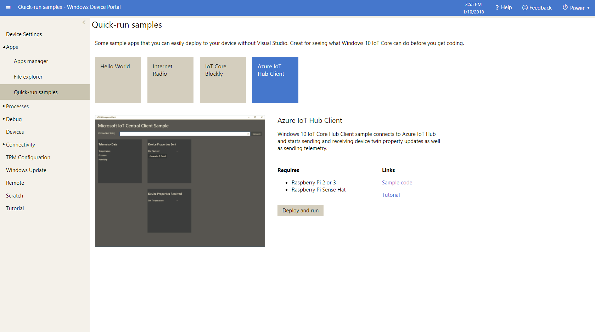

# Azure IoT Hub Client Sample

# Walk-through: Connecting to Microsoft IoT Central

[Additional documentation for this sample](https://blogs.windows.com/buildingapps/2015/12/09/windows-iot-core-and-azure-iot-hub-putting-the-i-in-iot/) 

#### In this article

This article describes how, as a device developer, to connect a device running a Windows 10 IoT Core device (like Raspberry Pi) to your Microsoft IoT Central application using the C# programming language.

### Before you begin

To complete the steps in this article, you need the following:

- A Microsoft IoT Central application created from the Sample Devkits application template. For more information, see [Create your Microsoft IoT Central Application](https://docs.microsoft.com/en-us/microsoft-iot-central/howto-create-application).
- A device running the Windows 10 IoT Core operating system.  For this walkthrough, we will use a Raspberry Pi.  
- Visual Studio installed (only needed if you are going to build/deploy the source code). 
  - With 'The Universal Windows Platform development' workload installed.

## Add a Real Device in Microsoft IoT Central

In Microsoft IoT Central, 

- Add a real device from the Raspberry Pi device template.
- Make a note of the device connection string. For more information, see Add a real device to your [Microsoft IoT Central application](https://docs.microsoft.com/en-us/microsoft-iot-central/tutorial-add-device).

## Setup A Physical Device

To setup a physical device, we need:

- A device running Windows IoT Core operating system.
  - To do that, follow the steps described [here](https://developer.microsoft.com/en-us/windows/iot/getstarted/prototype/setupdevice).
- A client application that can communicate with Microsoft IoT Central.
  - You can either build your own custom application using the Azure SDK and deploy it to your device (using Visual Studio). OR
  - You can download a pre-built sample and simply deploy and run it on the device.

## Deploy The Pre-built Sample Client Application to The Device

To deploy the client application to your Windows IoT Device,

- Ensure the connection string is stored on the device for the client application to use.
  - On the desktop, save the connection string in a text file named connection.string.iothub.
  - Copy the text file to the device’s document folder:
     - <i>[device-IP-address]</i>\C$\Data\Users\DefaultAccount\Documents\connection.string.iothub
- Go to the device web portal (in any browser, type http://<i>[device-IP-address]</i>:8080) (This will allow you to manage many aspects of your Windows IoT device. The feature we’ll need for this exercise is app installation).
  - On the left, expand the ‘Apps’ node.
  - Click ‘Quick-run samples’
  - Click ‘Azure IoT Hub Client’
  - Click ‘Deploy and run’

The application should launch on the device, and will look something like this:

In Microsoft IoT Central, you can see how the code running on the Raspberry Pi interacts with the application:

- On the Measurements page for your real device, you can see the telemetry.
- On the Properties page, you can see the value of the reported Die Number property.
- On the Settings page, you can change various settings on the Raspberry Pi such as voltage and fan speed.

## Source Code

You can see the source code for the client application on the Windows IoT samples page [here](https://github.com/Microsoft/Windows-iotcore-samples/tree/develop/Samples/Azure/IoTHubClients).

## Additional resources
* [Windows 10 IoT Core home page](https://developer.microsoft.com/en-us/windows/iot/)

This project has adopted the Microsoft Open Source Code of Conduct. For more information see the Code of Conduct FAQ or contact <opencode@microsoft.com> with any additional questions or comments.

