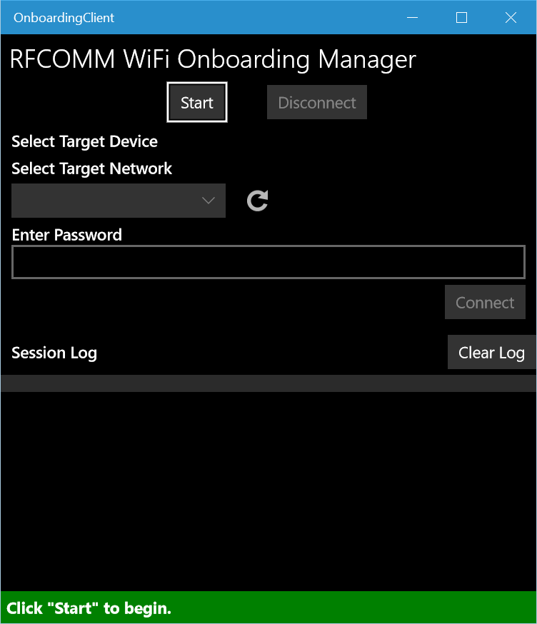
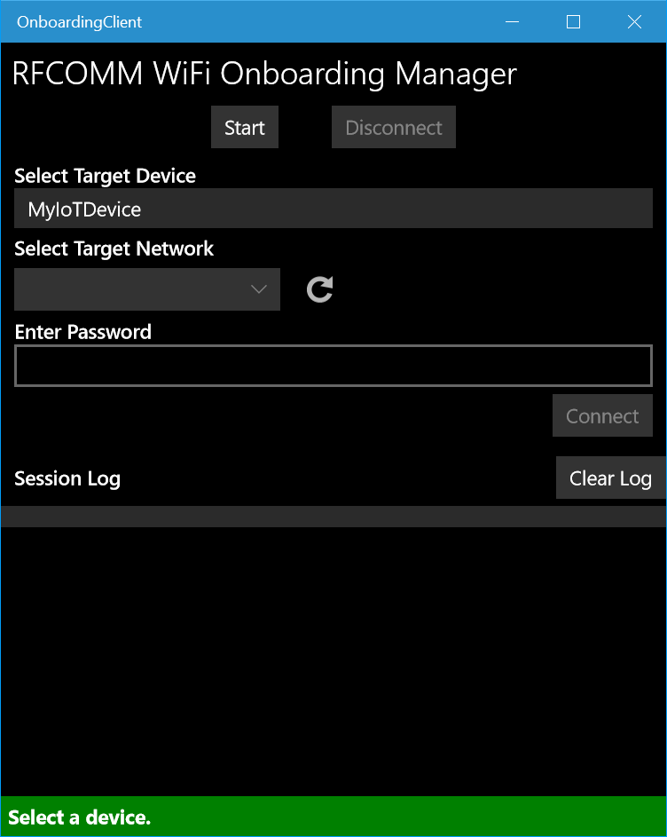
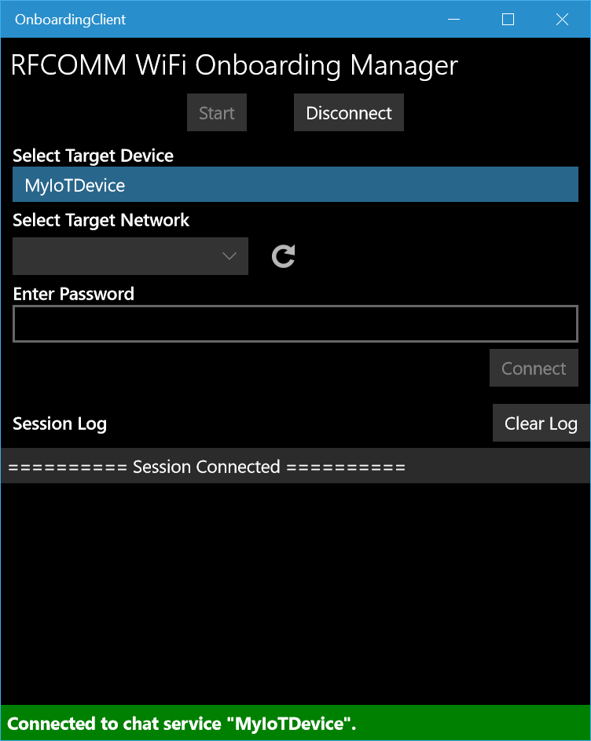
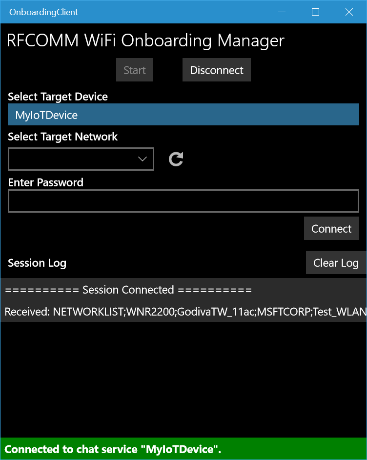
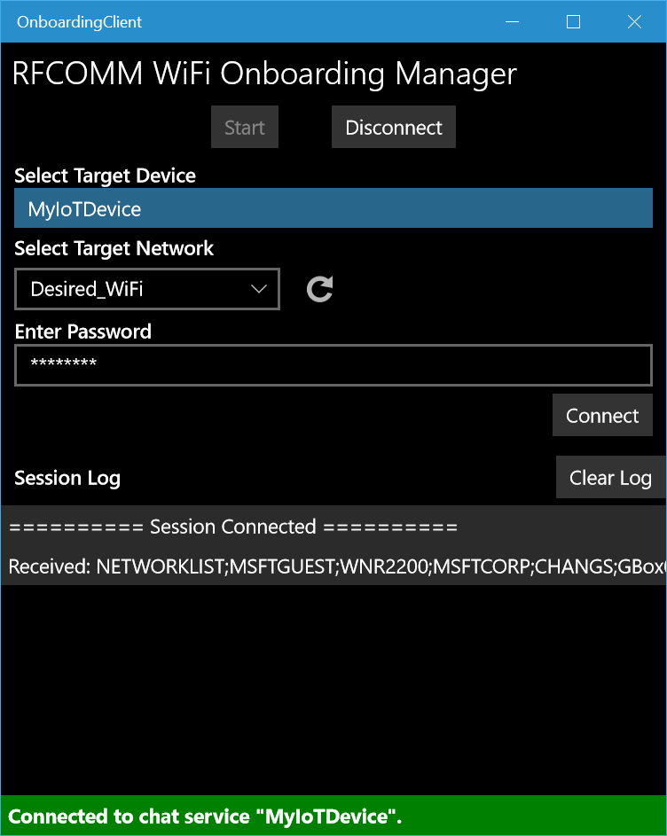
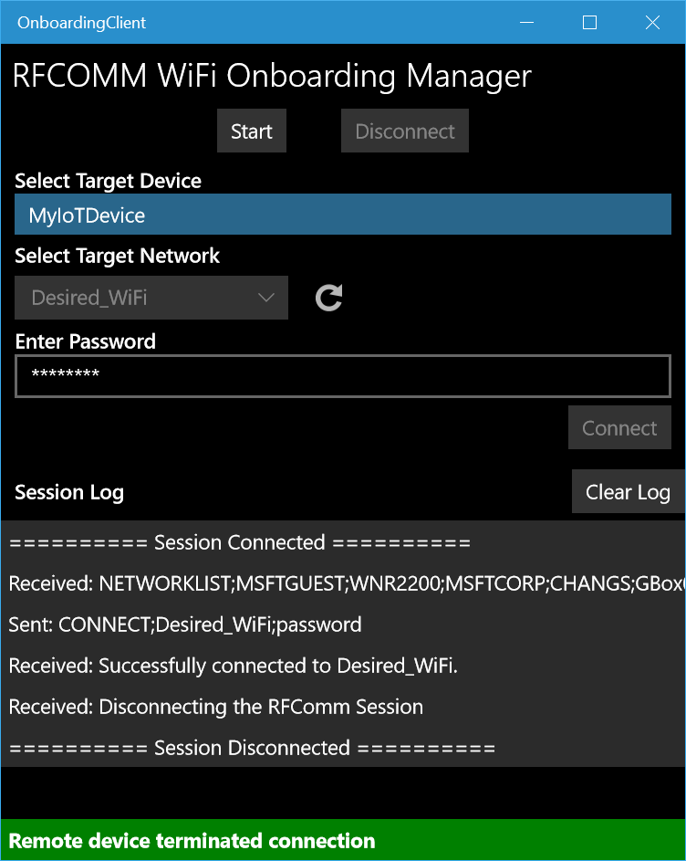

# IoT WiFi Onboarding via Bluetooth (RFCOMM)

This sample shows how to join your Headless IoT Device (an IoT device without a display) to your WiFi network through Bluetooth RFCOMM.

## Prerequisites

1. **IoT Device (Server)**: A headed or headless IoT device with WiFi and Bluetooth capability running Windows 10.
2. **Manager Device (Client)**: A Windows 10 device with WiFi capability. It can be a PC or a even a Windows 10 Phone.
3. **Dev Machine**: A laptop or desktop running Visual Studio 2017 or newer.
4. An available WiFi network for onboarding your IoT device. WiFi network may provide Open Authentication or may be secured with WPA2-PSK authentication. Substitute a Personal Hotspot from a cell phone if desired.

## Design
There are two parts to this sample:

1. **Server** - Running on the IoT Core device. This app (foreground or background) helps the Client connect your IoT Core device to a desired WiFi network.
2. **Client** - Running on Windows 10 system (can be a PC or a phone). This app talks to the RFCOMM server on the IoT Core device to get its network list and sends the network information back to the Server to join a desired WiFi network.
 
The general communication flow between Client and Server


## Usage
### IoT Device Setup
1. Install a clean OS to your IoT Device. If using IoT Dashboard, deselect the "WiFi Network Connection" checkbox when preparing your SD Card.
2. If your IoT Device needs an external Wi-Fi adapter, attach it now.
3. Open the "Server" solution in Visual Studio 2017 on your Dev Machine. Build and deploy the Server app to your IoT Device.
4. Set the Server App as the Default App. You may follow the directions [here](https://docs.microsoft.com/en-us/windows/iot-core/develop-your-app/setupdefaultapp).
5. Turn off the IoT Device for now.

### Wi-Fi Network Setup
1.  Ensure your WiFi router is on and configured to allow a network connection.

### Manager Device Setup
1. On your Manager Device, go to *Settings* > *About* to get the **Device Name** under *Device Specifications*.
2. Open the "Client" solution in Visual Studio 2017 on your Dev Machine.
3. Open **SampleConfiguration.cs**, find the line
    ```csharp
    public const string TARGET_NAME = "<DESKTOP_NAME>";
    ```
    and replace `<DESKTOP_NAME>` with **Device Name** of your Manager Device.
4. If you have only one network adapter on your IoT Device, skip to Step 5. Otherwise:
    1. Open **NetworkManager.cs**, and Search for `//TODO:`.
    2. Edit the the following section to find your targeted network adatper:
        ```csharp
        //Get the first WiFi adatper from the list. 
        //TODO: Edit this part if the system has more than one WiFi adatpers.
        m_wiFiAdapter = m_wiFiAdapterList[0];
        ```
5. Build and deploy the Client app to your Manager Device.

### Onboard your IoT Device 
1. Turn on Bluetooth on your Manager Device. Make sure it is **discoverable** by other devices.
2. Turn on your IoT Device.
3. On you Manager Device, wait for the incoming pairing notifcation from your IoT Device. Complete the Bluetooth pairing.
4. Once the Bluetooth connection between the IoT Device and Manager Device is successfully established, open the Client app on Manager Device. Press the **Start** button.

	

5. Select the IoT Device as the **Target Device**. The Client app will attempt to connect to the RFCOMM server on the selected device.

	

6. Once the RFCOMM session is established, the IoT Device will send a list of available network. On the Client app, select the desired WiFi network and enter the password. Click **Connect** to join the WiFi network.

	
	

7. Once the WiFi connection is established, the IoT Device will terminates the RFCOMM session. The network information is cached in the app. Next time when the Server apps starts, it will automatically connect to the last WiFi network it successfully connected to. If it fails to connect to the network, it will starts from Step 1 again.

	
	

## Additional Information
### Bluetooth RFCOMM
Please refer to [Bluetooth RFCOMM](https://docs.microsoft.com/en-us/windows/uwp/devices-sensors/send-or-receive-files-with-rfcomm) for more information on UWP implementation.

### Credential locker
We use credential locker to securely cache WiFi network information. Please refer to [Credential Locker](https://docs.microsoft.com/en-us/windows/uwp/security/credential-locker) for more information.
