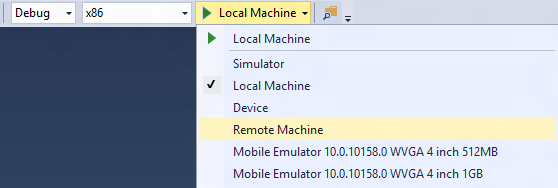
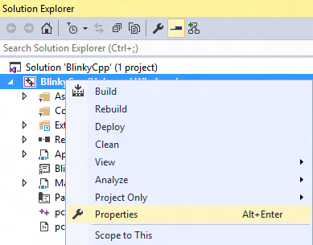

# IoT Startup App sample

We'll create a UWP app to demonstrate how one can create a simple startup app that can list all the installed apps on the IoT Core System using PackageManager API. We will also demonstrate how we can use the APIs to launch an app.

**Note:** The sample uses a restricted capability '*packageQuery*' to use the PackageManager APIs.

## Load the project in Visual Studio

You can find the source code for this sample by downloading a zip of all of our samples [here](https://github.com/ms-iot/samples/archive/develop.zip) and navigating to the `samples-develop\IoTHomeAppSample\IoTStartApp`. The sample code is in C++. Make a copy of the folder on your disk and open the project from Visual Studio.
With the application open in Visual Studio, set the architecture in the toolbar dropdown. If you’re building for MinnowBoard Max, select x86. If you’re building for Raspberry Pi 2 or 3, select ARM.
Next, in the Visual Studio toolbar, click on the Local Machine dropdown and select Remote Machine.



Next, right click on your project in the Solution Explorer pane. Select Properties.



Under Configuration Properties -> Debugging, modify the following fields:
Machine Name: If you previously used PowerShell to set a unique name for your device, you can enter it here (in this example, we’re using my-device). Otherwise, use the IP address of your Windows IoT Core device.
Authentication Mode: Set to Universal (Unencrypted Protocol)


When everything is set up, you should be able to press F5 from Visual Studio. The IoT Startup App will deploy and start on the Windows IoT device.

## Let's look at the code

### Adding the Restricted Capability

As noted earlier, in order to use the PackageManager APIs from the UWP app, we need to add the restricted capability to the *Package.appxManifest* file. The Visual Studio Manifest Designer doesn't allow adding restricted capability. Hence, we will have to manually edit the file and insert the folowing in the *Capabilities* section:
```xml
<Capabilities>
...
<!-- Restricted Capability to use PackageManager APIs in UWP app -->
<rescap:Capability Name="packageQuery" />
```

### Enumerating the Apps
The following code shows how to enumerate the apps:
```c++
public ref class AppListItem sealed
{
public:
    property Windows::UI::Xaml::Media::Imaging::BitmapImage^ ImgSrc;

    property Platform::String^ Name;

    property Platform::String^ PackageFullName;

    property Windows::ApplicationModel::Core::AppListEntry^ AppEntry;
};
```
```c++
void MainPage::EnumApplications()
{
    m_AppItemList = ref new Vector<AppListItem^>();
    auto mgr = ref new PackageManager();

    auto packages = mgr->FindPackagesForUserWithPackageTypes(nullptr, PackageTypes::Main);

    for (auto& pkg : packages)
    {
        auto task = create_task(pkg->GetAppListEntriesAsync());
        task.then([this, pkg](IVectorView<AppListEntry^>^ entryList)
        {
            for (auto entry : entryList)
            {
                try
                {
                    auto displayInfo = entry->DisplayInfo;

                    auto logo = displayInfo->GetLogo(Size(150.0, 150.0));

                    auto appItem = ref new AppListItem;
                    appItem->Name = displayInfo->DisplayName;
                    appItem->PackageFullName = pkg->Id->FullName;
                    appItem->AppEntry = entry;
                    appItem->ImgSrc = ref new BitmapImage();

                    create_task(logo->OpenReadAsync()).then([this, appItem](IRandomAccessStreamWithContentType^ stream)
                    {
                        appItem->ImgSrc->SetSourceAsync(stream);

                    });
                    m_AppItemList->Append(appItem);
                }
                catch (Exception^ e)
                {
                    OutputDebugString(e->Message->Data());
                }
                catch (...)
                {
                    OutputDebugString(L"Unknown Exception");
                    //ignore
                }
            }
        });
    }
}
```

### Launching the App
The following code shows how to launch the app:
```c++
void MainPage::StackPanel_Tapped(Object^ sender, TappedRoutedEventArgs^ e)
{
    auto appItem = dynamic_cast<AppListItem^>(appList->SelectedItem);

    if (appItem)
    {
        appItem->AppEntry->LaunchAsync();
    }
}
```

More information on PackageManager APIs can be found [here](https://docs.microsoft.com/en-us/uwp/api/Windows.Management.Deployment.PackageManager).
