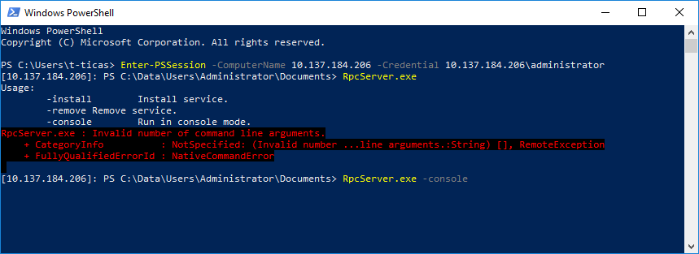

# Running the service and app in IoT

To run the projects in Windows for IoT:

* Set the target platform according to your device (in this example, we're building for a Raspberry Pi 3, so the platform is set to ARM) and build all the projects (Ctrl + Shift + B or Build > Build Solution).
* Copy the service executable to the board. The executable can be found at `cpp/<platform>/<build mode>/RpcServer.exe`, for example `cpp/ARM/Debug/RpcServer.exe` for ARM in debug mode. It can be copied to the board using Windows file sharing (open `\\<board address>\c$` in Windows Explorer). To make it easily accessible, you can put it in `C:\Windows\System32` in the board.
* Login to the board using PowerShell. Run `RpcServer.exe -console`:

* Deploy and run the UWP application through Visual Studio.
