# OpenCV

In this sample, we will build the OpenCV library for Windows and add it to a UWP C++ app, which will run facial and body recognition on a photo.

## Create a new UWP C++ project
___
The sample code is available to download, but as an exercise, we will create this app from scratch.

Even if you download the sample, code, you'll need to follow the steps in **Compile the OpenCV Libraries** and **Add the Libraries to your Project** below.

* Make sure your device is running and set up and you have Visual Studio installed. 
* You will need your device's IP address when connecting to it remotely.

* Make sure you have the C++ components for Visual Studio. To check, open the Start Menu, type in **Visual Studio Installer** and hit enter. Once the Visual Studio Installer opens, click **Modify** under your installed version of Visual Studio. Check to make sure you have the below components selected. If not, select them and update your installation.

    

1. Start Visual Studio 2017.
2. Create a new project with **(File \| New Project...)**.

    In the **New Project** dialog, navigate to **Universal** as shown below (in the left pane in the dialog: Templates \| Visual C++ \| Windows \| Universal).

3. Select the template **Blank App (Windows Universal)**.

    Note that we call the app OpenCVExample. You can name it something different, but you will have to adjust sample code that references OpenCVExample as well.

    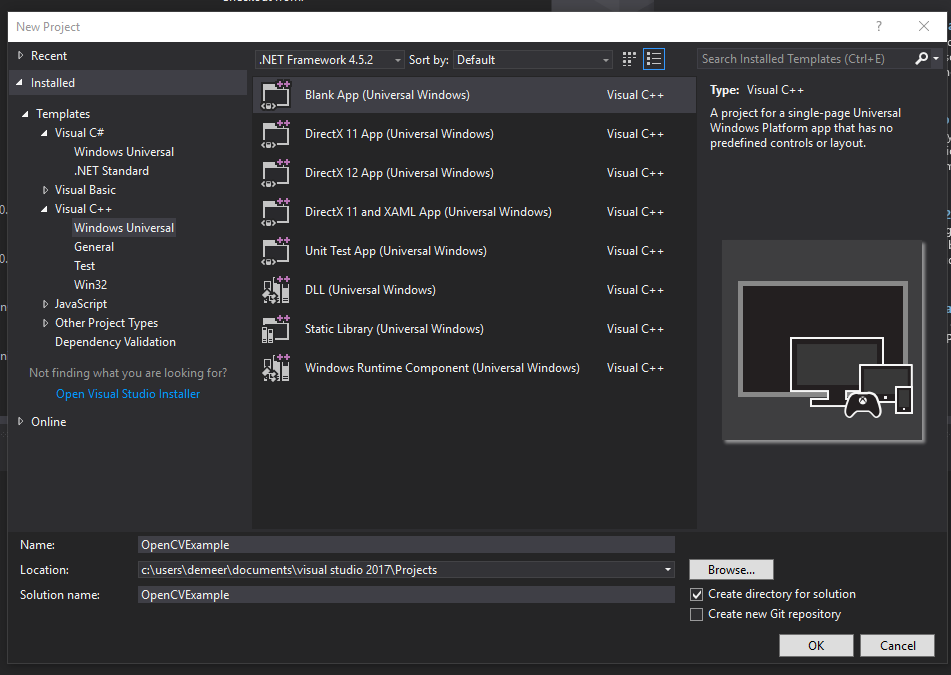

Note: If this is the first project you create, Visual Studio will likely prompt you to enable developer mode for Windows 10.

## Compile the OpenCV Libraries
___
1. Download the Microsoft fork of OpenCV from GitHub

    Download Microsoft's fork of the OpenCV library from [GitHub](https://github.com/Microsoft/opencv/tree/vs2015-samples). Unzip it to a place you can remember it, and **copy the folder's path (i.e. C:/path/to/opencv/)** for the next step.

2. Create the OpenCV environment variable

    Open the Start Menu and enter **Edit the system environment variables** and hit Enter. On the next screen, press **Environment Variables**, then **New**. Create a new variable called **OCV2015_ROOT** with a value of the path you copied, i.e. C:/path/to/opencv/

    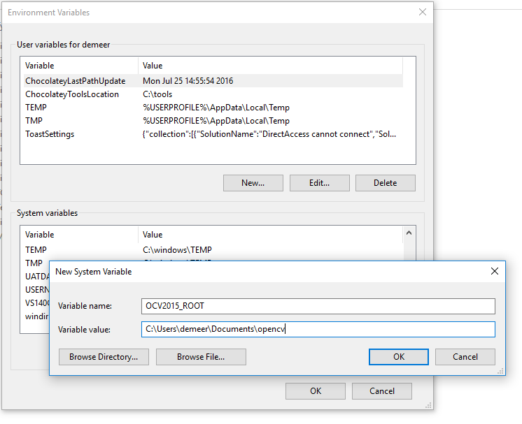

3. Build the solution

    This step depends on your device's architecture. Follow one of the options below:

    * x86 (i.e. Your machine or Minnowboard Max)

        Open the file explorer and navigate to the following path: **"%OCV2015_ROOT%\vs2015\WS\10.0\x86\"**, then open **OpenCV.sln** in Visual Studio.

        On the top of the screen, next to the green Run button, select **Release** instead of Debug and **Win32** instead of ARM or x64.


    * ARM (i.e. Raspberry Pi)

        Open the file explorer and navigate to the following path: **"%OCV2015_ROOT%\vs2015\WS\10.0\ARM\"**, then open **OpenCV.sln** in Visual Studio.

        On the top of the screen, next to the green Run button, select **Release** instead of Debug and **ARM** instead of x86 or x64.

    * x64

        Open the file explorer and navigate to the following path: **"%OCV2015_ROOT%\vs2015\WS\10.0\x64\"**, then open **OpenCV.sln** in Visual Studio.

        On the top of the screen, next to the green Run button, select **Release** instead of Debug and **x64** instead of x86 or ARM.

    Press Ctrl+Shift+B to Build the solution. Alternatively, press Build \| Build Solution. These results should compile without errors. You will have to re-build this project for each platform (x86, x64, or ARM) and release type (Debug or Release) that you want to use.


## Add the Libraries to your Project
___
1. Add the DLLs directly

    Return to your project's Visual Studio window. Right click on the project in the window and navigate to **Add \| Existing Items**

    * x86: In the new window, navigate to %OCV2015_ROOT%\vs2015\WS\10.0\x86\bin\Release

    * ARM: In the new window, navigate to %OCV2015_ROOT%\vs2015\WS\10.0\ARM\bin\Release

    * x64: In the new window, navigate to %OCV2015_ROOT%\vs2015\WS\10.0\x64\bin\Release

    Add the following files: **opencv_core300.dll, open_imgcodecs300.dll, opencv_imgproc300.dll, opencv_ml300.dll, opencv_objdetect300.dll**

    After adding the files, click on each one in the Solution Explorer and make **Content = "True"**

    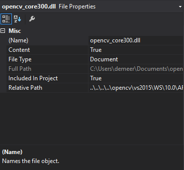


2. Modify you General Properties

    Right click on the **OpenCVExample (Universal Windows)** line of the Solution Explorer and click on **Properties**.

    In the dialog that pops up, navigate to Configuration Properties \| C / C++ \| General. From there, add the following to the **Additional Include Directories** field before the already-present contents:

    %OCV2015_ROOT%\modules\core\include;%OCV2015_ROOT%\modules\imgproc\include;%OCV2015_ROOT%\modules\imgcodecs\include;
    %OCV2015_ROOT%\modules\objdetect\include;%OCV2015_ROOT%\modules\hal\include;%OCV2015_ROOT%\modules\highgui\include;
    %OCV2015_ROOT%\modules\ml\include;

    For each new DLL you want to add, you need to add the appropriate "include" directory to this field.

    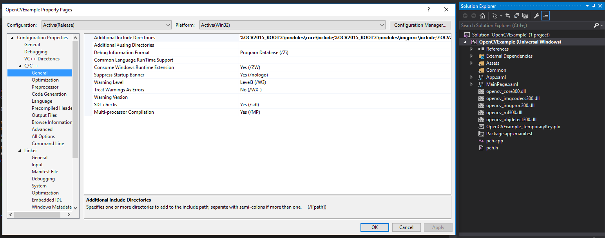

3. Modify your Linker Properties

    In the Properties window still, navigate to Linker \| General, then add the following to the **Additional Library Directories** field:

    * x86: %OCV2015_ROOT%\vs2015\WS\10.0\x86\lib\release;%(AdditionalLibraryDirectories)

    * ARM: %OCV2015_ROOT%\vs2015\WS\10.0\ARM\lib\release;%(AdditionalLibraryDirectories)

    * x64: %OCV2015_ROOT%\vs2015\WS\10.0\x64\lib\release;%(AdditionalLibraryDirectories)

    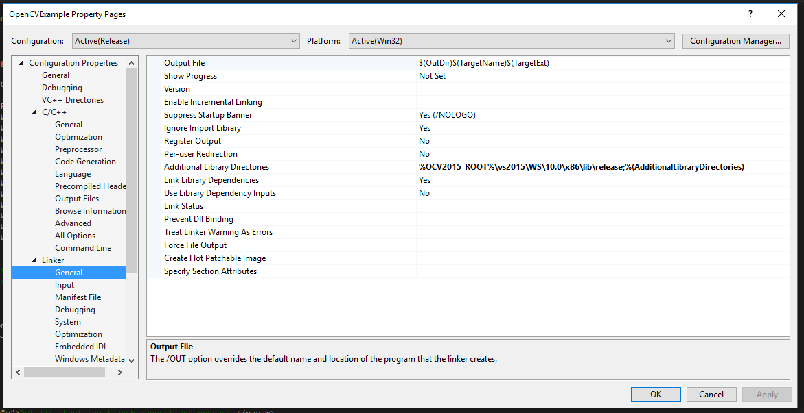

    Switch the menu to Input (still within Linker) and add the following to the **Additional Dependencies** field:

    opencv_core300.lib;opencv_imgproc300.lib;opencv_imgcodecs300.lib;opencv_objdetect300.lib;opencv_ml300.lib;

    For each new DLL you want to add, add the appropriate LIB in this field as well.

    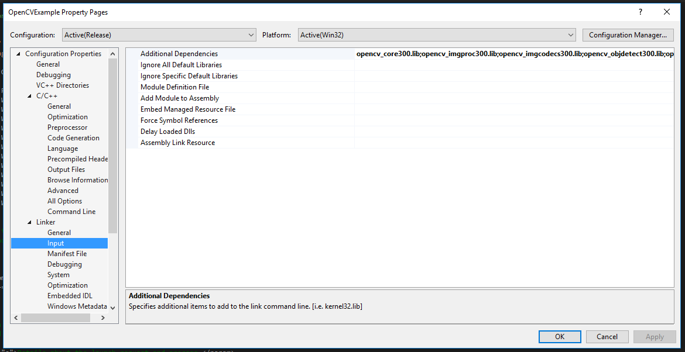

## Set up the User Interface
___
Open MainPage.xaml and replace the existing code with the following code to create the window UI:

``` xml
<Page
    x:Class="OpenCVExample.MainPage"
    xmlns="http://schemas.microsoft.com/winfx/2006/xaml/presentation"
    xmlns:x="http://schemas.microsoft.com/winfx/2006/xaml"
    xmlns:local="using:OpenCVExample"
    xmlns:d="http://schemas.microsoft.com/expression/blend/2008"
    xmlns:mc="http://schemas.openxmlformats.org/markup-compatibility/2006"
    mc:Ignorable="d">

    <Grid Background="{ThemeResource ApplicationPageBackgroundThemeBrush}">
        <Button x:Name="loadImageButton" Content="Test Image" HorizontalAlignment="Left" Height="31" Margin="19,72,0,0" VerticalAlignment="Top" Width="102" Click="loadImageButton_Click"/>
        <Image x:Name="storedImage" HorizontalAlignment="Left" Height="505" Margin="180,10,0,0" VerticalAlignment="Top" Width="955" Stretch="None"/>
        <Button x:Name="cannyEdgesButton" Content="Canny" HorizontalAlignment="Left" Height="31" Margin="19,146,0,0" VerticalAlignment="Top" Width="102" Click="cannyEdgesButton_Click"/>
        <Button x:Name="detectFeaturesButton" Content="Detect" HorizontalAlignment="Left" Height="31" Margin="19,221,0,0" VerticalAlignment="Top" Width="102" Click="detectFeaturesButton_Click"/>

    </Grid>
</Page>
```

To view the entire UI, change the dropdown in the top left corner from '5" Phone' to '12" Tablet'.

## Modify the actual C++ Files
___

### Modify the Header File

Open MainPage.xaml.h. Replace the contents with the following code:

``` C++
//
// MainPage.xaml.h
// Declaration of the MainPage class.
//

#pragma once

#include "MainPage.g.h"
#include <opencv2\core\core.hpp>

namespace OpenCVExample
{
    /// <summary>
    /// An empty page that can be used on its own or navigated to within a Frame.
    /// </summary>
    public ref class MainPage sealed
    {
    public:
        MainPage();
    private:
        cv::Mat _stored_image;
        void UpdateImage(const cv::Mat& image);
    private:
        void loadImageButton_Click(Platform::Object^ sender, Windows::UI::Xaml::RoutedEventArgs^ e);
        void cannyEdgesButton_Click(Platform::Object^ sender, Windows::UI::Xaml::RoutedEventArgs^ e);
        void detectFeaturesButton_Click(Platform::Object^ sender, Windows::UI::Xaml::RoutedEventArgs^ e);
    };
}

```

The header file stablishes the functions we're going to declar in the main .cpp file, as well as a private variable (*_stored_image*) which stores the content of the *storedImage* XAML Image element once we upload it.

### Add the Includes and Namespaces to the .cpp file

Add the following header files to the top of your code, right after the #include "MainPage.xaml.h" line:

``` C++
#include <opencv2\imgproc\types_c.h>
#include <opencv2\imgcodecs\imgcodecs.hpp>
#include <opencv2\core\core.hpp>
#include <opencv2\imgproc\imgproc.hpp>
#include <opencv2\objdetect.hpp>
#include <Robuffer.h>

using namespace Windows::UI::Xaml::Media::Imaging;
using namespace Windows::Storage::Streams;
using namespace Microsoft::WRL;

const cv::String face_cascade_name = "Assets/haarcascade_frontalface_alt.xml";
const cv::String body_cascade_name = "Assets/haarcascade_fullbody.xml";
```

These lines allow us to use OpenCV library functions, along with some necessary default classes as well. We also define the locations of the features classifiers we'll use later.

### Add the UpdateImage function

Add the following function right after the MainPage Constructor

``` C++
void  OpenCVExample::MainPage::UpdateImage(const cv::Mat& image)
{
    // Create the WriteableBitmap
    WriteableBitmap^ bitmap = ref new WriteableBitmap(image.cols, image.rows);

    // Get access to the pixels
    IBuffer^ buffer = bitmap->PixelBuffer;
    unsigned char* dstPixels = nullptr;

    // Obtain IBufferByteAccess
    ComPtr<IBufferByteAccess> pBufferByteAccess;
    ComPtr<IInspectable> pBuffer((IInspectable*)buffer);
    pBuffer.As(&pBufferByteAccess);

    // Get pointer to pixel bytes
    HRESULT get_bytes = pBufferByteAccess->Buffer(&dstPixels);
    if (get_bytes == S_OK) {
        memcpy(dstPixels, image.data, image.step.buf[1] * image.cols*image.rows);

        // Set the bitmap to the Image element
        storedImage->Source = bitmap;
    }
    else {
        printf("Error loading image into buffer\n");
    }
}
```

This function changes the image contained in the "storedImage" XAML Image element to the contents of the "image" argument.

### Add the Upload Button (loadImageButton) handler

Add the following function right after the UpdateImage function

``` C++
void OpenCVExample::MainPage::loadImageButton_Click(Platform::Object^ sender, Windows::UI::Xaml::RoutedEventArgs^ e)
{
    cv::Mat image = cv::imread("Assets/grpPC1.jpg");
    _stored_image = cv::Mat(image.rows, image.cols, CV_8UC4);
    cv::cvtColor(image, _stored_image, CV_BGR2BGRA);
    UpdateImage(_stored_image);

}
```

This function opens an image and uploads a default image to the *StoredImage* UI element.

### Add the Canny Edge Button (cannyEdgesButton) handler

Add the following function right after the last handler:

``` C++
// run a Canny filter on the image contained in _stored_image, display the results to the image pane
void OpenCVExample::MainPage::cannyEdgesButton_Click(Platform::Object^ sender, Windows::UI::Xaml::RoutedEventArgs^ e)
{
    cv::Mat result;
    cv::Mat intermediateMat;
    // Calculates if each pixel is part of an edge based on the gradient at that pixel
    // If a pixel gradient is higher than 90, the pixel is accepted as an edge
    // If a pixel gradient value is below 80, it is rejected.
    // If the pixel gradient is between 80 and 90, it will be accepted only if it is connected to a pixel with a gradient above 90.
    cv::Canny(_stored_image, intermediateMat, 80, 90);
    cv::cvtColor(intermediateMat, result, CV_GRAY2BGRA);
    UpdateImage(result);
}
```

This function applies [Canny Edge detection](http://docs.opencv.org/2.4/doc/tutorials/imgproc/imgtrans/canny_detector/canny_detector.html) to the image and updates the image container with the results.

### Add the face and body classifiers

Add the following lines and function right after the last handler:

``` C++
void InternalDetectObjects(cv::Mat& inputImg, std::vector<cv::Rect> & objectVector, std::vector<cv::Rect> & objectVectorBodies, cv::CascadeClassifier& face_cascade, cv::CascadeClassifier& body_cascade)
{
    cv::Mat frame_gray;

    cvtColor(inputImg, frame_gray, CV_BGR2GRAY);
    cv::equalizeHist(frame_gray, frame_gray);

    // Detect faces
    face_cascade.detectMultiScale(frame_gray, objectVector, 1.1, 2, 0 | CV_HAAR_SCALE_IMAGE, cv::Size(30, 30));
    //detect bodies
    body_cascade.detectMultiScale(frame_gray, objectVectorBodies, 1.1, 2, 0 | CV_HAAR_SCALE_IMAGE, cv::Size(30, 300));
}
```

This function uses [cascade classification](http://docs.opencv.org/2.4/doc/tutorials/objdetect/cascade_classifier/cascade_classifier.html) to classify and detect bodies and faces in a video stream (or image) using two Haar classifiers, face\_cascade and body\_cascade, stored in the xml files we provided for you. It's a method of classification involving machine learning, as explained on OpenCV's [website](http://docs.opencv.org/2.4/modules/objdetect/doc/cascade_classification.html).

### Add the "Detect Faces and Bodies" button (detectFeaturesButton) event handler

Add the following lines and function right after the last helper function:

``` C++
// run the object detection function on the image and draw rectangles around the results
void OpenCVExample::MainPage::detectFeaturesButton_Click(Platform::Object^ sender, Windows::UI::Xaml::RoutedEventArgs^ e)
{
    cv::CascadeClassifier face_cascade;
    cv::CascadeClassifier body_cascade;

    if (!face_cascade.load(face_cascade_name)) {
        printf("Couldnt load Face detector '%s'\n", face_cascade_name);
        exit(1);
    }

    if (!body_cascade.load(body_cascade_name)) {
        printf("Couldnt load Body detector '%s'\n", body_cascade_name);
        exit(1);
    }

    cv::Mat frame = cv::imread("Assets/grpPC1.jpg");

    if (frame.empty())
        return;

    std::vector<cv::Rect> faces;
    std::vector<cv::Rect> bodies;
    // run object detection
    InternalDetectObjects(frame, faces, bodies, face_cascade, body_cascade);
    // draw red rectangles around detected faces
    for (unsigned int i = 0; i < faces.size(); i++)
    {
        cv::rectangle(_stored_image, faces[i], cv::Scalar(0, 0, 255, 255), 5);
    }
    // draw black rectangles around detected bodies
    for (unsigned int i = 0; i < bodies.size(); i++)
    {
        cv::rectangle(_stored_image, bodies[i], cv::Scalar(0, 0, 0, 255), 5);
    }
    // draw the image in the pane
    UpdateImage(_stored_image);
}
```

This function loads the classifiers, re-reads the image (the classification doesn't work on a Canny image in case the user clicked that button first), finds the faces and bodies using the helper function from the last step, and draws rectangles around the results: red for the faces, black for the bodies. It then pushes the updated image to the container.

### Add in the Resources

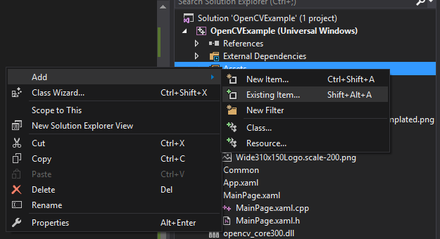

Download the [picture](../../Resources/images/OpenCV/grpPC1.jpg), [face classifier](https://github.com/ms-iot/content/blob/develop/Resources/data_models/opencv/haarcascade_frontalface_alt.xml), and [body classifier](https://github.com/ms-iot/content/blob/develop/Resources/data_models/opencv/haarcascade_fullbody.xml) and add them to your Assets folder within your project.

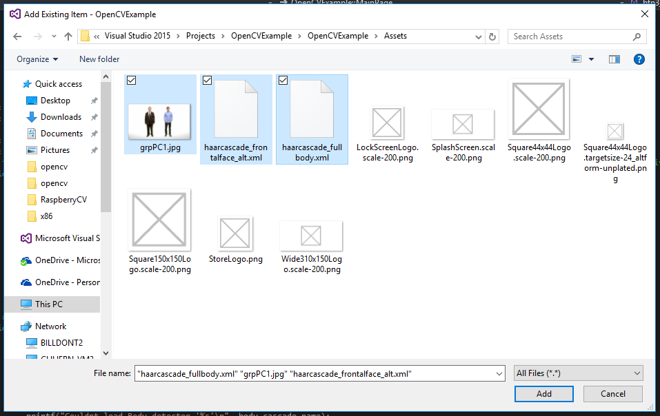

## Optional: Build and test your app locally
___

1. If you've built the x86 version of OpenCV, you can test the program on your local machine.  Make sure the app builds correctly by invoking the **Build \| Build Solution** menu command.

2. Press F5 to run the program on your machine.

    Press the "Test Image" button to see the test image.

    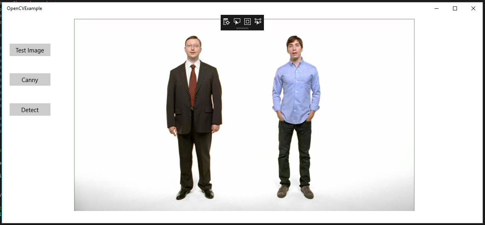

    Press the "Canny" button to see the Canny edges on the test image.

    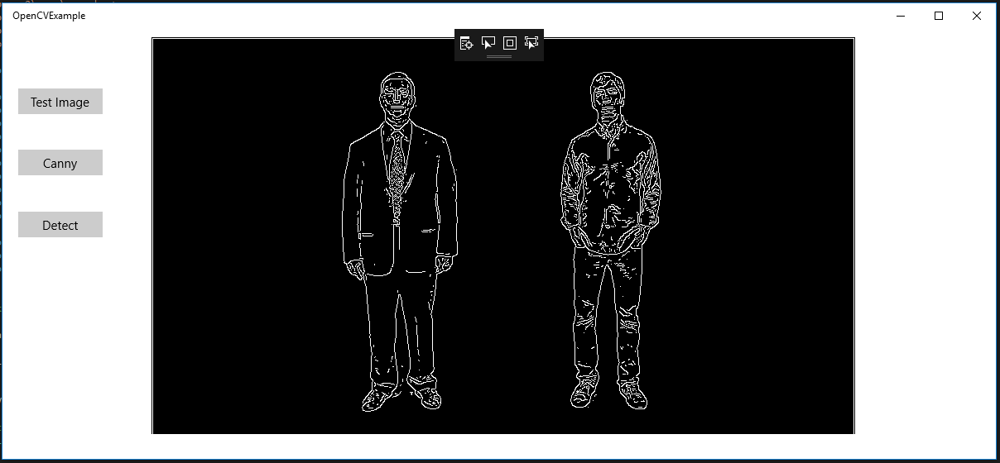

    Press the "Detect" button to see the detected faces and bodies in the image indicated by rectangles.

    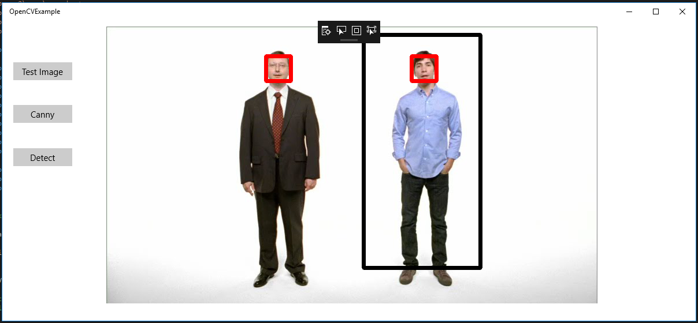

    Close the app once you're done validating its correct operation.

## Deploy the app to your Windows 10 IoT Core Device
___

1. Click on the dropdown next to the **Local Machine** label and click on **Remote Machine**. Make sure the dropdown just to the left says your device's architecture, either **x86**, **x64**, or **ARM**. The **Remote Machine** click should open a dialog. Enter your device's IP address (or unique name) into the field labeled *Address*, then press **Select.**

2. If the dialog does not appear, right click on your project and go to the Properties menu. From there, click on Debugging. Clicking on **Machine Name** and then **Locate** should provide the same dialog to enter the device's IP address.

    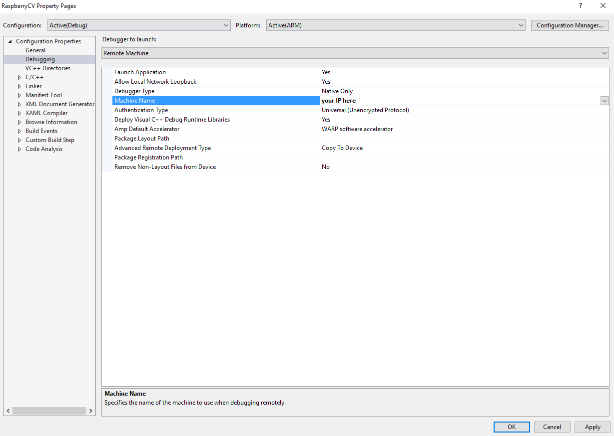

    

    Make sure the device is powered on, then click the "Run" button. The app should run on your device.

4. Congratulations! Your app should now be working!

## Notes:
- Make sure if you have Latest or Required Windows 10 SDK mentioned in the Project.  Right click on Project -> Properties -> General ( under Configuration Properties ) -> Target Platform Version 
- Make sure to following the Instructions provided in above link
- Compile OpenCV.sln as per link Instructions
- Then Try to Compile this current solution as there are some dependency libraries thats get used in here.


## Troubleshoot:
- error LNK1104: cannot open file 'opencv_core300d.lib'
     Can be 2 reasons
     - a. You might not have followed [OpenCV documentation](https://developer.microsoft.com/en-us/windows/iot/samples/OpenCV) and did not configure Environment Variable
     - b. You might have not compiled OpenCV.sln for respective platform for which you are trying to compile OpenCVExample.sln
