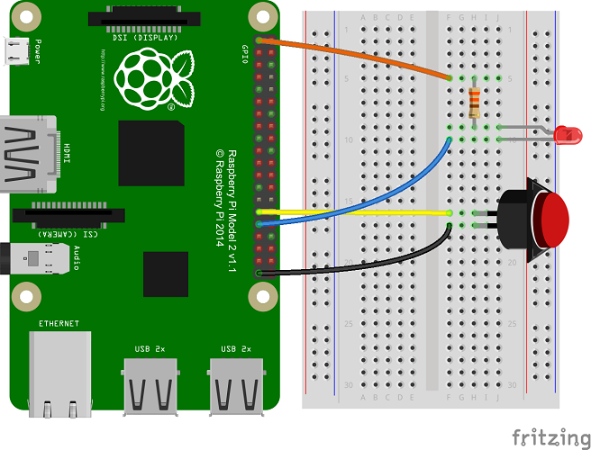
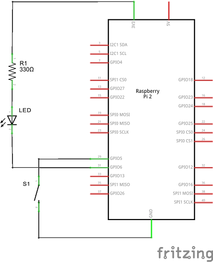
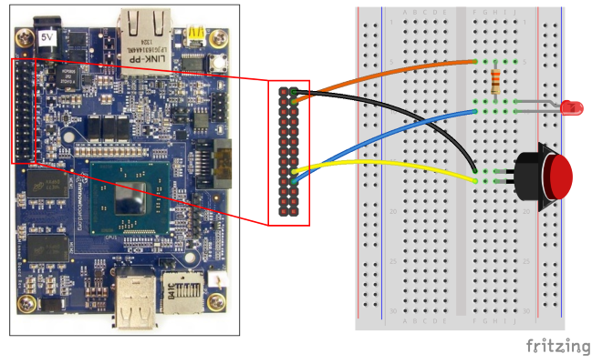
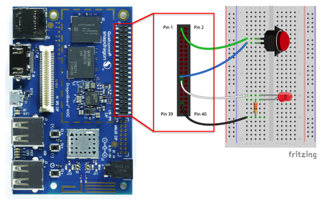
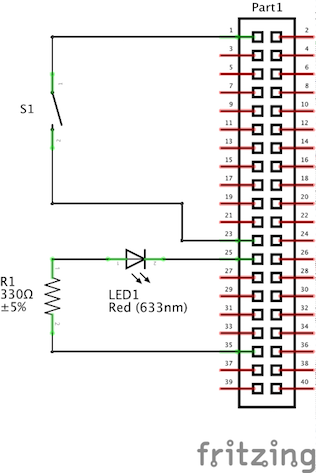

# Push button

In this sample, we connect a push button to your Raspberry Pi 2 or 3, Up Squared*, or the DragonBoard 410c and use it to control an LED. We use GPIO interrupts to detect when the button is pressed and toggle the LED in response.

*The Up Squared should be used in place of the Minnowboard Max. We are in the process of updating our documentation to reflect this change.  


This is a headed sample, so please ensure that your device is in headed
mode by running this command: `setbootoption.exe headed` (changing the headed/headless state will require a reboot).

Also, be aware that the GPIO APIs are only available on Windows IoT Core, so this sample cannot run on your desktop.


### Components

You will need the following components :

* [EG1311-ND Tactile Button](http://www.digikey.com/product-detail/en/320.02E11.08BLK/EG1311-ND/101397)

* [Red LED](http://www.digikey.com/product-detail/en/C5SMF-RJS-CT0W0BB1/C5SMF-RJS-CT0W0BB1-ND/2341832)

* [330 &#x2126; resistor](http://www.digikey.com/product-detail/en/CFR-25JB-52-330R/330QBK-ND/1636)

* Breadboard and several male-to-female for the Raspberry Pi 2 or 3 or MinnowBoard Max or male-to-male wires for the DragonBoard

### Connect the circuit to your device

Let's start by wiring up the components on a breadboard. Visit the corresponding **Raspberry Pi 2 or 3, MinnowBoard Max, or DragonBoard 410c** sections below depending on your device.

#### Raspberry Pi 2 or 3

| Breadboard Diagram                                                                        | Schematic                                                                          |
| ----------------------------------------------------------------------------------------- | ---------------------------------------------------------------------------------- |
|       |  |

<sub>*Images made with [Fritzing](http://fritzing.org/)*</sub>

##### Connecting the LED

* Connect the cathode (the shorter leg) of the LED to Pin 31 (GPIO 6) of the Raspberry Pi 2 or 3

* Connect the anode (the longer leg) of the LED to one lead of the 330 &#x2126; resistor

* Connect the other end of the 330 &#x2126; resistor to Pin 1 (3.3V) on Raspberry Pi 2 or 3

##### Connecting the Push Button

* Connect one pin of the push button to Pin 29 (GPIO 5) of the Raspberry Pi 2 or 3

* Connect the other pin of the push button to the ground

Here is the pinout of the RPi2 and RPi3:


<sub>*Image made with [Fritzing](http://fritzing.org/)*</sub>

#### MinnowBoard Max

| Breadboard Diagram                                                                        | Schematic                                                                          |
| ----------------------------------------------------------------------------------------- | ---------------------------------------------------------------------------------- |
|        |   |

<sub>*Images made with [Fritzing](http://fritzing.org/)*</sub>

##### Connecting the LED

* Connect the cathode (the shorter leg) of the LED to Pin 20 (GPIO 6) of the MinnowBoard Max

* Connect the anode (the longer leg) of the LED to one lead of the 330 &#x2126; resistor

* Connect the other end of the 330 &#x2126; resistor to Pin 4 (3.3V) on MinnowBoard Max

##### Connecting the Push Button

* Connect one pin of the push button to Pin 18 (GPIO 5) of the MinnowBoard Max

* Connect the other pin of the push button to the Pin 2 (Ground)

Here is the pinout of the MBM:


<sub>*Image made with [Fritzing](http://fritzing.org/)*</sub>

#### DragonBoard 410c

For reference, the functionality of the low-speed expansion connector is outlined in the following diagram


Perform the following steps to connect the LED:

* Connect the cathode (the shorter leg) of the LED to pin 25 (GPIO 13)
* Connect the annode (the longer leg) of the LED to one lead of the 330 &#x2126; resistor
* Connect the other end of the 330 &#x2126; resistor to pin 35 (1.8V PWR)

Perform the following steps to connect the push button:

* Connect one pin of the push button to pin 23 (GPIO 36)
* Connect the other pin of the push button to pin 1 (GND)

The breadboard might look similar to the following with the circuit assembled:



A schematic for the circuit is shown in the diagram below:



Finally, the LED_PIN and BUTTON_PIN variables of the **MainPage.xaml.cs** file of the sample code will need the following modification:

```csharp
private const int LED_PIN = 13;
private const int BUTTON_PIN = 36;
```

### Building and running the sample

1. Download a zip of all of our samples [here](https://github.com/Microsoft/Windows-iotcore-samples/archive/master.zip).
1. Open `samples-develop\PushButton\CS\PushButton.csproj` in Visual Studio.
1. If you have **Raspberry Pi 2 or 3** or **DragonBoard 410c**, Select `ARM` for the target architecture. Otherwise, for **MinnowBoard Max** select `x86`
1. Go to `Build -> Build Solution`
1. Select `Remote Machine` from the debug target
1. Hit F5 to deploy and debug. Enter the IP address of your device
   and select `Universal` for the authentication type.

### Let's look at the code

First, we open the GpioPin resources we'll be using. The button is connected to
GPIO5 in active LOW configuration, meaning the signal will be HIGH when the
button is not pressed and the signal will go LOW when the button is pressed.
We'll be using the LED, connected to GPIO6, which is connected in
active LOW configuration, meaning driving the pin HIGH will turn off the LED
and driving the pin LOW will turn on the LED.

```csharp
buttonPin = gpio.OpenPin(BUTTON_PIN);
ledPin = gpio.OpenPin(LED_PIN);
```

We initialize the LED in the OFF state by first latching a HIGH value onto the
pin. When we change the drive mode to Output, it will immediately drive the
latched output value onto the pin. The latched output value is undefined when
we initially open a pin, so we should always set the pin to a known state
before changing it to an output. Remember that we connected the other end 
of the LED to 3.3V, so we need to drive the pin to low to have current flow into the LED.

```csharp
// Initialize LED to the OFF state by first writing a HIGH value
// We write HIGH because the LED is wired in a active LOW configuration
ledPin.Write(GpioPinValue.High); 
ledPin.SetDriveMode(GpioPinDriveMode.Output);
```

Next, we set up the button pin. For the Raspberry Pi 2 or 3 or the DragonBoard 410c, we take advantage of the fact that it has 
built-in pull up resistors that we can activate. We use the built-in pull up resistor so that we don't need to supply a resistor externally. 
The MinnowBoard Max has 10k&#x2126; pull-up resistors that are on by default and not configurable, so we insert a check to make sure this drive mode is supported.

```csharp
// Check if input pull-up resistors are supported
if (buttonPin.IsDriveModeSupported(GpioPinDriveMode.InputPullUp))
	buttonPin.SetDriveMode(GpioPinDriveMode.InputPullUp);
else
	buttonPin.SetDriveMode(GpioPinDriveMode.Input);
```

Next we connect the GPIO interrupt listener. This is an event that will get
called each time the pin changes state. We also set the DebounceTimeout
property to 50ms to filter out spurious events caused by electrical noise.
Buttons are mechanical devices and can make and break contact many times on a
single button press. We don't want to be overwhelmed with events so we filter
these out.

```csharp
// Set a debounce timeout to filter out switch bounce noise from a button press
buttonPin.DebounceTimeout = TimeSpan.FromMilliseconds(50);

// Register for the ValueChanged event so our buttonPin_ValueChanged 
// function is called when the button is pressed
buttonPin.ValueChanged += buttonPin_ValueChanged;
```

In the button interrupt handler, we look at the edge of the GPIO signal to
determine whether the button was pressed or released. If the button was
pressed, we flip the state of the LED.

```csharp
private void buttonPin_ValueChanged(GpioPin sender, GpioPinValueChangedEventArgs e)
{
	// toggle the state of the LED every time the button is pressed
	if (e.Edge == GpioPinEdge.FallingEdge)
	{
		ledPinValue = (ledPinValue == GpioPinValue.Low) ?
			GpioPinValue.High : GpioPinValue.Low;
		ledPin.Write(ledPinValue);
	}
```

We also want to update the user interface with the current state of the
pin, so we invoke an update operation on the UI thread. Capturing the result
of an async method in a local variable is necessary to suppress a compiler
warning when we don't want to wait for an asynchronous operation to complete.

```csharp
// need to invoke UI updates on the UI thread because this event
// handler gets invoked on a separate thread.
var task = Dispatcher.RunAsync(CoreDispatcherPriority.Normal, () => {
	if (e.Edge == GpioPinEdge.FallingEdge)
	{
		ledEllipse.Fill = (ledPinValue == GpioPinValue.Low) ? 
			redBrush : grayBrush;
		GpioStatus.Text = "Button Pressed";
	}
	else
	{
		GpioStatus.Text = "Button Released";
	}
});
```

That's it! Each time you press the button, you should see the LED change
state.
