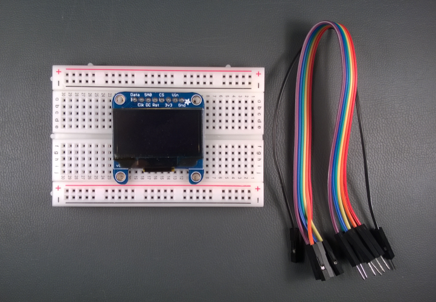
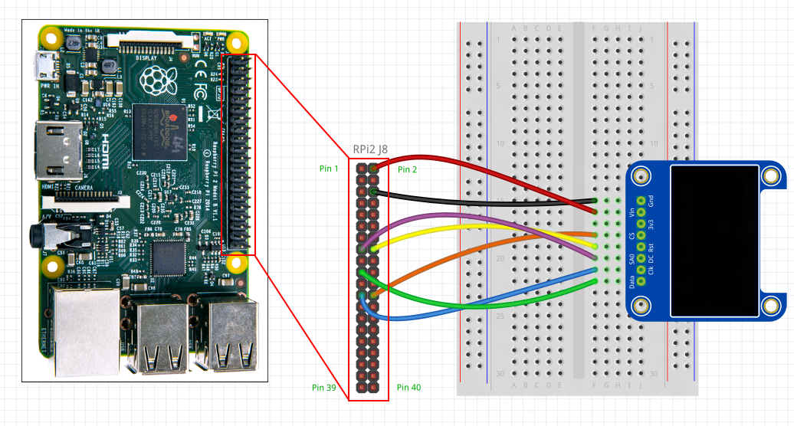
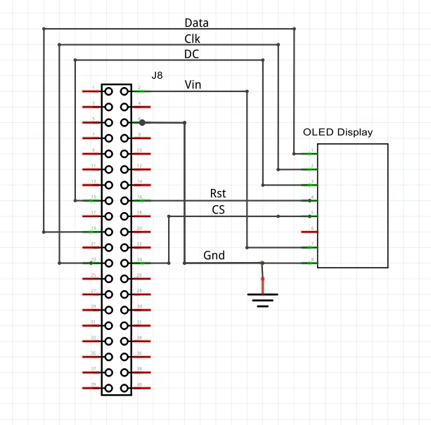
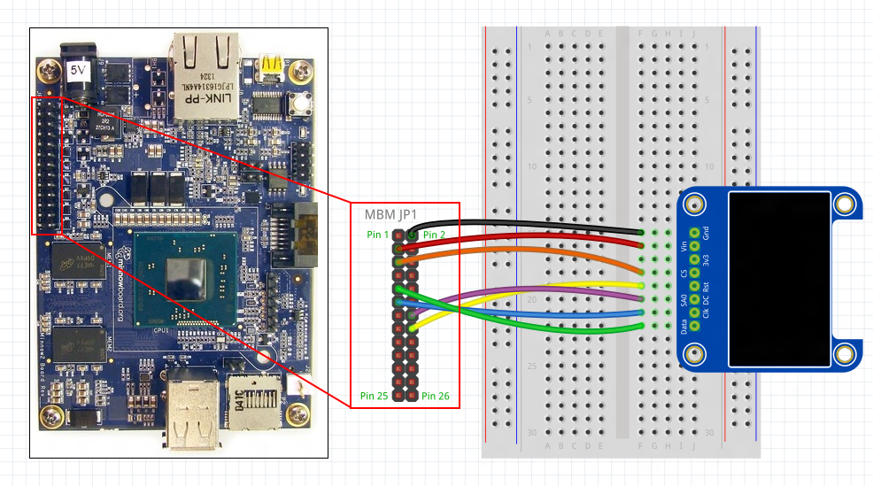
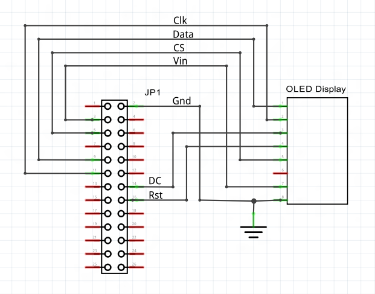
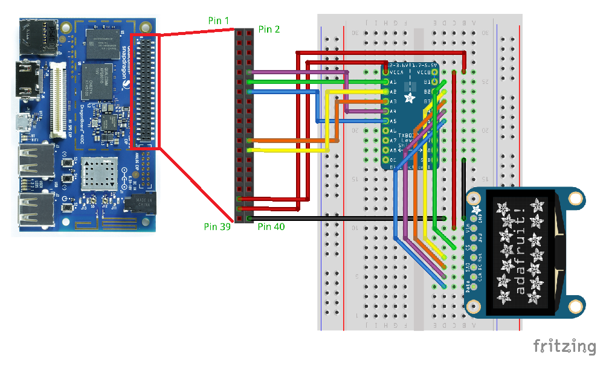
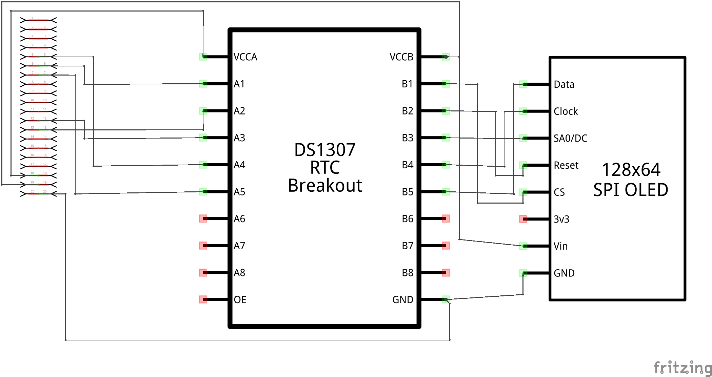
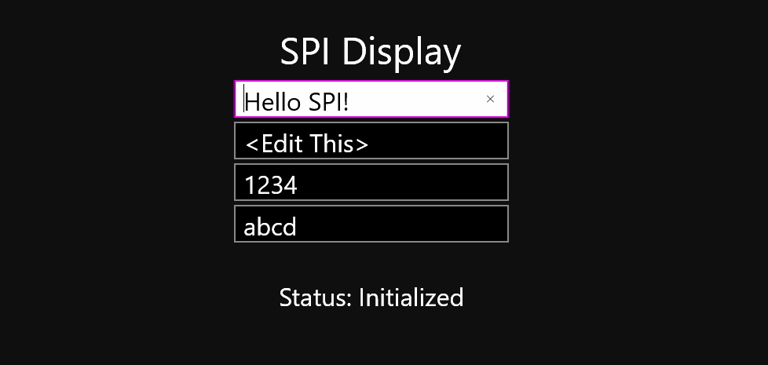

# SPI display

In this sample, we interface a SPI based [OLED display](http://www.adafruit.com/product/938) to your Raspberry Pi 2 or 3, Up Squared*, or DragonBoard 410c. We then create an app that lets us write lines of text to the display. Step-by-step instructions are provided, so no background knowledge of SPI is needed. However, if you want to learn more, SparkFun provides a great [tutorial on SPI](https://learn.sparkfun.com/tutorials/serial-peripheral-interface-spi).

*The Up Squared should be used in place of the Minnowboard Max. We are in the process of updating our documentation to reflect this change. 

This is a headed sample.  To better understand what headed mode is and how to configure your device to be headed, follow the instructions [here](https://docs.microsoft.com/en-us/windows/iot-core/learn-about-hardware/headlessmode).

### Load the project in Visual Studio

You can find the source code for this sample by downloading a zip of all of our samples [here](https://github.com/Microsoft/Windows-iotcore-samples/archive/master.zip) and navigating to the `samples-develop\SPIDisplay`.  Make a copy of the folder on your disk and open the project from Visual Studio. 
Note that this app requires a device with a physical SPI port and will not work if running in an emulated environment.

### Connect the SPI Display to your device

First, we need to wire up the display to your device. You'll need a few components:

* <a name="SPI_Display"></a>a [Monochrome 1.3" 128x64 OLED graphic display](http://www.adafruit.com/product/938) from Adafruit with pin headers soldered on

* a breadboard and several male-to-female connector wires (Raspberry Pi 2 or 3 or MinnowBoard Max) or male-to-male connector wires (DragonBoard 410c)

* <a name="SPI_Display"></a>If you are using a DragonBoard 410c, you'll also need a [8-channel Bi-directional Logic Level Converter](http://www.adafruit.com/products/395) from Adafruit with pin headers soldered on

Visit the **Raspberry Pi 2 or 3, MinnowBoard Max, or DragonBoard 410c** sections below depending on which device you have:



#### Raspberry Pi 2 or 3
For the Raspberry Pi 2 or 3, we need to hook up power, ground, SPI, and a few GPIO pins to the OLED display. For additional information on the Raspberry Pi 2 or 3 pins, visit the [Raspberry Pi 2 pin mapping page](/Samples/PinMappingsRPi2)

**Note: Make sure to power off the RPi2 or RPi3 when connecting your circuit. This is good practice to reduce the chance of an accidental short circuit during construction.**

The OLED display has 8 IO pins, connect them as follows:

1. **DATA:**  Connect to MOSI on the RPi2 or RPi3 (Pin 19). This is the SPI master data out line.
2. **CLK:**     Connect to SCLK on the RPi2 or RPi3 (Pin 23). This is the SPI clock line.
3. **SA0/DC:**   Connect to GPIO 22 on the RPi2 or RPi3 (Pin 15). This is the Data/Command line for the display. (See the [datasheet](http://www.adafruit.com/datasheets/SSD1306.pdf){:target="_blank"} for more information about the display pin functions)
4. **RST:** Connect to GPIO 23 on the RPi2 or RPi3 (Pin 16). This is the hardware Reset line for the display. (See the [datasheet](http://www.adafruit.com/datasheets/SSD1306.pdf){:target="_blank"} for more information about the display pin functions)
5. **CS:** Connect to CE0 on the RPi2 or RPi3 (Pin 24). This is the SPI chip select line.
6. **3V3:**  Leave unconnected. The display has its own on-board power regulator which provides it with 3.3V
7. **VIN:**  Connect 5V the RPi2 or RPi3 (Pin 2).
8. **GND:**  Connect to ground on the RPi2 or RPi3 (Pin 6).

Here are the connections shown on a breadboard:



<sub>*Image made with [Fritzing](http://fritzing.org/)*</sub>

Here are the schematics:



#### MinnowBoard Max
For the MinnowBoard Max, we need to hook up power, ground, SPI, and a few GPIO pins to the OLED display. See the [MBM pin mapping page](/Samples/PinMappingsMBM) for more details on the MBM IO pins.

**Note: Make sure to power off the MBM when connecting your circuit. This is good practice to reduce the chance of an accidental short circuit during construction.**

The OLED display has 8 IO pins, connect them as follows:

1. **DATA:**  Connect to MOSI on the MBM (Pin 9). This is the SPI master data out line.
2. **CLK:**     Connect to SCLK on the MBM (Pin 11). This is the SPI clock line.
3. **SA0/DC:**   Connect to GPIO 3 on the MBM (Pin 14). This is the Data/Command line for the display. (See the [datasheet](http://www.adafruit.com/datasheets/SSD1306.pdf){:target="_blank"} for more information about the display pin functions)
4. **RST:** Connect to GPIO 4 on the MBM (Pin 16). This is the hardware Reset line for the display. (See the [datasheet](http://www.adafruit.com/datasheets/SSD1306.pdf){:target="_blank"} for more information about the display pin functions)
5. **CS:** Connect to CS1 on the MBM (Pin 5). This is the SPI chip select line.
6. **3V3:**  Leave unconnected. The display has its own on-board power regulator which provides it with 3.3V
7. **VIN:**  Connect 5V the MBM (Pin ).
8. **GND:**  Connect to ground on the MBM (Pin 2).

Here are the connections shown on a breadboard:



<sub>*Image made with [Fritzing](http://fritzing.org/)*</sub>

Here are the schematics:



#### DragonBoard 410c

For the DragonBoard 410c, connections need to be made from the power, ground, SPI, and a couple of GPIO connections of the single board computer to the OLED display.

**Note:  Make sure to power off the DragonBoard 410c when connecting your circuit.  This is good practice to reduce the change of an accidental short circuit during contruction.**

The OLED display has 8 IO pins that are connected to the logic level converter as follows:

1.  **DATA:**    Connect to pin B5.  This is the SPI master data out line.
2.  **CLK:**     Connect to pin B4.  This is the SPI clock line.
3.  **SA0/DC:**  Connect to pin B3.  This is the data / command line for the display.
4.  **RST:**     Connect to pin B2.  This is the hardware reset line for the display.
5.  **CS:**      Connect to pin B1.  This is the SPI chip select line.
6.  **3V3:**     This connection is _unused_.
7.  **VIN:**     Connect to VCCB.
8.  **GND:**     Connect to GND.

The logic level converter is connected to the DragonBoard as follows:

1.  **A5:**     Connect to pin 14 (SPI0 MOSI).  
2.  **A4:**     Connect to pin 8 (SPI0 CLK).  
3.  **A3:**     Connect to pin 24 (GPIO 12).  
4.  **A2:**     Connect to pin 26 (GPIO 69).  
5.  **A1:**     Connect to pin 12 (SPI0 CS N).  
6.  **VCCA:**   Connect to pin 35 (1.8V PWR).
7.  **VCCB:**   Connect to pin 37 (5V PWR).
8.  **GND:**    Connect to pin 40 (GND).

The following diagram shows what your breadboard might resemble with the circuit assembled:



A schematic for the circuit is:




### Deploy and run the app

When everything is set up, power your device back on, and open up the sample app in Visual Studio. Configure the code depending on which device you are using.

```csharp
public sealed partial class MainPage : Page
{
        /* Important! Uncomment the code below corresponding to your target device */

        /* Uncomment for MinnowBoard Max */
        //private const string SPI_CONTROLLER_NAME = "SPI0";  /* For MinnowBoard Max, use SPI0                            */
        //private const Int32 SPI_CHIP_SELECT_LINE = 0;       /* Line 0 maps to physical pin number 5 on the MBM          */
        //private const Int32 DATA_COMMAND_PIN = 3;           /* We use GPIO 3 since it's conveniently near the SPI pins  */
        //private const Int32 RESET_PIN = 4;                  /* We use GPIO 4 since it's conveniently near the SPI pins  */

        /* Uncomment for Raspberry Pi 2 or 3 */
        //private const string SPI_CONTROLLER_NAME = "SPI0";  /* For Raspberry Pi 2 or 3, use SPI0                             */
        //private const Int32 SPI_CHIP_SELECT_LINE = 0;       /* Line 0 maps to physical pin number 24 on the RPi2 or RPi3        */
        //private const Int32 DATA_COMMAND_PIN = 22;          /* We use GPIO 22 since it's conveniently near the SPI pins */
        //private const Int32 RESET_PIN = 23;                 /* We use GPIO 23 since it's conveniently near the SPI pins */

        /* Uncomment for DragonBoard 410c */
        //private const string SPI_CONTROLLER_NAME = "SPI0";  /* For DragonBoard, use SPI0                                */
        //private const Int32 SPI_CHIP_SELECT_LINE = 0;       /* Line 0 maps to physical pin number 12 on the DragonBoard */
        //private const Int32 DATA_COMMAND_PIN = 12;          /* We use GPIO 12 since it's conveniently near the SPI pins */
        //private const Int32 RESET_PIN = 69;                 /* We use GPIO 69 since it's conveniently near the SPI pins */
        
        //...
}
```

Next, right-click on the **SPIDisplay** project in **Solution Explorer** and select **"Set as StartUp Project"**.
Follow the instructions to [setup remote debugging and deploy the app](/Docs/AppDeployment.htm#csharp). The SPIDisplay app will deploy and start, and you should see text data show up on OLED display.
 You can now type into the app and have the text mirrored on the attached OLED display.



Congratulations! You've connected a SPI graphics display.

### Let's look at the code
The code in this sample can be split up into two main sections:

1. **Initialization Code:** This performs initializations for GPIO, SPI, and the OLED display. Setting up these prerequisites is necessary before we can send graphics data to the OLED display.

2. **Text Display Code:** This code monitors the textbox control in the UI, and waits for a user to enter text. When this happens the app converts the text into graphics data that gets sent to the display over SPI.

Let's start by digging into the initialization code first.

### Initialization Code
Here is the C# code for the top-level initialization function.

```csharp
using Windows.Devices.Enumeration;
using Windows.Devices.Spi;
using Windows.Devices.Gpio;
using DisplayFont;

/* Initialize GPIO, SPI, and the display */
private async void InitAll()
{
    try
    {
        InitGpio();             /* Initialize the GPIO controller and GPIO pins */
        await InitSpi();        /* Initialize the SPI controller                */
        await InitDisplay();    /* Initialize the display                       */
    }
    /* If initialization fails, display the exception and stop running */
    catch (Exception ex)
    {
        Text_Status.Text = "Exception: " + ex.Message;
        if (ex.InnerException != null)
        {
            Text_Status.Text += "\nInner Exception: " + ex.InnerException.Message;
        }
        return;
    }

    /* Register a handler so we update the SPI display anytime the user edits a textbox */
    Display_TextBoxLine0.TextChanged += Display_TextBox_TextChanged;
    Display_TextBoxLine1.TextChanged += Display_TextBox_TextChanged;
    Display_TextBoxLine2.TextChanged += Display_TextBox_TextChanged;
    Display_TextBoxLine3.TextChanged += Display_TextBox_TextChanged;

    /* Manually update the display once after initialization*/
    DisplayTextBoxContents();

    Text_Status.Text = "Status: Initialized";
}
```

* The SPI display requires the use of GPIO and SPI, so we initialize the following in sequence:
1. Initialize GPIO controller and pins
2. Initialize the SPI bus
3. Initialize the OLED SPI display

* If any of the initializations fail, we display an error and halt additional processing. This might occur if the display is wired incorrectly,
or if the host device does not have a SPI bus (for example, if you try to run this on a desktop Windows machine)

* Once the initializations have all completed successfully, we register the **Display_TextBox_TextChanged()** function for the **TextChanged** event on the textboxes.
This ensures that our function gets called to update the display any time the user edits text.

* Finally, we make a single call to **DisplayTextBoxContents()** to display some default sample text on the screen when we first start up.

Next, let's take a closer look at what each of the initialization functions is doing in more detail.

#### InitGPIO()

There are two pins on the SPI OLED display we need to control, the Data/Command pin and the Reset pin. To communicate with these,
we need to initialize the GPIO controller and configure the pins as outputs.

```csharp
/* Initialize the GPIO */
private void InitGpio()
{
    try
    {
        IoController = GpioController.GetDefault(); /* Get the default GPIO controller on the system */

        /* Initialize a pin as output for the Data/Command line on the display  */
        DataCommandPin = IoController.OpenPin(DATA_COMMAND_PIN);
        DataCommandPin.Write(GpioPinValue.High);
        DataCommandPin.SetDriveMode(GpioPinDriveMode.Output);

        /* Initialize a pin as output for the hardware Reset line on the display */
        ResetPin = IoController.OpenPin(RESET_PIN);
        ResetPin.Write(GpioPinValue.High);
        ResetPin.SetDriveMode(GpioPinDriveMode.Output);
    }
    /* If initialization fails, throw an exception */
    catch (Exception ex)
    {
        throw new Exception("GPIO initialization failed", ex);
    }
}
```

* We start by retrieving the default GPIO controller on the device with the **GpioController.GetDefault()** function.

* Next we initialize the **DATA_COMMAND_PIN** as output. This pin is used by the display to determine if data on the SPI bus is to be interpreted as graphics data or as a command.

* Finally we initialize the **RESET_PIN** as output. This pin is used to hardware-reset the display as part of the display initialization.

* If at any point we get a failure, we throw an exception to the top-level **InitAll()** function.

#### InitSpi()
Following the GPIO initialization, we initialize the SPI bus. The bus is used to send graphics data and commands to the OLED screen for display,
and needs to be configured before we can talk to the display.

```csharp
/* Initialize the SPI bus */
private async Task InitSpi()
{
    try
    {
        var settings = new SpiConnectionSettings(SPI_CHIP_SELECT_LINE); /* Create SPI initialization settings                               */
        settings.ClockFrequency = 10000000;                             /* Datasheet specifies maximum SPI clock frequency of 10MHz         */
        settings.Mode = SpiMode.Mode3;                                  /* The display expects an idle-high clock polarity, we use Mode3
                                                                         * to set the clock polarity and phase to: CPOL = 1, CPHA = 1
                                                                         */

        string spiAqs = SpiDevice.GetDeviceSelector(SPI_CONTROLLER_NAME);       /* Find the selector string for the SPI bus controller          */
        var devicesInfo = await DeviceInformation.FindAllAsync(spiAqs);         /* Find the SPI bus controller device with our selector string  */
        SpiDisplay = await SpiDevice.FromIdAsync(devicesInfo[0].Id, settings);  /* Create an SpiDevice with our bus controller and SPI settings */

    }
    /* If initialization fails, display the exception and stop running */
    catch (Exception ex)
    {
        throw new Exception("SPI Initialization Failed", ex);
    }
}
```

* We start by specifying some configuration settings for our SPI bus:
1. We specify which chip select line we want to use. This line is connected to the **CS** pin on the display, and lets the display controller know when we're about to start a SPI bus transaction.
2. The clock frequency is set to 10MHz. This is the rated speed for the display as documented in the [datasheet](http://www.adafruit.com/datasheets/SSD1306.pdf).
3. **settings.Mode** is set to **SpiMode.Mode3**. This configures clock polarity and phase for the bus as documented in the [datasheet](http://www.adafruit.com/datasheets/SSD1306.pdf).

* Next, we get the class selection string for our SPI controller. This controller controls the SPI lines on the exposed pin header. We then use the selection string to get the SPI bus controller matching our string name.

* Finally, we create a new **SpiDevice** with the settings and bus controller obtained previously.

* If at any point we get a failure, we throw an exception to the top-level **InitAll()** function.

#### InitDisplay()
Now that we have initialized GPIO and SPI, we can communicate with display. Before we can send graphics data however, we first need to configure some settings on the display controller.

```csharp
/* Send SPI commands to power up and initialize the display */
private async Task InitDisplay()
{
    /* Initialize the display */
    try
    {
        /* See the datasheet for more details on these commands: http://www.adafruit.com/datasheets/SSD1306.pdf             */
        await ResetDisplay();                   /* Perform a hardware reset on the display                                  */
        DisplaySendCommand(CMD_CHARGEPUMP_ON);  /* Turn on the internal charge pump to provide power to the screen          */
        DisplaySendCommand(CMD_MEMADDRMODE);    /* Set the addressing mode to "horizontal"                                  */
        DisplaySendCommand(CMD_SEGREMAP);       /* Flip the display horizontally, so it's easier to read on the breadboard  */
        DisplaySendCommand(CMD_COMSCANDIR);     /* Flip the display vertically, so it's easier to read on the breadboard    */
        DisplaySendCommand(CMD_DISPLAY_ON);     /* Turn the display on                                                      */
    }
    catch (Exception ex)
    {
        throw new Exception("Display Initialization Failed", ex);
    }
}
```

* We start by performing a hardware reset by calling **ResetDisplay()**. The function simply toggles the hardware Reset pin to reset the display.

* Next, we send it a series of commands using the **DisplaySendCommand()** function. This function is a wrapper around the **SpiDevice.Write()** function which sends the actual command over SPI.
These commands turn the display on and put it into a state where it's ready to accept graphics data.

* If at any point we get a failure, we throw an exception to the top-level **InitAll()** function.

### Text Display Code

Now that the display is initialized, we can send text to the screen. Previously in the initialization function, we registered **Display_TextBox_TextChanged()** to trigger any time the user changes the textbox.
This function calls the **DisplayTextBoxContents()** function below which runs through the process of writing text out to the screen:

```csharp
/* Update the SPI display to mirror the textbox contents */
private void DisplayTextBoxContents()
{
    try
    {
        ClearDisplayBuf();  /* Blank the display buffer             */
        WriteLineDisplayBuf(Display_TextBoxLine0.Text, 0, 0);
        WriteLineDisplayBuf(Display_TextBoxLine1.Text, 0, 1);
        WriteLineDisplayBuf(Display_TextBoxLine2.Text, 0, 2);
        WriteLineDisplayBuf(Display_TextBoxLine3.Text, 0, 3);
        DisplayUpdate();    /* Write our changes out to the display */
    }
    /* Show an error if we can't update the display */
    catch (Exception ex)
    {
        Text_Status.Text = "Status: Failed to update display";
        Text_Status.Text = "\nException: " + ex.Message;
    }
}

/* Updates the display when the textbox contents change */
private void Display_TextBox_TextChanged(object sender, TextChangedEventArgs e)
{
    DisplayTextBoxContents();
}
```

* **ClearDisplayBuf()** simply sets all bytes in our local display buffer to '0' so we start with a blank slate.

* Next we call **WriteLineDisplayBuf()** to write a line of text from the textbox to our local display buffer.

* In **DisplayUpdate()**, we write the contents of our local buffer out to the display over SPI.

In the following sections, we'll detail the **WriteCharDisplayBuf()** and **DisplayUpdate()** functions, which perform the bulk of the work in rendering character data and sending the data over SPI.

#### WriteCharDisplayBuf()

The **WriteCharDisplayBuf()** function performs the work to convert a single character into an array of bytes representing the character image data.
This function is frequently called by **WriteLineDisplayBuf()** to render individual characters in a string. Lets take a look at how it works.

```csharp
/*
 * NAME:        WriteCharDisplayBuf
 * DESCRIPTION: Writes one character to the display screen buffer (DisplayUpdate() needs to be called subsequently to output the buffer to the screen)
 * INPUTS:
 *
 * Character: The character we want to draw. In this sample, special characters like tabs and newlines are not supported.
 * Col:       The horizontal column we want to start drawing at. This is equivalent to the 'X' axis pixel position.
 * Row:       The vertical row we want to write to. The screen is divided up into 4 rows of 16 pixels each, so valid values for Row are 0,1,2,3.
 *
 * RETURN VALUE:
 * We return the number of horizontal pixels used. This value is 0 if Row/Col are out-of-bounds, or if the character isn't available in the font.
 */
private UInt32 WriteCharDisplayBuf(Char Chr, UInt32 Col, UInt32 Row)
{
    /* Check that we were able to find the font corresponding to our character */
    FontCharacterDescriptor CharDescriptor = DisplayFontTable.GetCharacterDescriptor(Chr);
    if (CharDescriptor == null)
    {
        return 0;
    }

    /* Make sure we're drawing within the boundaries of the screen buffer */
    UInt32 MaxRowValue = (SCREEN_HEIGHT_PAGES / DisplayFontTable.FontHeightBytes) - 1;
    UInt32 MaxColValue = SCREEN_WIDTH_PX;
    if (Row > MaxRowValue)
    {
        return 0;
    }
    if ((Col + CharDescriptor.CharacterWidthPx + DisplayFontTable.FontCharSpacing) > MaxColValue)
    {
        return 0;
    }

    UInt32 CharDataIndex = 0;
    UInt32 StartPage = Row * 2;
    UInt32 EndPage = StartPage + CharDescriptor.CharacterHeightBytes;
    UInt32 StartCol = Col;
    UInt32 EndCol = StartCol + CharDescriptor.CharacterWidthPx;
    UInt32 CurrentPage = 0;
    UInt32 CurrentCol = 0;

    /* Copy the character image into the display buffer */
    for (CurrentPage = StartPage; CurrentPage < EndPage; CurrentPage++)
    {
        for (CurrentCol = StartCol; CurrentCol < EndCol; CurrentCol++)
        {
            DisplayBuffer[CurrentCol, CurrentPage] = CharDescriptor.CharacterData[CharDataIndex];
            CharDataIndex++;
        }
    }

    /* Pad blank spaces to the right of the character so there exists space between adjacent characters */
    for (CurrentPage = StartPage; CurrentPage < EndPage; CurrentPage++)
    {
        for (; CurrentCol < EndCol + DisplayFontTable.FontCharSpacing; CurrentCol++)
        {
            DisplayBuffer[CurrentCol, CurrentPage] = 0x00;
        }
    }

    /* Return the number of horizontal pixels used by the character */
    return CurrentCol - StartCol;
}
```

* We start by searching for a given character in our font table **DisplayFontTable[]**. This table contains pixel data for commonly used ASCII characters.
Note that special characters such as the newline character are not supported in this sample, and are ignored by **WriteCharDisplayBuf()**.

* Once we have the pixel dimensions for the character, we perform some checks to make sure it can fit within the boundaries of the screen.

* We then copy the character pixel data into our local screen buffer array **DisplayBuffer[,]**. This buffer holds a local copy of the contents of the screen.
We use this buffer since it's much quicker to perform pixel operations on a local buffer first, and then send the data to the screen over SPI when we've completed our pixel manipulation.

* Afterwards we pad some space to the right of our character. That way characters printed adjacent to each other have a little bit of separation space.
Again, all of this is happening in our local screen buffer. No data has been sent to the screen yet.


#### DisplayUpdate()
After all of our data has been written to our local buffer. We're ready to write it out over SPI to the screen. For this, we call **DisplayUpdate()**:

```csharp
/* Writes the Display Buffer out to the physical screen for display */
private void DisplayUpdate()
{
    int Index = 0;
    /* We convert our 2-dimensional array into a serialized string of bytes that will be sent out to the display */
    for (int PageY = 0; PageY < SCREEN_HEIGHT_PAGES; PageY++)
    {
        for (int PixelX = 0; PixelX < SCREEN_WIDTH_PX; PixelX++)
        {
            SerializedDisplayBuffer[Index] = DisplayBuffer[PixelX, PageY];
            Index++;
        }
    }

    /* Write the data out to the screen */
    DisplaySendCommand(CMD_RESETCOLADDR);         /* Reset the column address pointer back to 0 */
    DisplaySendCommand(CMD_RESETPAGEADDR);        /* Reset the page address pointer back to 0   */
    DisplaySendData(SerializedDisplayBuffer);     /* Send the data over SPI                     */
}
```

* We start by iterating through our display buffer to convert our 2-dimensional buffer array into a single serialized array of data to be sent over SPI. Since we configured the display in "horizontal mode" previously,
we take horizontal "slices" of our display buffer and store them sequentially in the serialized buffer.

* Once we've completed serialization of the data, we send commands to reset the column and page address pointers of the display back to '0'. This ensures we start writing in the upper left corner of the screen.

* Finally, we call **DisplaySendData()** to send our buffer contents over SPI. This function is a wrapper around **SpiDevice.Write()**, which sends the entire buffer out over SPI.

```csharp
/* Send graphics data to the screen */
private void DisplaySendData(byte[] Data)
{
    /* When the Data/Command pin is high, SPI data is treated as graphics data  */
    DataCommandPin.Write(GpioPinValue.High);
    SpiDisplay.Write(Data);
}
```
