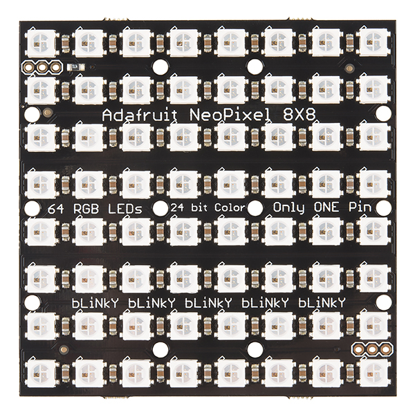
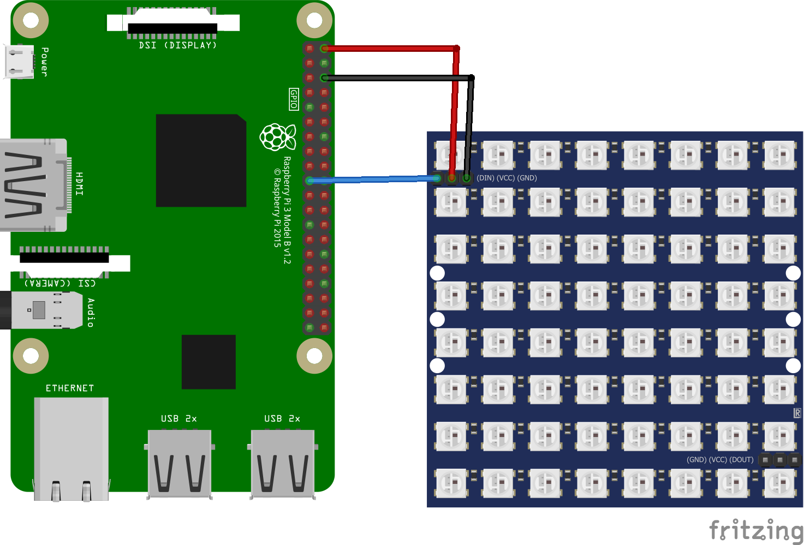
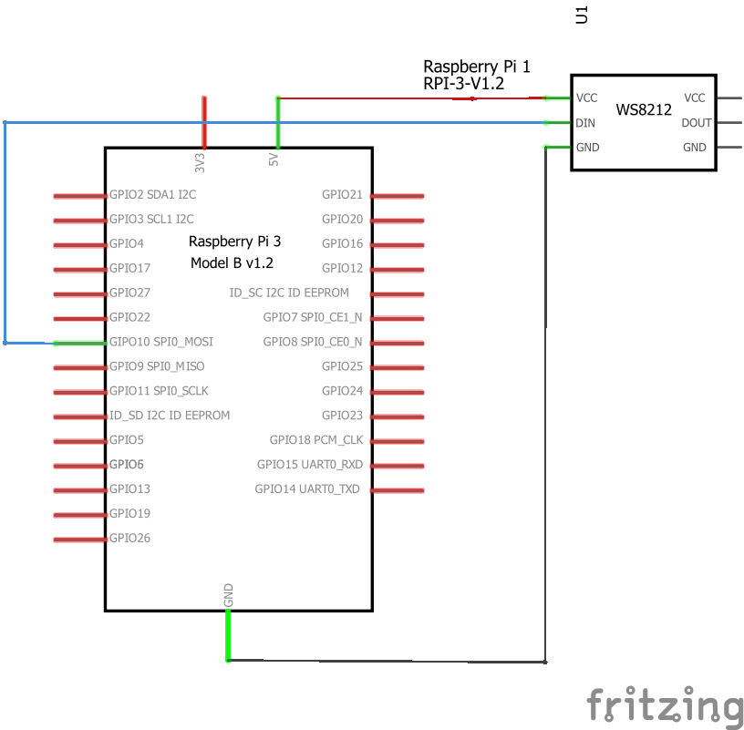
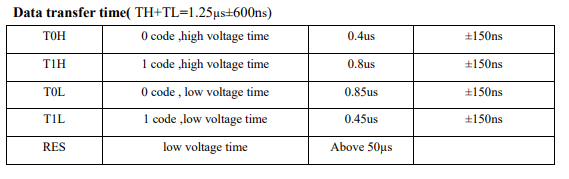
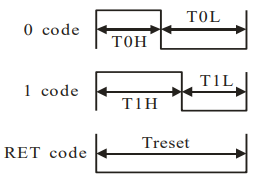
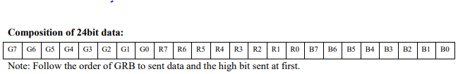

# ws2812b drive with SPI

We'll connect an SPI accelerometer to your Raspberry Pi 3 and create a simple app to read data from it. We'll walk you through step-by-step, so no background knowledge of SPI is needed.
However, if you're curious, SparkFun provides a great [tutorial on SPI](https://learn.sparkfun.com/tutorials/serial-peripheral-interface-spi).

This is a headed sample.  To better understand what headed mode is and how to configure your device to be headed, follow the instructions [here](https://docs.microsoft.com/en-us/windows/iot-core/learn-about-hardware/headlessmode).

### Load the project in Visual Studio

You can find the source code for this sample by downloading a zip of all of our samples [here](https://github.com/Microsoft/Windows-iotcore-samples/archive/master.zip) and navigating to the `samples\SPIWS2812b`.  Make a copy of the folder on your disk and open the project from Visual Studio.

### The WS2812B Led

WS2812B is a intelligent control LED light source that the control circuit and RGB chip. 

View the [WS2812B Datasheet](https://cdn-shop.adafruit.com/datasheets/WS2812B.pdf)

### Connect the ws2812b matrix board to your device

You'll need a few components:

* <a name="NeoPixel NeoMatrix 8x8"></a>an [NeoPixel NeoMatrix 8x8 - 64 RGB LED](https://www.sparkfun.com/products/12662) with pin headers soldered on

* a breadboard and a couple of female-to-female connector wires

Visit the **Raspberry Pi 2 or 3/MinnowBoard Max** sections below depending on which device you have:



#### Raspberry Pi 2 or 3
If you have a Raspberry Pi 2 or 3, we need to hook up power, ground, and the SPI lines to the accelerometer.
 See the [Raspberry Pi 2 and 3 pin mapping page](https://docs.microsoft.com/en-us/windows/iot-core/learn-about-hardware/pinmappings/pinmappingsrpi) for more details on the RPi2 and RPi3 IO pins.

**Note: Make sure to power off the RPi2 or RPi3 when connecting your circuit. This is good practice to reduce the chance of an accidental short circuit during construction.**

The WS2812b breakout board has 3 IO pins, connect them as follows:

1. **GND:**  Connect to ground on the RPi2 or RPi3 (Pin 6)
2. **VCC:**  Connect to 3.3V on the RPi2 or RPi3 (Pin 1)
7. **SDA:**  Connect to SPI0 MOSI on the RPi2 or RPi3 (Pin 19)

Here are the connections shown on a breadboard:



<sub>*Image made with [Fritzing](http://fritzing.org/)*</sub>
 
Here are the schematics:



### About the implementation

The WS2812B include intelligent digital port data latch and signal reshaping amplification drive circuit. To set the RGB value there is a time specification that define what is a 1 or 0 value.



And the sequence chart that explains how to set each bit of RGB data



...and we need 24 of this patterns to set the entire RGB data of the led



#### Initialize the SPI Bus

```csharp
public async Task InitializeAsync(int pixels, string spiFriendlyName = "SPI0", int chipSelectLine = 0)
{
    //we use 4bits for each byte of ws2812b, so we need 12 bytes to set the 24 bytes of led
    var lenghtBuffer = pixels * 12;
    bufferLedSPI = new byte[lenghtBuffer];

    var settings = new SpiConnectionSettings(chipSelectLine);
    settings.ClockFrequency = 4000000;

    var spi = SpiDevice.GetDeviceSelector(spiFriendlyName);
    var deviceInformation = await DeviceInformation.FindAllAsync(spi);
    spiDevice = await SpiDevice.FromIdAsync(deviceInformation[0].Id, settings);
}
```

We initialize the SPI with 4MHz. It means that each bit sent will have 0.25us signal width. (1s/40000000) = 0.25us

So using the **Sequence Chart** to send a zero bit we need to send two bits high and two bits low. So we can create the constants of these sequences of bits. 

```csharp
private const byte ledBitOn = 0b1110;
private const byte ledBitOff = 0b1100;
```

TH = 0b1110 = 0.25us + 0.25us + 0.25us + 0s = 0.85us

TL = 0b1100 = 0.25us + 0.25us + 0s + 0s = 0.5us

```csharp
private byte[] Encode(byte ColorByte)
{
    byte[] byteArray = new byte[4];
    int indexBit = 0;
    int indexByte = 3;
    byte mask = 0x80;

    while(indexBit < 8)
    {
        mask = (byte)(0x80 >> indexBit);
        indexBit++;

        if ((ColorByte & mask) > 0)
            byteArray[indexByte] = ledBitOn << 4;
        else
            byteArray[indexByte] = ledBitOff << 4;

        
        mask = (byte)(1 >> indexBit);
        indexBit++;

        if ((ColorByte & mask) > 0)
            byteArray[indexByte] |= ledBitOn;
        else
            byteArray[indexByte] |= ledBitOff;

        indexByte--;


    return byteArray;
}
```

Each color of RGB is represented by a byte. How we seen, each bit of WS2812B needs 4 bits of the data sent by the SPI, so to send 8 bits of WS2812B we'll use 4 bytes (two bits on each byte).

And finally, we build this bytes for all colors. 

```csharp
public bool Write(int pixel, byte red, byte green, byte blue)
{
    byte[] Colors = new byte[] { green, red, blue };
    
    if (spiDevice != null)
    {
        int indexPixel = pixel * 12;

        foreach (byte Color in Colors)
        { 
            byte[] EncodedBytes = Encode(Color);

            foreach (byte Data in EncodedBytes)
            {
                bufferLedSPI[indexPixel++] = Data;
            }
        }
        return true;
    }

    return false;
}
```

Just write data to SPI

```csharp
public void RefreshLeds()
{
    spiDevice.Write(bufferLedSPI);
    Thread.Sleep(1);
}
```
