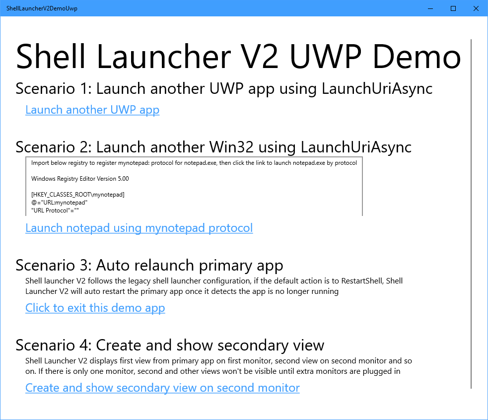

# UWP Sample App

This is a UWP app sample for Shell Launcher V2, see how to configure UWP app for Shell Launcher V2 in the samples. This app demonstrates that when using an UWP app as the shell, in shell launcher v2, you can

* Launch another UWP using [LaunchUriAsync](https://docs.microsoft.com/en-us/uwp/api/windows.system.launcher.launchuriasync), if the other UWP app has registered protocol, in its package manifest. See how to[ register and handle URI activation for UWP app](https://docs.microsoft.com/en-us/windows/uwp/launch-resume/handle-uri-activation)
* Launch another Win32 app using [LaunchUriAsync](https://docs.microsoft.com/en-us/uwp/api/windows.system.launcher.launchuriasync), if the other Win32 app has registered protocol. See [Installing and Registering Protocol Handlers](https://docs.microsoft.com/en-us/windows/desktop/search/-search-3x-wds-ph-install-registration)
* The UWP shell app will be auto-restarted if it's closed by accident or crashed, given that you have specified RestartShell as the default action in Config xml
* Have multiple views for the shell UWP app. Shell Launcher V2 defines that for the shell UWP app, its first view is displayed on main monitor, 2nd view will be on left-most monitor, 3rd view will be on 2nd to left monitor and so on. If there is only one monitor, only the main view gets displayed.

