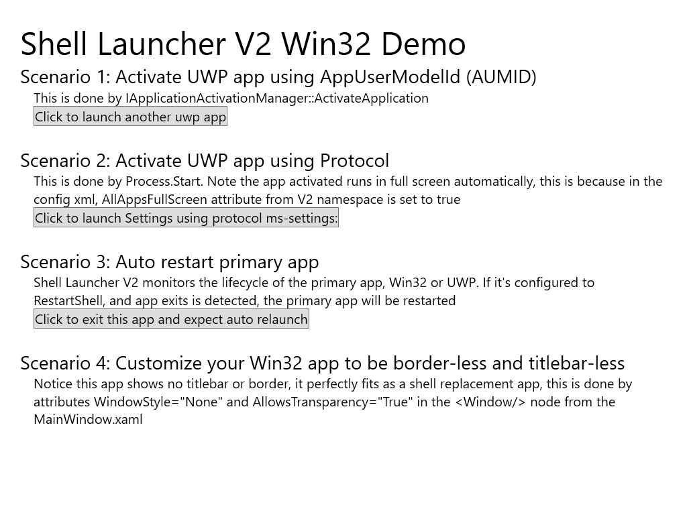

# Win32 Sample App

This is a Win32 app sample for Shell Launcher V2, see how to configure Win32 app for Shell Launcher V2 in the samples. This app demonstrates that when using a Win32 app as the shell, in shell launcher v2, you can

* Launch another UWP using ApplicationActivationManager, given the other UWP app's AppUserModelId (AUMID)
* Launch another UWP using protocol, if the other UWP has registered URI in package manifest. Instead of using LaunchUriAsync in UWP app, here you can simply call CreateProcess (C++) or Process.Start (C#) given the protocol as the target.
* The Win32 shell app will be auto-restarted, if it's closed by accident or crashed, if you use RestartShell as the default action in Config xml
* Configure your Win32 shell app as border-less and titlebar-less

