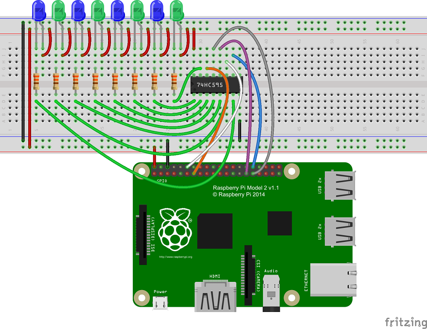
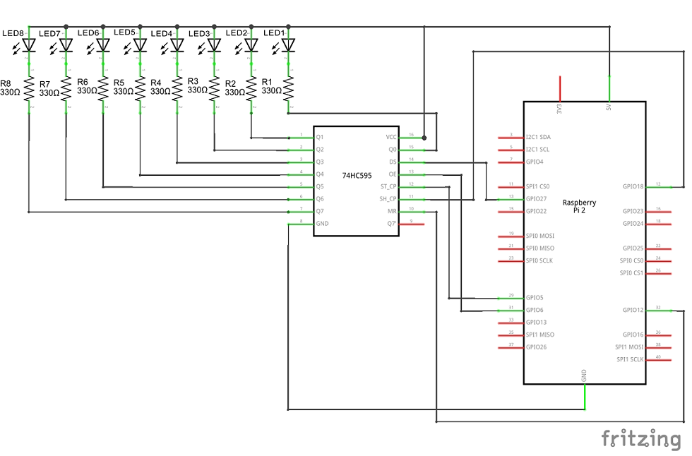
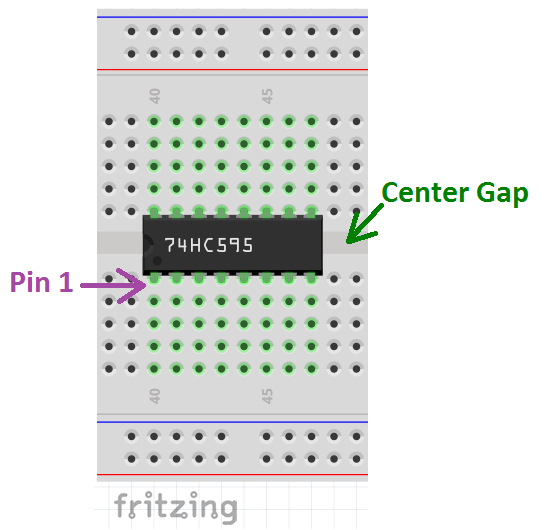
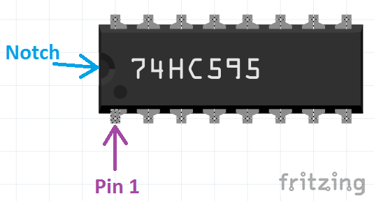
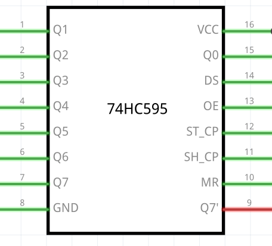

# Shift register


In this sample, we'll connect an 8-bit serial-in, parallel-out shift register to your Raspberry Pi 2 or 3* and create a simple app that uses the shift register to control eight LEDs.

This is a headed sample, so please ensure that your device is in headed
mode by running this command: `setbootoption.exe headed` (changing the headed/headless state will require a reboot).

*This sample only works with Raspberry Pi 2 or 3 and is not supported on Minnowboard Max or DragonBoard 410c.

### Connect the Shift Register to Your Device

You will need the following components:

* 1 Raspberry Pi 2 or 3

* 1 [74HC595N serial-in, parallel-out Shift Register](http://www.digikey.com/product-detail/en/SN74HC595N/296-1600-5-ND/277246)

* 4 [blue LEDs](http://www.digikey.com/product-detail/en/C503B-BCS-CV0Z0461/C503B-BCS-CV0Z0461-ND/1922944)

* 4 [green LEDs](http://www.digikey.com/product-detail/en/C503B-GCN-CY0C0791/C503B-GCN-CY0C0791-ND/1922940)

* 8 [330 &#x2126; resistors](http://www.digikey.com/product-detail/en/CFR-25JB-52-330R/330QBK-ND/1636)

* An HDMI monitor

* A breadboard and several male-to-female and male-to-male connector wires

Let's start by wiring up the components on the breadboard as shown in the diagram below.

**Note: Make sure to power off the RPi2 or RPi3 when connecting your circuit. This is good practice to reduce the chance of an accidental short circuit during construction.**



*Image made with [Fritzing](http://fritzing.org/)*


Here is the schematic:



*Image made with [Fritzing](http://fritzing.org/)*


#### Connecting the 74HC595N Shift Register

Place the Shift Register on your breadboard such that it straddles the center gap of the breadboard.



*Image made with [Fritzing](http://fritzing.org/)*


Locate pin 1 of the 74HC595N shift register by finding the notch on the IC. If you orient the IC so that the end with the notch is facing left, pin 1 will be the first pin in the lower left below the notch.



*Image made with [Fritzing](http://fritzing.org/)*

The pinout of the 74HC595N is shown below and can be found in the [datasheet](http://www.ti.com/lit/ds/symlink/sn74hc595.pdf).



*Image made with [Fritzing](http://fritzing.org/)*

Make the following connections on the 74HC595N shift register:

* Pins 1, 2, 3, 4, 5, 6, 7 and Pin 15  **Q0** thru **Q7**: Connect each of these pins to a 330 &#x2126; resistor - one 330 &#x2126; resistor for each pin

* Pin 8  **GND**: Connect to the ground rail on the side of the breadboard (blue stripe)

* Pin 9  **Q7'**:  Leave unconnected

* Pin 10 **SRCLR**: Connect to **GPIO 12** (pin 32) on the RPi2 or RPi3 (pin mapping is below)

* Pin 11 **SRCLK**: Connect to **GPIO 18** (pin 12) on the RPi2 or RPi3

* Pin 12 **RCLK**: Connect to **GPIO 5** (pin 29) on the RPi2 or RPi3

* Pin 13 **OE**: Connect to **GPIO 6** (pin 31) on the RPi2 or RPi3

* Pin 14 **SER**: Connect to **GPIO 27** (pin 13) on the RPi2 or RPi3

* Pin 15 **Q7**: See above.

* Pin 16 **VCC**: Connect to the voltage supply rail on the side of the breadboard (red stripe)

#### Connecting the LEDs and Resistors

Let's add the LEDs and resistors to the breadboard.

* If not already connected, place eight 330 &#x2126; resistors on the breadboard and connect each resistor to an output pin (Q0 thru Q7) on the shift register.

* Connect a cathode (the shorter leg) of the four green and four blue LEDs to the other end of a 330 &#x2126; resistor you placed on the breadboard in the previous step. Try to keep the LEDs lined up together in a row on the breadboard. The order of the green and blue LEDs is up to you. We chose to alternate LED colors.

* Connect the anodes (the longer leg) of the LEDs to the voltage supply rail on the side of the breadboard (red stripe)

When done, you should have a row (or as close to a row as possible) of blue and green LEDs on your breadboard.

* Each of the shift register outputs Q0 thru Q7 should be connected to a 330 &#x2126; resistor.

* The other end of each of the 330 &#x2126; resistors should be connected to the cathode of an LED.

* Each LED should have its anode connected to the voltage supply rail.

#### Connecting the Raspberry Pi 2 or 3

We need to hook up power, ground, and the I2C lines from on the Raspberry Pi 2 or 3 to the 74HC595N shift register and the breadboard.


* Pin 2 **5V PWR** Connect to the voltage supply rail on the side of the breadboard (red stripe)

* Pin 6 **GND** Connect to the ground rail on the side of the breadboard (blue stripe)

* Pin 12 **GPIO18** If not already connected, connect to **SRCLK** (pin 11) on the shift register

* Pin 13 **GPIO27** If not already connected, connect to **SER** (pin 14) on the shift register

* Pin 29 **GPIO5** If not already connected, connect to **RCLK** (pin 12) on the shift register

* Pin 31 **GPIO6** If not already connected, connect to **OE** (pin 13) on the shift register

* Pin 32 **GPIO12** If not already connected, connect to **SRCLR** (pin 10) on the shift register

### Create the Sample App

When everything is set up, power your device back on. You can find the source code for this sample by downloading a zip of all of our samples [here](https://github.com/Microsoft/Windows-iotcore-samples/archive/master.zip) and navigating to the `samples-develop\ShiftRegister`, 
but as an exercise, this tutorial will take you through the complete steps to create this app from scratch. 
Open up Visual Studio and create a new C# Windows Universal Blank App. Click **File -> New -> Project** then select **Templates -> Visual C# -> Windows -> Universal -> Blank App (Universal Windows)**. 
For this sample, we cleverly named ours **ShiftRegisterSample**.

The code in this sample does three things:

1. Initializes the RPi2 or RPi3 GPIO pins and the 74HC595N shift register

2. At regular intervals, it clocks in one data bit on the shift register's serial input.

3. Responds to user input

    a. Changes the timer delay based on user input. This results in a change in the blinking rate of the LEDs

    b. Inverts the LED flashing pattern if the user clicks the Invert button on the display


#### Add content to MainPage.xaml

Let's add some content to the MainPage which will be displayed on a screen connected to the Raspberry Pi 2 or 3.
 We want to add a couple TextBoxes, a Slider, and a Button.

* The Slider allows the user to control the rate at which the LEDs flash.

* The button allows the user to invert the pattern which the LEDs use to flash.

* The Textboxes will provide info about the slider.

Let's begin.

* From Solution Explorer, select the MainPage.xaml file.

* Locate the `<Grid>` tag in the XAML section of the designer, and add the following markup:

<UL>
``` xml
<Grid Background="Black">
    <StackPanel HorizontalAlignment="Center" VerticalAlignment="Center">
        <TextBlock x:Name="DelayText" Text="500ms" Margin="10" TextAlignment="Center" FontSize="26.667" />
        <Slider x:Name="Delay" Width="200" Value="500" Maximum="1000" LargeChange="100" SmallChange="10" Margin="10" ValueChanged="Delay_ValueChanged" StepFrequency="10"/>
        <Button Name="ToggleButton" Content="Invert LEDs" FontSize="26.667" Width="400" HorizontalAlignment="Center" Height="50" Margin="10" Background="Red" Click="ToggleButtonClicked" />
        <TextBlock x:Name="GpioStatus" Text="Waiting to initialize GPIO..." Margin="10,50,10,10" TextAlignment="Center" FontSize="26.667" />
    </StackPanel>
</Grid>
```
</UL>

#### Add code to MainPage.xaml.cs

Before we add any code to MainPage.xaml.cs, we need to add a reference to the Windows IoT Extension SDK.

 * In Solution Explorer, right-click on **References** and select **Add Reference...**

 * In the Reference Manager window, click the arrow next to **Windows Universal** then click on **Extensions**

 * Place a check mark in the box next to **Windows IoT Extension SDK** and click **OK**

 * Open MainPage.xaml.cs from Solution Explorer (you may need to click on the arrow next to MainPage.xaml first)

 * Add the following line at the top of MainPage.xaml.cs

```csharp
using Windows.Devices.Gpio;
```

With the references added, let's start adding code. The complete code we implemented for MainPage.xaml.cs is located at end of this section. Below are some key parts of the code with explanations

Variables and Constants

```csharp
// use these constants for controlling how the initial time interval for clocking in serial data to the shift register.
private const double TIMER_INTERVAL = 100; // value is milliseconds and denotes the timer interval
private const double TIME_DELAY = 1;

// The 74HC595N has five input pins that are used to control the device.
// See the datasheet http://www.ti.com/lit/ds/symlink/sn74hc595.pdf for details
// Shift Register Clock (SRCLK): the clock for the serial input to the shift register
private const int SRCLK_PIN = 18; // GPIO 18 is pin 12 on RPi2 or RPi3 header
private GpioPin shiftRegisterClock;

// Serial input (SER): the serial data input to the shift register. Use in conjunction with SRCLK.
private const int SER_PIN = 27; // GPIO 27 is pin 13 on RPi2 or RPi3 header
private GpioPin serial;

// Storage Register Clock (RCLK): the clock for clocking data from the serial input to the parallel output in the shift register
private const int RCLK_PIN = 5; // GPIO 5 is pin 29 on RPi2 or RPi3 header
private GpioPin registerClock;

// Output Enable (OE): When set low, the each of the eight shift register outputs (Q0, Q1,...Q7) are set high/low depending on the binary value in the storage register
private const int OE_PIN = 6; // GPIO 6 is pin 31 on RPi2 or RPi3 header
private GpioPin outputEnable;

// Storage Register Clear (SRCLR): Input pin for clearing shift register values that stored previously.
private const int SRCLR_PIN = 12; // GPIO 12 is pin 32 on RPi2 or RPi3 header
private GpioPin shiftRegisterClear;

private DispatcherTimer timer;
private byte pinMask = 0x01;
private bool areLedsInverted = true;

private SolidColorBrush redBrush = new SolidColorBrush(Windows.UI.Colors.Red);
private SolidColorBrush grayBrush = new SolidColorBrush(Windows.UI.Colors.LightGray);
```

Here are what some of these constants and variables represent

 * `SRCLK_PIN`, `SER_PIN`, `RCLK_PIN`, `OE_PIN`, `SRCLR_PIN` represent the RPi2 or RPi3 GPIO numbers of the pins connected to the correspondingly named shift register control pins.

 * `shiftRegisterClock`, `serial`, `registerClock`, `outputEnable`, `shiftRegisterClear` are the GPIO objects that are used to control the RPi2 or RPi3 GPIO pins that connect to the correspondingly named shift register pins.

 * `pinMask` contains the data bits that we clock in to the shift register one bit at a time. The bits in pinMask represent the on/off pattern for the LEDs. A bit value of '1' represents an off LED and a bit value of '0' is an on LED.

The method `InitializeSystem()`

`InitializeSystem()` does the following:

 * Sets up the RPi2 or RPi3 GPIO that are used to control and send data to the shift register

 * Sets up the timer used control the frequency at which the RPi2 or RPi3 sends one bit of data to the shift register

```csharp
private void InitializeSystem()
{
    // initialize the GPIO pins we will use for bit-banging our serial data to the shift register
    var gpio = GpioController.GetDefault();

    // Show an error if there is no GPIO controller
    if (gpio == null)
    {
        GpioStatus.Text = "There is no GPIO controller on this device.";
        return;
    }

    // setup the RPi2 or RPi3 GPIO that controls the shift register
    shiftRegisterClock = gpio.OpenPin(SRCLK_PIN);
    serial = gpio.OpenPin(SER_PIN);
    registerClock = gpio.OpenPin(RCLK_PIN);
    outputEnable = gpio.OpenPin(OE_PIN);
    shiftRegisterClear = gpio.OpenPin(SRCLR_PIN);

    // reset the pins to a known state
    shiftRegisterClock.Write(GpioPinValue.Low);
    shiftRegisterClock.SetDriveMode(GpioPinDriveMode.Output);
    serial.Write(GpioPinValue.Low);
    serial.SetDriveMode(GpioPinDriveMode.Output);
    registerClock.Write(GpioPinValue.Low);
    registerClock.SetDriveMode(GpioPinDriveMode.Output);
    outputEnable.Write(GpioPinValue.Low);
    outputEnable.SetDriveMode(GpioPinDriveMode.Output);
    shiftRegisterClear.Write(GpioPinValue.Low);
    shiftRegisterClear.SetDriveMode(GpioPinDriveMode.Output);

    // With the shiftRegisterClear GPIO set low, sending a rising edge on the register clock
    // will clear (set all bits to 0) the shift register
    registerClock.Write(GpioPinValue.High);

    // typically, when bit-banging a serial signal out, a delay is needed between setting the output
    // value and sending a rising or falling edge on the clock. However, the setup and hold
    // times for this shift register at 5V are in the nanoseconds (see datasheet) so we can cheat
    // a bit here by not adding a delay before driving the register clock low
    registerClock.Write(GpioPinValue.Low);
    shiftRegisterClear.Write(GpioPinValue.High);

    GpioStatus.Text = "GPIO pin initialized correctly.";

    try
    {
        timer = new DispatcherTimer();
        timer.Interval = TimeSpan.FromMilliseconds(TIMER_INTERVAL);
        timer.Tick += Timer_Tick;
        timer.Start();
    }
    catch (Exception e)
    {
        System.Diagnostics.Debug.WriteLine("Exception: {0}", e.Message);
        return;
    }
}
```

The method `SendDataBit()`

`SendDataBit()` is called by the timer when the designated time interval has passed.
 This method clocks out one bit of data representing the most significant bit (MSB) in the variable `pinMask`. The data bit is clocked into the first bit position
 in the shift register. The toggling of the serial clock pin by the RPi2 or RPi3 to clock in the data bit also causes the previous eight bits of data in the shift register to shift one bit position with the bit in the last position being lost.
 After clocking in the data bit, all bits in `pinMask` are left shifted one bit position. The value of `pinMask` is then checked and, depending on whether the LED lighting pattern is set as inverted, the least significant bit (LSB) of 'pinMask' is set to either a '1' or '0'.

```csharp
private void SendDataBit()
{
    if ((pinMask & 0x80) > 0)
    {
        serial.Write(GpioPinValue.High);
        shiftRegisterClock.Write(GpioPinValue.High);
        shiftRegisterClock.Write(GpioPinValue.Low);
        registerClock.Write(GpioPinValue.High);
        registerClock.Write(GpioPinValue.Low);
    }
    else
    {
        serial.Write(GpioPinValue.Low);
        shiftRegisterClock.Write(GpioPinValue.High);
        shiftRegisterClock.Write(GpioPinValue.Low);
        registerClock.Write(GpioPinValue.High);
        registerClock.Write(GpioPinValue.Low);
    }

    pinMask <<= 1;
    if (areLedsInverted)
    {
        if (pinMask == 0)
        {
            pinMask = 0x01;
        }
    }
    else
    {
        pinMask |= 0x01;
        if (pinMask == 0xFF)
        {
            pinMask &= 0xFE;
        }
    }
}
```

`ToggleButtonClicked()` is triggered when the app user clicks on the button on the display screen to invert the LEDs. This method inverts all the bits in `pinMask`, sets or clears the flag `areLedsInverted` depending on what the previous state was.
 Finally, it changes the color of the button - red when the LEDs are inverted and gray when they are not.

```csharp
private void ToggleButtonClicked(object sender, RoutedEventArgs e)
{
    pinMask ^= 0xFF;
    if (areLedsInverted)
    {
        areLedsInverted = false;
        ToggleButton.Background = grayBrush;
    }
    else
    {
        areLedsInverted = true;
        ToggleButton.Background = redBrush;
    }
}
```

### Build, Deploy and Run the App

Let's build, deploy and run the app on our Raspberry Pi 2 or 3.

* If not already open, open in Visual Studio the app you created with the code above.

* Follow the instructions to [setup remote debugging and deploy the app](/Docs/AppDeployment.htm#csharp).

After several moments, you will see the screen attached to the RPi2 or RPi3 change to show a slider, some text, and a button. The LEDs will light up and follow the pattern set in 'pinMask'.


Congratulations! You've successfully connected an 8-bit serial-in, parallel-out shift register to your Raspberry Pi 2 or 3.

### The complete MainPage.xaml.cs code

```csharp
using System;
using System.Collections.Generic;
using System.IO;
using System.Linq;
using System.Runtime.InteropServices.WindowsRuntime;
using Windows.Foundation;
using Windows.Foundation.Collections;
using Windows.UI.Xaml;
using Windows.UI.Xaml.Controls;
using Windows.UI.Xaml.Controls.Primitives;
using Windows.UI.Xaml.Data;
using Windows.UI.Xaml.Input;
using Windows.UI.Xaml.Media;
using Windows.UI.Xaml.Navigation;
using Windows.Devices.Gpio;
// The Blank Page item template is documented at http://go.microsoft.com/fwlink/?LinkId=402352&clcid=0x409

namespace ShiftRegisterSample
{
    /// <summary>
    /// An empty page that can be used on its own or navigated to within a Frame.
    /// </summary>
    public sealed partial class MainPage : Page
    {
        // use these constants for controlling how the initial time interval for clocking in serial data to the shift register.
        private const double TIMER_INTERVAL = 100; // value is milliseconds and denotes the timer interval
        private const double TIME_DELAY = 1;

        // The 74HC595N has five input pins that are used to control the device.
        // See the datasheet http://www.ti.com/lit/ds/symlink/sn74hc595.pdf for details
        // Shift Register Clock (SRCLK): the clock for the serial input to the shift register
        private const int SRCLK_PIN = 18; // GPIO 18 is pin 12 on RPi2 or RPi3 header
        private GpioPin shiftRegisterClock;

        // Serial input (SER): the serial data input to the shift register. Use in conjunction with SRCLK.
        private const int SER_PIN = 27; // GPIO 27 is pin 13 on RPi2 or RPi3 header
        private GpioPin serial;

        // Storage Register Clock (RCLK): the clock for clocking data from the serial input to the parallel output in the shift register
        private const int RCLK_PIN = 5; // GPIO 5 is pin 29 on RPi2 or RPi3 header
        private GpioPin registerClock;

        // Output Enable (OE): When set low, the each of the eight shift register outputs (Q0, Q1,...Q7) are set high/low depending on the binary value in the storage register
        private const int OE_PIN = 6; // GPIO 6 is pin 31 on RPi2 or RPi3 header
        private GpioPin outputEnable;

        // Storage Register Clock (SRCLK): the clock for clocking the current 8 bits of data from the serial input register to the storage register
        private const int SRCLR_PIN = 12; // GPIO 12 is pin 32 on RPi2 or RPi3 header
        private GpioPin shiftRegisterClear;

        private DispatcherTimer timer;
        private byte pinMask = 0x01;
        private bool areLedsInverted = true;

        private SolidColorBrush redBrush = new SolidColorBrush(Windows.UI.Colors.Red);
        private SolidColorBrush grayBrush = new SolidColorBrush(Windows.UI.Colors.LightGray);

        public MainPage()
        {
            this.InitializeComponent();

            // Register for the unloaded event so we can clean up upon exit
            Unloaded += MainPage_Unloaded;

            InitializeSystem();
        }

        private void InitializeSystem()
        {
            // initialize the GPIO pins we will use for bit-banging our serial data to the shift register
            var gpio = GpioController.GetDefault();

            // Show an error if there is no GPIO controller
            if (gpio == null)
            {
                GpioStatus.Text = "There is no GPIO controller on this device.";
                return;
            }

            // setup the RPi2 or RPi3 GPIO that controls the shift register
            shiftRegisterClock = gpio.OpenPin(SRCLK_PIN);
            serial = gpio.OpenPin(SER_PIN);
            registerClock = gpio.OpenPin(RCLK_PIN);
            outputEnable = gpio.OpenPin(OE_PIN);
            shiftRegisterClear = gpio.OpenPin(SRCLR_PIN);

            // reset the pins to a known state
            shiftRegisterClock.Write(GpioPinValue.Low);
            shiftRegisterClock.SetDriveMode(GpioPinDriveMode.Output);
            serial.Write(GpioPinValue.Low);
            serial.SetDriveMode(GpioPinDriveMode.Output);
            registerClock.Write(GpioPinValue.Low);
            registerClock.SetDriveMode(GpioPinDriveMode.Output);
            outputEnable.Write(GpioPinValue.Low);
            outputEnable.SetDriveMode(GpioPinDriveMode.Output);
            shiftRegisterClear.Write(GpioPinValue.Low);
            shiftRegisterClear.SetDriveMode(GpioPinDriveMode.Output);

            // With the shiftRegisterClear GPIO set low, sending a rising edge on the register clock
            // will clear (set all bits to 0) the shift register
            registerClock.Write(GpioPinValue.High);

            // typically, when bit-banging a serial signal out, a delay is needed between setting the output
            // value and sending a rising or falling edge on the clock. However, the setup and hold
            // times for this shift register at 5V is in the nanoseconds (see datasheet) so we can cheat
            // a bit here by not adding a delay before driving the register clock low
            registerClock.Write(GpioPinValue.Low);
            shiftRegisterClear.Write(GpioPinValue.High);

            GpioStatus.Text = "GPIO pin initialized correctly.";

            try
            {
                timer = new DispatcherTimer();
                timer.Interval = TimeSpan.FromMilliseconds(TIMER_INTERVAL);
                timer.Tick += Timer_Tick;
                timer.Start();
            }
            catch (Exception e)
            {
                System.Diagnostics.Debug.WriteLine("Exception: {0}", e.Message);
                return;
            }
        }

        private void MainPage_Unloaded(object sender, object args)
        {
            // Cleanup
            shiftRegisterClock.Dispose();
            serial.Dispose();
            registerClock.Dispose();
            outputEnable.Dispose();
            shiftRegisterClear.Dispose();
        }

        private void SendDataBit()
        {
            if ((pinMask & 0x80) > 0)
            {
                serial.Write(GpioPinValue.High);
                shiftRegisterClock.Write(GpioPinValue.High);
                shiftRegisterClock.Write(GpioPinValue.Low);
                registerClock.Write(GpioPinValue.High);
                registerClock.Write(GpioPinValue.Low);
            }
            else
            {
                serial.Write(GpioPinValue.Low);
                shiftRegisterClock.Write(GpioPinValue.High);
                shiftRegisterClock.Write(GpioPinValue.Low);
                registerClock.Write(GpioPinValue.High);
                registerClock.Write(GpioPinValue.Low);
            }

            pinMask <<= 1;
            if (areLedsInverted)
            {
                if (pinMask == 0)
                {
                    pinMask = 0x01;
                }
            }
            else
            {
                pinMask |= 0x01;
                if (pinMask == 0xFF)
                {
                    pinMask &= 0xFE;
                }
            }
        }

        private void Timer_Tick(object sender, object e)
        {
            SendDataBit();
        }

        private void Delay_ValueChanged(object sender, RangeBaseValueChangedEventArgs e)
        {
            if (timer == null)
            {
                return;
            }
            if (e.NewValue == Delay.Minimum)
            {
                DelayText.Text = "Stopped";
                timer.Stop();
            }
            else
            {
                DelayText.Text = e.NewValue + "ms";
                timer.Interval = TimeSpan.FromMilliseconds(e.NewValue);
                timer.Start();
            }
        }

        private void ToggleButtonClicked(object sender, RoutedEventArgs e)
        {
            pinMask ^= 0xFF;
            if (areLedsInverted)
            {
                areLedsInverted = false;
                ToggleButton.Background = grayBrush;
            }
            else
            {
                areLedsInverted = true;
                ToggleButton.Background = redBrush;
            }
        }
    }
}
```
