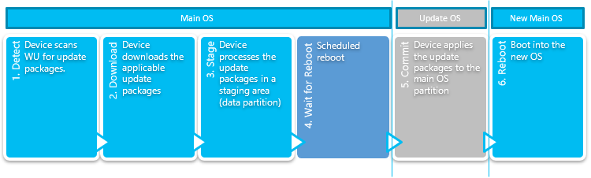

# System Update Manager

We’ll create a simple application to interactively start and monitor system updates.

This sample requires the [Windows Insider Preview SDK](https://www.microsoft.com/en-us/software-download/windowsinsiderpreviewSDK) build 17723 or newer to build.

## System Update Manager Overview

The system update process has the following states:

1. Detect – Determine if any update packages are available.
2. Download – Download the update packages from the server.
3. Stage – Unpack the update packages and stage them to be committed later.
4. Wait for reboot into the Update OS.  The Update OS shows gears on Windows 10 IoTCore while the OS changes are being committed.
5. Commit.  Boot into the Update OS which shows gears while system update changes are committed.
6. Reboot into updated Main OS.  At this point the update process is complete.

Installing an update package includes staging the update package by extracting the files and settings to a staging area, and then later committing the staged changes. Update packages cannot be rolled back on Windows 10 IoTCore once the commit phase begins.  Uncommitted update packages which have only been staged can be discarded if necessary by cancelling the update.  Once the commit process is started it cannot be interrupted.

The automatic update process is controlled by policy.  An OEM can control the policy through a policy manager like MDM, or DUC(Device Update Center).

Interactive update process sessions are controlled by the device user.  Policies that would defer the automatic update process may be overridden during an interactive update process session.  For example the user can scan for update packages, and download them with an interactive process session when an automatic update process session would be blocked from performing these actions by the current policies.  The interactive update process may also stage the update packages.  Staging update packages unpacks the packages and prepares the files and settings in the package to be committed.

Once the update packages are downloaded and staged, the interactive update process may be continued by the developer by rebooting into the update OS and commiting the update packages.  The Update OS is a very small OS that has the sole purpose of committing update packages.  On Windows 10 IoTCore the Update OS shows a screen with moving gears.  Rebooting into the Update OS can be done in response to user input or as part of the business logic of a single purpose device.  A normal system reboot will not change to the UpdateOS, RebootToCompleteInstall() must be called.  Alternatively the developer may choose to wait until the next scheduled automatic update process reboot window as configured by current policies (outside of active hours for example.)

## Before You Install

Before trying to use the SystemUpdateManager API the application should verify that SystemManagementContract 6.0 is present.

    if (!ApiInformation.IsApiContractPresent("Windows.System.SystemManagementContract", 6, 0))
    {
        // SystemUpdateManager was first implemented in SystemManagementContract 6.0
        VisualStateManager.GoToState(this, "NotSupported", false);
        UpdateStateTextBlock.Text = "Windows.System.SystemManagementContract 6.0 not found";
    }

Next the application should make sure that SystemUpdateManager is supported on the current version and edition of Windows

    else if (!SystemUpdateManager.IsSupported())
    {
        // The API must be supported by the current edition of Windows
        // This can also return false if the application doesn't have the systemManagement capability
        VisualStateManager.GoToState(this, "NotSupported", false);
        UpdateStateTextBlock.Text = "System Update not supported (or systemManagement capability missing)";
    }

## Displaying the System Update State

If the contract is present and the API is supported then register for state change notifications:

    // Register for state change notifications
    SystemUpdateManager.StateChanged += SystemUpdateManager_StateChanged;

    private void SystemUpdateManager_StateChanged(object sender, object args)
    {
        var action = _dispatcher.RunAsync(CoreDispatcherPriority.Normal, () =>
        {
            UpdateVisualState();
        });
    }

Initialize the user interface:

    // Display update information
    UpdateStateTextBlock.Text = GetResourceString(SystemUpdateManager.State.ToString());
    LastChecked.Text = SystemUpdateManager.LastUpdateCheckTime.ToString("G");
    LastInstalled.Text = SystemUpdateManager.LastUpdateInstallTime.ToString("G");

    // Attach ViewModel to ListView
    UpdateItemsListView.ItemsSource = _items;

    // Initialize the visual state
    UpdateVisualState();
    UpdateFlightRing();

    BlockAutoReboot.IsOn = IsAutomaticRebootBlockOn();

The **UpdateVisualState** sample code function does the following:

1. Updates the state field.
2. Updates the last update check time.
3. Updates the VisualStateManager state.
4. Updates progress bars for states with progress.
5. Updates the update item status.

Here's the code:

    // Update the state text
    UpdateStateTextBlock.Text = GetResourceString(SystemUpdateManager.State.ToString());

    // Update the last update check time
    LastChecked.Text = SystemUpdateManager.LastUpdateCheckTime.ToString("G");

    // Change the VisualStateManager state based on the current SystemUpdateManagerState
    var state = SystemUpdateManager.State;
    Debug.WriteLine($"State={state}");
    switch (state)
    {
        case SystemUpdateManagerState.Idle:
        case SystemUpdateManagerState.Detecting:
        case SystemUpdateManagerState.Downloading:
        case SystemUpdateManagerState.Installing:
        case SystemUpdateManagerState.RebootRequired:
            VisualStateManager.GoToState(this, SystemUpdateManager.State.ToString(), false);
            break;

        case SystemUpdateManagerState.AttentionRequired:
            AttentionRequiredTextBlock.Text = GetResourceString(SystemUpdateManager.AttentionRequiredReason.ToString());
            VisualStateManager.GoToState(this, "AttentionRequired", false);
            break;

        default:
            VisualStateManager.GoToState(this, "UnknownState", false);
            break;
    }

    // Update progress for states with progress
    switch (SystemUpdateManager.State)
    {
        case SystemUpdateManagerState.Downloading:
            Debug.WriteLine($"Downloading={SystemUpdateManager.DownloadProgress}");
            SessionDownloadProgressBar.Value = SystemUpdateManager.DownloadProgress;
            break;
        case SystemUpdateManagerState.Installing:
            Debug.WriteLine($"Installing={SystemUpdateManager.InstallProgress}");
            SessionDownloadProgressBar.Value = SystemUpdateManager.DownloadProgress;
            SessionInstallProgressBar.Value = SystemUpdateManager.InstallProgress;
            break;
    }

    // Update progress items
    switch (SystemUpdateManager.State)
    {
        case SystemUpdateManagerState.Downloading:
        case SystemUpdateManagerState.Installing:
            foreach (var updateItem in SystemUpdateManager.GetUpdateItems())
            {
                var viewModelItem = _items.Where(x => x.Id == updateItem.Id).FirstOrDefault();
                if (viewModelItem != null)
                {
                    viewModelItem.Update(updateItem);
                }
                else
                {
                    _items.Add(new UpdateItemViewModel(updateItem));
                }
            }
            break;
    }

## Install System Updates

If the device owner has automatic update process policies configured so that they control when downloads start, or they choose to allow customers to start the update process interactively then calling **SystemUpdateManager.StartInstall()** will check for update packages and download the update packages if they exist.  This is a fire-and-forget method that runs asynchronously but returns immediately.  

Progress of the update process can be tracked through the StateChanged event and the State property.  If a download is already in progress the call returns immediately without error.  If user attention is needed to proceed the state is set to AttentionRequired and the AttentionRequiredReason is set.  If an unrecoverable error occurs the state is set to ExtendedError, and the ExtendedError property is set.

To begin an update call **SystemUpdateManager.StartInstall()**.  If the parameter is **SystemUpdateStartInstallAction.UpToReboot** then the install will proceed until a reboot is required.  If the parameter is **SystemUpdateStartInstallAction.AllowReboot** then the install will proceed and reboot as soon as it is allowed by policy.

    private void CheckForUpdates_Click(object sender, RoutedEventArgs e)
    {
        if (SystemUpdateManager.State == SystemUpdateManagerState.Idle)
        {
            SystemUpdateManager.StartInstall(SystemUpdateStartInstallAction.UpToReboot);
        }
    }

To commit a system update install, sometimes a reboot required.  In this case **SystemUpdateManager.State** will equal **SystemUpdateManagerState.RebootRequired**.  Note that a normal reboot will not work to finalize the changes in this state.  You must call **SystemUpdateManager.RebootToCompleteInstall()** or wait for the automatically scheduled reboot to occur during the system update windows (outside of user active hours).

    private void RebootNow_Click(object sender, RoutedEventArgs e)
    {
        if (SystemUpdateManager.State == SystemUpdateManagerState.RebootRequired)
        {
            SystemUpdateManager.RebootToCompleteInstall();
        }
    }

Manage user active hours:

    private void ChangeActiveHours_Click(object sender, RoutedEventArgs e)
    {
        StartTime.Time = SystemUpdateManager.UserActiveHoursStart;
        EndTime.Time = SystemUpdateManager.UserActiveHoursEnd;
        ActiveHoursErrorText.Visibility = Visibility.Collapsed;
        ActiveHoursPopup.IsOpen = true;
    }

    private void SaveActiveHours_Click(object sender, RoutedEventArgs e)
    {
        bool succeeded = SystemUpdateManager.TrySetUserActiveHours(StartTime.Time, EndTime.Time);
        if (succeeded)
        {
            ActiveHoursPopup.IsOpen = false;
        }
        else
        {
            // Active hours not set display error message
            string format = GetResourceString("ActiveHoursErrorFormat");
            ActiveHoursErrorText.Text = String.Format(format, SystemUpdateManager.UserActiveHoursMax);
            ActiveHoursErrorText.Visibility = Visibility.Visible;
        }
    }

## Get Last System Update Error

  If an error occurs during installation of a system update then **SystemUpdateManager.LastErrorInfo** will be set.  Here is an example of displaying the last error information:

    var info = SystemUpdateManager.LastErrorInfo;
    if (SystemUpdateManager.LastErrorInfo.ExtendedError == null)
    {
        NoErrorText.Visibility = Visibility.Visible;
        LastErrorInfoPanel.Visibility = Visibility.Collapsed;
    }
    else
    {
        NoErrorText.Visibility = Visibility.Collapsed;
        LastErrorInfoPanel.Visibility = Visibility.Visible;
        ErrorStateTextBlock.Text = GetResourceString(info.State.ToString());
        HResultTextBlock.Text = (info.ExtendedError == null) ? "No Error Data" : info.ExtendedError.Message;
        IsInteractiveTextBlock.Text = GetResourceString(info.IsInteractive ? "Yes" : "No");
    }

## System Update Flight Ring

The flight ring can be empty, Canary, Selfhost, or user-defined.  If the value is empty then 'None' is selected in the UI.  Otherwise if it is not Canary or Selfhost assume that the ring is user-defined and save it to the UI list.

    private void UpdateFlightRing()
    {
        var ring = Windows.System.Update.SystemUpdateManager.GetFlightRing();
        for (int i = 0; i < FlightRingCombo.Items.Count(); i++)
        {
            if (ring == FlightRingCombo.Items[i] as string)
            {
                FlightRingCombo.SelectedIndex = i;
                return;
            }
        }

        // if the current ring is non-empty and is not in the list save it to the list
        if (!String.IsNullOrEmpty(ring))
        {
            int index = FlightRingCombo.Items.Count;
            FlightRingCombo.Items.Insert(index, ring);
            FlightRingCombo.SelectedIndex = index;
            return;
        }

        FlightRingCombo.SelectedIndex = 0;
    }

    private void FlightRingCombo_SelectionChanged(object sender, SelectionChangedEventArgs e)
    {
        var oldRing = SystemUpdateManager.GetFlightRing();
        var newRing = e.AddedItems[0].ToString();
        Debug.WriteLine($"newRing={newRing} oldRing={oldRing}");

        if (oldRing != newRing)
        {
            if (newRing == "None")
            {
                // only set if previous ring was not null or empty
                if (!String.IsNullOrEmpty(oldRing))
                {
                    Windows.System.Update.SystemUpdateManager.SetFlightRing(String.Empty);
                }
            }
            else
            {
                Windows.System.Update.SystemUpdateManager.SetFlightRing(newRing);
            }
        }
    }

## Block Automatic Reboots

To tell the update service that the system updates aren’t allowed, call **SystemUpdateManager.UnblockAutomaticRebootAsync(id)** where **id** is a unique string composed of numbers letters and dashes. When the critical code execution is completed the code should call **SystemUpdateManager.UnblockAutomaticRebootAsync()** for each **id** that was passed into **BlockAutomaticRebootAsync()**

    if (BlockAutoReboot.IsOn)
    {
        await SystemUpdateManager.BlockAutomaticRebootAsync(Guid.NewGuid().ToString());
    }
    else
    {
        var ids = SystemUpdateManager.GetAutomaticRebootBlockIds();
        foreach(var id in ids)
        {
            bool unblocked = await SystemUpdateManager.UnblockAutomaticRebootAsync(id);
        }
    }
