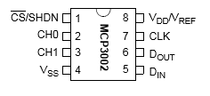
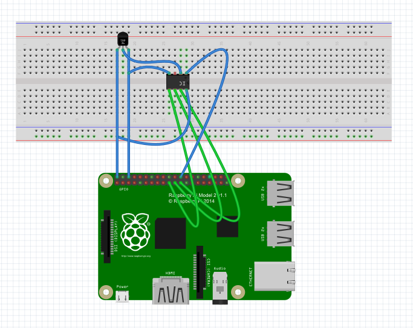
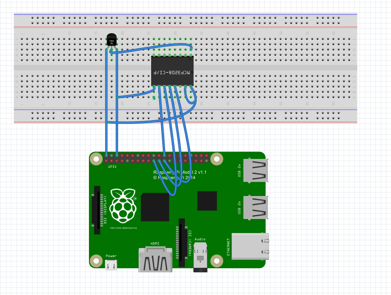

# Temperature and force sensor
This sample uses SPI communication.
A temperature/force sensor is connected to an ADC, the ADC is connected to the Raspberry Pi 2 or 3 through SPI Pins. The ADC converts the analog sensor output to a digital value that is then read by the Raspberry Pi 2 or 3 using SPI. The value read from the ADC is displayed on the screen attached to the Raspberry Pi 2 or 3.
This is basically a simplified version of Potentiometer sensor sample, which has an LED light as an extra output.
You can also use a Force sensor in this sample. Try to press the Force sensor gentle or hard to see the data output difference.
This sample only has C# version.

## Read before start
This sample assumes that Raspberry Pi 2 or 3 has already been set up as below below:

- Raspberry Pi 2 or 3 has been connected to HDMI monitor
- A SD image card has been plugged to Pi 2 or 3
- An Ethernet cable has been plugged to Pi 2 or 3
- Raspberry Pi 2 or 3 has been powered on

## Parts needed

- [1 MCP3002 10-bit ADC](http://www.digikey.com/product-detail/en/MCP3002-I%2FP/MCP3002-I%2FP-ND/319412) or [1 MCP3208 12-bit ADC](http://www.digikey.com/product-search/en?KeyWords=mcp3208%20ci%2Fp&WT.z_header=search_go)
- [1 TMP36 Temperature sensor](http://www.digikey.com/product-detail/en/TMP36GT9Z/TMP36GT9Z-ND/820404) or [1 FSR 402 Force sensor](http://www.digikey.com/product-detail/en/30-81794/1027-1001-ND/2476468)
- Raspberry Pi 2 or 3 board
- 1 breadboard and a couple of wires
- HDMI Monitor

## Parts Review

* MCP3002 or MCP3208

Below are the pinouts of the MCP3002 and MCP3208 analog-to-digital converters (ADC) used in this sample.




* Raspberry Pi 2 and 3

 

## Parts Connection

1. Connect the TMP36 temperature Sensor to the MCP3002; `Sensor output pin` (the middle pin) should be connected to `CH0` on the MCP3002;

If you are using a [Force sensor](http://www.digikey.com/product-detail/en/30-81794/1027-1001-ND/2476468) which only has two legs, set the left leg to 5V,
and connect the other Leg to `CH0` on MCP3002

Detailed connection:

;
;

With each model of Raspberry Pi 2 or 3, the pin layout might be a little different. But the pin connection with MCP3002 should be as below:

- MCP3002: VDD/VREF - 5V on Raspberry Pi 2 or 3
- MCP3002: CLK - "SPI0 SCLK" on Raspberry Pi 2 or 3
- MCP3002: Dout - "SPI0 MISO" on Raspberry Pi 2 or 3
- MCP3002: Din - "SPI0 MOSI" on Raspberry Pi 2 or 3
- MCP3002: CS/SHDN - "SPI0 CS0" on Raspberry Pi 2 or 3
- MCP3002: DGND - GND on Raspberry Pi 2 or 3
- MCP3002: CH0- Sensor Output Pin

2. **Alternative: If you are using MCP3208** Connect the temperature Sensor to MCP3208; `Sensor output pin` (the mid pin) should be connected to `CH0` on MCP3208.

Detailed connection:



With each model of Raspberry Pi 2 or 3, the pin layout might be a little different.
But the pin connection with MCP3208 should be as below:

- MCP3208: VDD - 5V on Raspberry Pi 2 or 3
- MCP3208: VREF - 5V on Raspberry Pi 2 or 3
- MCP3208: CLK - "SPI0 SCLK" on Raspberry Pi 2 or 3
- MCP3208: Dout - "SPI0 MISO" on Raspberry Pi 2 or 3
- MCP3208: Din - "SPI0 MOSI" on Raspberry Pi 2 or 3
- MCP3208: CS/SHDN - "SPIO CS0 on Raspberry Pi 2 or 3
- MCP3208: DGND - GND on Raspberry Pi 2 or 3

## Look at the code

Let's go through the code. We use a timer in the sample, and each time the 'Tick' event is called,
we read the sensor data through ADC, and the value will be displayed on the screen.

* Timer Code
Setup timer in C#:
```csharp
public MainPage()
{
	// ...

	this.timer = new DispatcherTimer();
	this.timer.Interval = TimeSpan.FromMilliseconds(500);
	this.timer.Tick += Timer_Tick;
	this.timer.Start();

	// ...
}
private void Timer_Tick(object sender, object e)
{
	DisplayTextBoxContents();
}
```

* Initialize SPI pin
```csharp
private async void InitSPI()
{
    try
    {
        var settings = new SpiConnectionSettings(SPI_CHIP_SELECT_LINE);
        settings.ClockFrequency = 500000;// 10000000;
        settings.Mode = SpiMode.Mode0; //Mode3;

        string spiAqs = SpiDevice.GetDeviceSelector(SPI_CONTROLLER_NAME);
        var deviceInfo = await DeviceInformation.FindAllAsync(spiAqs);
        SpiDisplay = await SpiDevice.FromIdAsync(deviceInfo[0].Id, settings);
    }

    /* If initialization fails, display the exception and stop running */
    catch (Exception ex)
    {
        throw new Exception("SPI Initialization Failed", ex);
    }
}
```

* read the sensor data through SPI communication

```csharp

/*Raspberry Pi 2 or 3  Parameters*/
private const string SPI_CONTROLLER_NAME = "SPI0";  /* For Raspberry Pi 2 or 3, use SPI0                             */
private const Int32 SPI_CHIP_SELECT_LINE = 0;       /* Line 0 maps to physical pin number 24 on the RPi2 or RPi3        */

/*Channel configuration for MCP3208, Uncomment this if you are using MCP3208*/

// byte[] readBuffer = new byte[3]; /*this is defined to hold the output data*/
// byte[] writeBuffer = new byte[3] { 0x06, 0x00, 0x00 };//00000110 00; /* It is SPI port serial input pin, and is used to load channel configuration data into the device*/

/*Channel configuration for MCP3002, Uncomment this if you are using MCP3002*/
byte[] readBuffer = new byte[3]; /*this is defined to hold the output data*/
byte[] writeBuffer = new byte[3] { 0x68, 0x00, 0x00 };//00001101 00; /* It is SPI port serial input pin, and is used to load channel configuration data into the device*/

private SpiDevice SpiDisplay;

// create a timer
private DispatcherTimer timer;
int res;

public void DisplayTextBoxContents()
{
    SpiDisplay.TransferFullDuplex(writeBuffer, readBuffer);
    res = convertToInt(readBuffer);
    textPlaceHolder.Text = res.ToString();

}
```

* Convert sensor bit data to a number

```csharp
/* This is the conversion for MCP3208 which is a 12 bits output; Uncomment this if you are using MCP3208 */
// public int convertToInt(byte[] data)
// {
//    int result = data[1] & 0x0F;
//    result <<= 8;
//    result += data[2];
//    return result;
// }
/* */

/* This is the conversion for MCP3002 which is a 10 bits output; Uncomment this if you are using MCP3002 */
public int convertToInt(byte[] data)
{
    int result = data[0] & 0x03;
    result <<= 8;
    result += data[1];
    return result;
}
```

## Deploy the sample
Choose `Debug` and `ARM` configuration, choose `Remote Machine`, right click the project, under Property, click Debug tag,
Put the Raspberry Pi 2 or 3 IP in the Remote machine field, and select `Universal` authentication.

Press `F5`

If you are using Temp sensor, you can try to hold the sensor or apply some heat on it to see how the output change. If you are using Force sensor, you can hold it hard or gentle to see
how the output change on the screen. You can also switch the sensor to a light sensor to play around with it.

[Deploy temperature sensor](../../Resources/images/TempSensor/Deploy.PNG)
