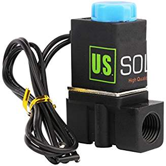
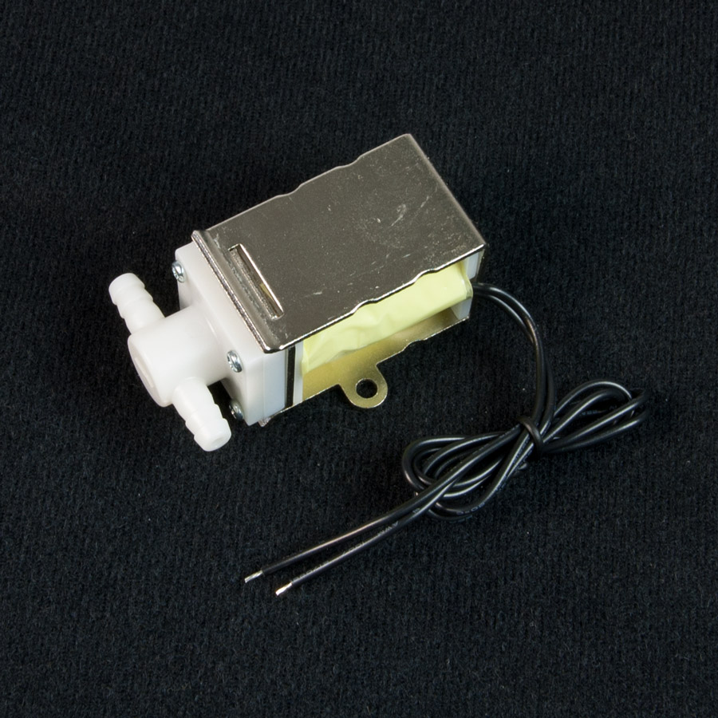
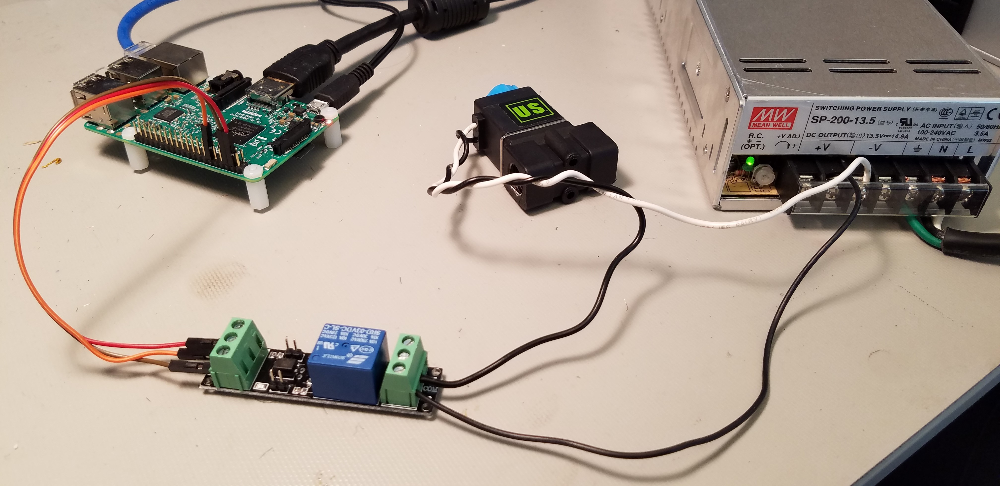
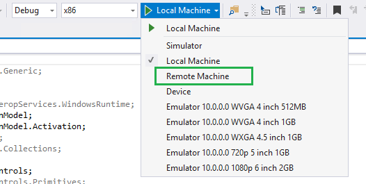
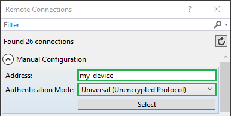
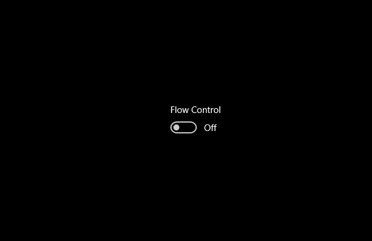

# Valve Control

In this sample, we will demonstrate how to use a relatively inexpensive valve device and a Raspberry Pi to control the flow of liquid through a hose.

Keep in mind that the GPIO APIs are only available on Windows 10 IoT Core, so this sample cannot run on your desktop.

## Set up your hardware
___
The hardware setup for this sample is relatively simple.

You’ll need a few components:

*   a 12VDC relay (we used a SRD-03VDC-SL-C)
*   a normally-closed, solenoid-controlled valve (we tested a couple)
	* 
	* 

*   a microcontroller board running Windows IoT Core (we used a Raspberry Pi 3) with a free GPIO pin



### For Raspberry Pi 2 or 3 (RPi2 or RPi3)

1.  Connect a wire between the VCC labeled terminal on the relay to 5V (pin 4 on the expansion header) on the RPi3.
2.  Connect a wire between the GND labeled terminal on the relay to the ground pin (pin 6) on the RPi3.
3.  Connect a wire between the terminal labeled IN on the relay to the GPIO pin that we will read from (we used GPIO-18, pin 12).

The other side of the relay directs the higher current voltage that powers the valve.  There are three terminals.  If you want current when the GPIO pin supplies power, then use 
the NC or "normally closed" terminal and the COM or "common" terminal.  If the goal is to have the valve open unless the GPIO pin supplies power, then use the NO or "normally open"
terminal and the COM terminal.  For our project, we use the NC and COM terminals.  Keep in mind that many devices like this valve have a documented "duty cycle" that defines the
amount of time at once, or the percentage of time over a time period, that the device can be continuously powered.  If the project requires a valve that is open most of the time
then it is a better design to use a valve that is normally open, rather than to use a normally closed valve and keep power to it most of the time, as it could overheat and damage
the device.

4.  Attach to the network using the ethernet or wifi connection, as desired (we used ethernet to connect to our PC on the local network).
5.  Connect the monitor to your device (we used an HDMI cable to connect our Raspberry Pi 3 to a standard monitor).

For reference, here is the pinout of the RPi2 and RPi3:


## Deploy your app

1.  With the application open in Visual Studio, set the architecture in the toolbar dropdown. We use `ARM` since we used the Raspberry Pi, but if you’re building for MinnowBoard Max, remember to select `x86`.

2.  Next, in the Visual Studio toolbar, click on the `Local Machine` dropdown and select `Remote Machine`

    

3.  At this point, Visual Studio will present the **Remote Connections** dialog. If you previously used [PowerShell](https://docs.microsoft.com/en-us/windows/iot-core/connect-your-device/powershell) to set a unique name for your device, you can enter it here (in this example, we’re using **my-device**). Otherwise, use the IP address of your Windows IoT Core device. After entering the device name/IP select `Universal` for Windows Authentication, then click **Select**.

    

4.  You can verify or modify these values by navigating to the project properties (select **Properties** in the Solution Explorer) and choosing the `Debug` tab on the left:

    

When everything is set up, you should be able to press F5 from Visual Studio. If there are any missing packages that you did not install during setup, Visual Studio may prompt you to acquire those now. The app will deploy and start on the Windows IoT device, and you should see an on/off switch in the middle of the screen.



To test the app (and the device) plug a USB mouse in one of the free ports on the Raspberry Pi, and click the on/off switch on the screen.  Most relays will emit an audible click as the high voltage circuit is closed, providing power to the valve.  Also, visual inspection of the devices
we tried show the valve opening.  If it is possible to blow into the back of the valve, there should be resistance when the power to the valve is off, and air blown should flow through the valve freely when it is powered and open.

Congratulations! You just controlled the flow through the valve and you're ready to connect hoses to control other substances.

## Let’s look at the code

The code for this sample is made easier by using a class to interface with such devices, found in FlowControl.cs.  This, in turn, is dependent upon a reusable class called Measurement, which is found in Models/Measurement.cs.

In order to understand how the code works, an explanation of the sensor device will help.  The device is based on the principle that a coil of wire is electrified and creates a magnetic field, which pushes an actuator (a small metal rod inside the valve) that uncovers a small
hole that the fluid flows through.  When no electricity is supplied, a spring pushes the actuator back into place and covers the hole so that no fluid can flow through it.  By controlling the supply of electricity to the valve through the use of a relay, we can turn on and off
the flow of liquid through the valve.

### Timer code

Here is how you set up the application to use the Flow object in C#:

```csharp
public MainPage()
{
    this.InitializeComponent();

    _flowControl = new FlowControl();
    _flowControl.FlowControlChanged += OnFlowControlChanged;

    FlowControlSwitch.Toggled += FlowControlSwitch_Toggled;
}
```
As you can see, we call Initialize to allow the object
to setup internally.  Then we simply attach method references to the OnFlowChange event so that we get notified when readings are taken from the sensor.  The event provides to us a value that continues to increase that 
represents the cumulative volume measured by the sensor.  Since our user interface was implemented to display sort of a rolling average of the value of the sensor, we calculate the amount added since the last event and pass
that to the radial gauge control for display.

## Additional resources
* [Windows 10 IoT Core home page](https://developer.microsoft.com/en-us/windows/iot/)
* [Documentation for all samples](https://developer.microsoft.com/en-us/windows/iot/samples)

This project has adopted the Microsoft Open Source Code of Conduct. For more information see the Code of Conduct FAQ or contact <opencode@microsoft.com> with any additional questions or comments.
