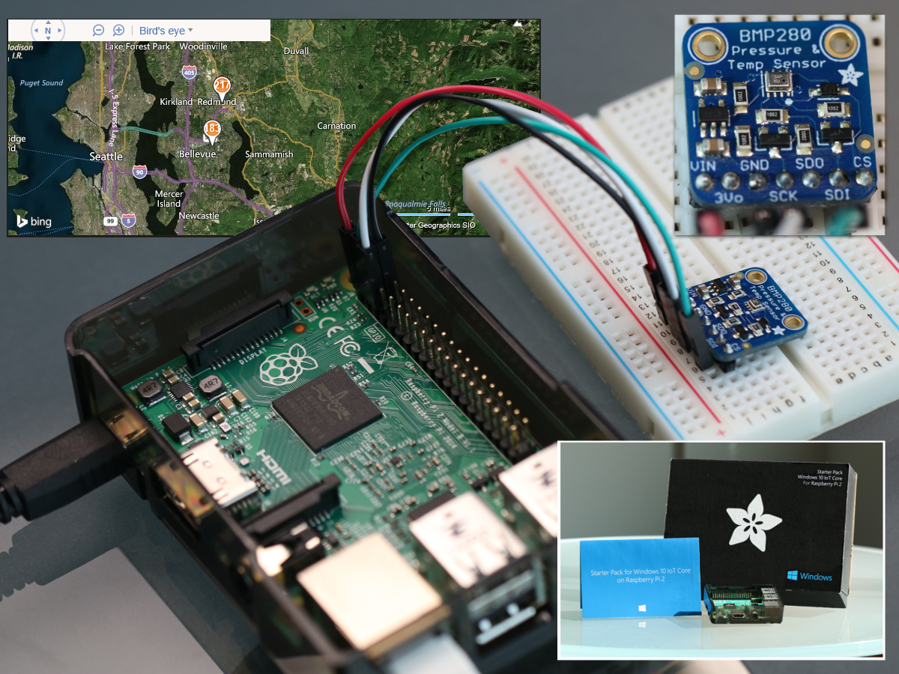

  

    <ol class="breadcrumb">
      <li><a href="/Docs/AdafruitMakerKit">Overview of Starter Pack</a></li>
      <li class="active">Weather Station</li>
    </ol>
    <header class="page-title-header remove-top-margin">
      <h1 class="page-title">Weather Station</h1>
      
Communicate with an I2C/SPI based temperature and pressure sensor

    </header>
  

  

    

    <h3>Communicate with an I2C/SPI based temperature and pressure sensor.</h3>
    Upon executing this sample, you'll have learned how to measure temperature and pressure using I2C/SPI!
    

    Each pin on the map below is another maker that has run this sample. Zoom around to see where they are and deploy the sample to put your pin on the map!
  

  

<iframe class="maker-kit" src="https://adafruitsample.azurewebsites.net/cardViewer?lesson=203" width="100%" height="550px" scrolling="no"></iframe>

  

    
  

  

    <h2>There are two versions of this project.</h2>
    <h2 class="text-center thin-header">If you have v1 of the kit with a BMP280 Click <a target="_blank" href="https://www.hackster.io/windows-iot/weather-station">here</a> to get started!</h2>
    <h2 class="text-center thin-header">If you have v2 of the kit with a BME280 Click <a target="_blank" href="https://www.hackster.io/windows-iot/weather-station-v-2-0-8abe16?auth_token=80b912d8d81919969ccab0080ddd8e2f">here</a> to get started!</h2>
  

  

    <h2 class="thin-header">...or <a href="/Samples/WhatColor"> continue to the next project.</a></h2>
  

