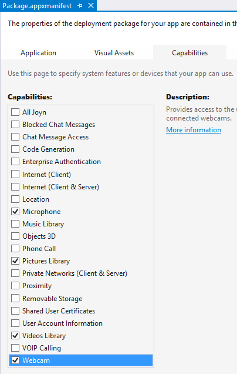

# Basic webcam app 

Initialize a webcam, take pictures, and record video and audio.  
  
This is a headed sample.  To better understand what headed mode is and how to configure your device to be headed, follow the instructions [here](https://docs.microsoft.com/en-us/windows/iot-core/learn-about-hardware/headlessmode).  
  
### Load the project in Visual Studio  
  
You can find the source code for this sample by downloading a zip of all of our samples [here](https://github.com/Microsoft/Windows-iotcore-samples/archive/master.zip). Make a copy of the folder on your disk and open the project from Visual Studio.  
  
This is a Universal Windows application  
  
### Connecting your webcam  
  
You'll need:  
  
* <a name="USB_WebCam"></a>A USB web cam (Example: [Microsoft Life Cam](http://www.microsoft.com/hardware/en-us/p/lifecam-hd-3000))
  
Connect the web cam to one of USB ports on the IoT Device  
  
### Deploy your app  
  
If you're building for Minnowboard Max, select `x86` as the architecture. If you're building for Raspberry Pi 2 or 3 or DragonBoard , select `ARM`.  

**DragonBoard only:** Before deploying this app, disable the on-board mic and audio drivers. This is required on every reboot when running this app
``` xml 
DragonBoard - Commands to disable audio and mic drivers:

devcon remove AUDD\QCOM2451
devcon remove ADCM\QCOM242E 
```  
  
Select **Remote Machine** to point to IoT device and hit F5 to deploy to your device. Go back to the basic 'Hello World' [sample](/Samples/HelloWorld). if you need guidance   
  
### Test your app   
  
The sample app when deployed displays 2 buttons `Initialize Audio and Video` and `Initialize Audio Only`. Below is a description of the actions available when the buttons are clicked.  
  
### Initialize Audio and Video:  
  
* Preview will appear in the left most canvas  
* `Take Photo` when clicked would store the photo in the default location and show the last captured photo in the canvas in the middle  
* `Start Video Record` when clicked would begin recording. When done, press `Stop Video Record` to save the video. Video is automatically played back in the right most canvas  
  
### Initialize Audio Only:  
  
* `Start Audio Record` when clicked will begin recording. When done press `Stop Audio Record` to save the audio. Audio is automtically played back.  
  
**NOTE:** In order to hear the audio, an audio device (ex: earphones) must be connected to the analog audio output on Raspberry Pi2. On MinnowBoard Max, audio output is available via HDMI  
  
Congratulations! You created your first web cam app.  
 
### Let's look at the code  
 
The code for this sample uses the [Windows.Media.Capture](https://msdn.microsoft.com/en-us/library/windows/apps/windows.media.capture.aspx) namespace.   
 
**MediaCapture** class will be used to enumerate, connect to, and perform actions using the web camera connected to the device.   
 
For accessing the web cam, the microphone, and the default storage folders, you must add the following capabilities to the **Package.appxmanifest** file in your project:  



**NOTE:** You can also add capabilities directly by opening the **Package.appxmanifest** file in an XML editor (Right Click on the file -> Open with -> XML (Text) Editor) and adding the capabilities below:
 
``` xml  
 <Capabilities>      
   <uap:Capability Name="videosLibrary" />  
   <uap:Capability Name="picturesLibrary" />  
   <DeviceCapability Name="microphone" />  
   <DeviceCapability Name="webcam" />  
 </Capabilities>  
```  
 
## Initialize MediaCapture object  
 
**MediaCapture** object can be initialized to capture video or audio only. In the sample,   
 
* **initVideo_Click** initializes the device for both audio and video when `Initialize Audio and Video` is clicked.   
* **initAudioOnly_Click** initializes the device for audio only when `Initialize Audio Only` is clicked.  
 
```csharp  
private async void initVideo_Click(object sender, RoutedEventArgs e)  
{ 
   // ...  
 
   //Video and Audio is initialized by default  
   mediaCapture = new MediaCapture();  
   await mediaCapture.InitializeAsync();  
 
   // ...  
}  
 
private async void initAudioOnly_Click(object sender, RoutedEventArgs e)  
{  
   // ...  
     
   mediaCapture = new MediaCapture();  
   var settings = new Windows.Media.Capture.MediaCaptureInitializationSettings();  
   settings.StreamingCaptureMode = Windows.Media.Capture.StreamingCaptureMode.Audio;  
   settings.MediaCategory = Windows.Media.Capture.MediaCategory.Other;  
   settings.AudioProcessing = Windows.Media.AudioProcessing.Default;  
   await mediaCapture.InitializeAsync(settings);  
     
   // ...  
}  
```  
  
### Audio and Video Mode: Start Preview, Take a photo  
  
This section describes some XAML components we create to display the preview and photo output from the web cam. First we create a **CaptureElement** for preview and a and **Image** for the captured photo.  
  
``` xml  
<Canvas Name="PreviewCanvas" Grid.Row="1" Grid.Column="0" Width="320" Height="320" Background="Gray"  Margin="0,0,0,0" Visibility="Visible">  
    <CaptureElement x:Name="previewElement" Width="320" Height="320" HorizontalAlignment="Left" Visibility="Visible"/>  
</Canvas>  
  
<Canvas Name="PhotoCanvas" Grid.Row="1" Grid.Column="1" Width="320" Height="320" Background="Gray"  Margin="40,0,0,0" Visibility="Visible">  
    <Image x:Name="captureImage" Width="320" Height="320" Visibility="Visible"/>  
</Canvas>  
```  
  
When the camera is initialized successfully, we start the preview in **initVideo_Click**.   
  
When the `Take Photo` button is clicked, we capture the image, store it in the default storage, and display it in the XAML canvas element in **takePhoto_Click**  
  
```csharp  
private async void initVideo_Click(object sender, RoutedEventArgs e)  
{  
    // ...  
  
    // Start Preview                  
    previewElement.Source = mediaCapture;  
    await mediaCapture.StartPreviewAsync();  
      
    // ...  
}  
  
private async void takePhoto_Click(object sender, TextChangedEventArgs e)  
{  
    // ...  
  
    photoFile = await KnownFolders.PicturesLibrary.CreateFileAsync(  
                    PHOTO_FILE_NAME, CreationCollisionOption.GenerateUniqueName);  
    ImageEncodingProperties imageProperties = ImageEncodingProperties.CreateJpeg();  
      
    await mediaCapture.CapturePhotoToStorageFileAsync(imageProperties, photoFile);  
      
    IRandomAccessStream photoStream = await photoFile.OpenReadAsync();  
    BitmapImage bitmap = new BitmapImage();  
    bitmap.SetSource(photoStream);  
    captureImage.Source = bitmap;  
  
    // ...  
}  
```  
  
### Audio and Video Mode: Record a video and playback  
  
This section describes how we record a video and play it back. First we create a **MediaElement** in XAML to playback the video  
  
``` xml  
<Canvas Name="VideoCanvas" Grid.Row="1" Grid.Column="2" Width="320" Height="320" Background="Gray" Margin="40,0,0,0" Visibility="Visible">  
    <MediaElement x:Name="playbackElement" Width="320" Height="320" Visibility="Visible"/>  
</Canvas>  
```  
  
When the `Start Video Record` button is clicked, we change the content on the button to `Stop Video Record`.   
  
When this button is clicked **recordVideo_Click** is called and we read the content of the button to determine whether we want to start or stop the video recording.   
  
The code below shows how we accomplish this. Once the recording is stopped, we store the video in the default storage location and play it back in the XAML canvas element.  
  
**NOTE:** In order to hear the audio, an audio device (ex: earphones) must be connected to the analog audio output on Raspberry Pi2. On MinnowBoard Max, audio output is available via HDMI  
  
```csharp  
private async void recordVideo_Click(object sender, RoutedEventArgs e)  
{  
    // ...  
  
    if (recordVideo.Content.ToString() == "Start Video Record")  
    {          
        String fileName;  
        fileName = VIDEO_FILE_NAME;  
  
        recordStorageFile = await Windows.Storage.KnownFolders.VideosLibrary.CreateFileAsync(fileName,   
                                                            Windows.Storage.CreationCollisionOption.GenerateUniqueName);       
  
        MediaEncodingProfile recordProfile = null;  
        recordProfile = MediaEncodingProfile.CreateMp4(Windows.Media.MediaProperties.VideoEncodingQuality.Auto);  
  
        await mediaCapture.StartRecordToStorageFileAsync(recordProfile, recordStorageFile);  
        recordVideo.IsEnabled = true;  
        recordVideo.Content = "Stop Video Record";         
    }  
    else  
    {  
        status.Text = "Stopping video recording...";  
        await mediaCapture.StopRecordAsync();  
          
        var stream = await recordStorageFile.OpenReadAsync();  
        playbackElement.AutoPlay = true;  
        playbackElement.SetSource(stream, recordStorageFile.FileType);  
        playbackElement.Play();  
        recordVideo.Content = "Start Video Record";  
    }  
	  
    // ...  
}  
```  
  
### Audio Only Mode: Record audio and playback  
  
This section describes how we record an audio and play it back. First we create a **MediaElement** in XAML to playback the audio  
  
``` xml  
<Canvas Grid.Row="1" Grid.Column="3" x:Name='playbackCanvas3' Width='0' Height ='0' Margin="0,0,0,0">  
    <MediaElement  x:Name='playbackElement3' Width="0"  Height="0"/>  
</Canvas>  
```  
  
When the `Start Audio Record` button is clicked, we change the content on the button to `Stop Audio Record`.   
  
When this button is clicked **recordAudio_Click** is called and we read the content of the button to determine whether we want to start or stop the audio recording.   
  
The code below shows how we accomplish this. Once the recording is stopped, we store the audio in the default storage location and play it back in the XAML canvas element.  
  
**NOTE:** In order to hear the audio, an audio device (ex: earphones) must be connected to the analog audio output on Raspberry Pi2. On MinnowBoard Max, audio output is available via HDMI  
  
```csharp  
private async void recordAudio_Click(object sender, RoutedEventArgs e)  
{  
    // ...  
  
    if (recordAudio.Content.ToString() == "Start Audio Record")  
    {     
        recordStorageFile = await Windows.Storage.KnownFolders.VideosLibrary.CreateFileAsync(AUDIO_FILE_NAME,   
                                                    Windows.Storage.CreationCollisionOption.GenerateUniqueName);       
  
        MediaEncodingProfile recordProfile = null;  
        recordProfile = MediaEncodingProfile.CreateMp4(Windows.Media.MediaProperties.VideoEncodingQuality.Auto);  
  
        await mediaCapture.StartRecordToStorageFileAsync(recordProfile, recordStorageFile);  
        recordAudio.IsEnabled = true;  
        recordAudio.Content = "Stop Audio Record";     
    }  
    else  
    {  
        status.Text = "Stopping audio recording...";  
  
        await mediaCapture.StopRecordAsync();  
  
        recordAudio.IsEnabled = true;  
        recordAudio.Content = "Start Audio Record";  
  
        var stream = await audioFile.OpenAsync(Windows.Storage.FileAccessMode.Read);  
        status.Text = "Playback recorded audio: " + audioFile.Path;  
        playbackElement3.AutoPlay = true;  
        playbackElement3.SetSource(stream, audioFile.FileType);  
        playbackElement3.Play();  
    }  
	  
    // ...  
}  
```  
  
### MediaCapture callbacks  
  
There are two callbacks illustrated in the sample: **MediaCapture.Failed** and **MediaCapture.RecordLimitationExceeded**.   
  
We assign these in the **initVideo_Click** and **initAudio_Click** functions  
  
```csharp  
private async void initVideo_Click(object sender, RoutedEventArgs e)  
{  
    // ...  
  
    // Set callbacks for failure and recording limit exceeded      
    mediaCapture.Failed += new MediaCaptureFailedEventHandler(mediaCapture_Failed);  
    mediaCapture.RecordLimitationExceeded += new Windows.Media.Capture.RecordLimitationExceededEventHandler(mediaCapture_RecordLimitExceeded);  
	  
    // ...	  
}  
  
private async void initAudio_Click(object sender, RoutedEventArgs e)  
{  
    // ...  
  
    // Set callbacks for failure and recording limit exceeded      
    mediaCapture.Failed += new MediaCaptureFailedEventHandler(mediaCapture_Failed);  
    mediaCapture.RecordLimitationExceeded += new Windows.Media.Capture.RecordLimitationExceededEventHandler(mediaCapture_RecordLimitExceeded);  
	  
    // ...	  
}  
  
private void mediaCapture_Failed(MediaCapture currentCaptureObject, MediaCaptureFailedEventArgs currentFailure)  
{  
    // Display error message  
}  
  
public async void mediaCapture_RecordLimitExceeded(Windows.Media.Capture.MediaCapture currentCaptureObject)  
{  
    // ...  
      
    await Dispatcher.RunAsync(Windows.UI.Core.CoreDispatcherPriority.Normal, async () =>  
    {            
        await mediaCapture.StopRecordAsync();  
        isRecording = false;  
        recordAudio.Content = "Start Audio Record";  
        recordVideo.Content = "Start Video Record";  
      
        // Display error message and storage path for recorded files          
    });  
      
    // ...  
}  
```  
  
To summarize:  
  
* First, we create a **MediaCapture** object to initialize the web cam with either both audio and video settings or only audio settings  
  
* Based on user input, we initialize camera preview, take a photo, record a video or record an audio  
  
* Media files are stored appropriately and can be played back.  
  
* **MediaCapture** callback delegates are used as needed  
