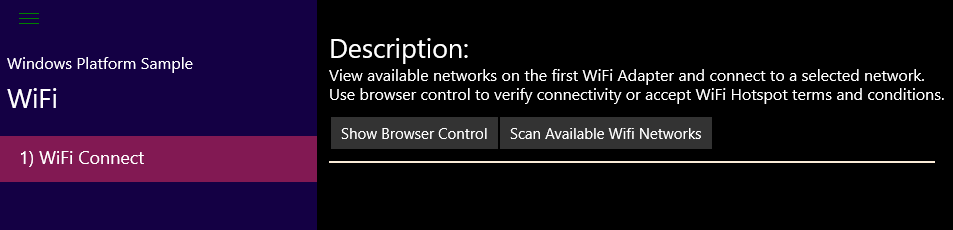
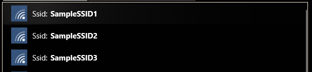
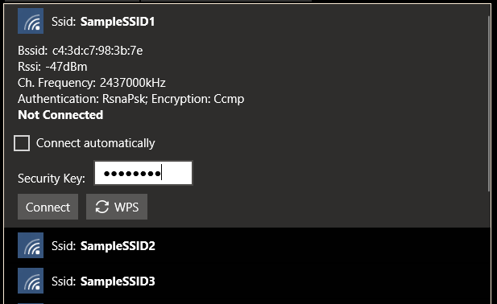
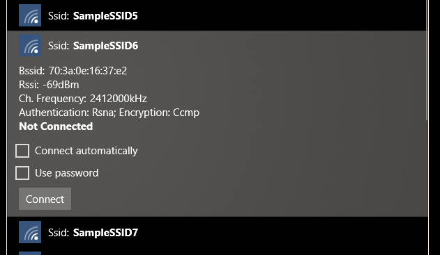
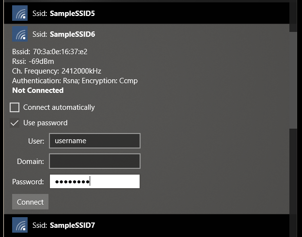
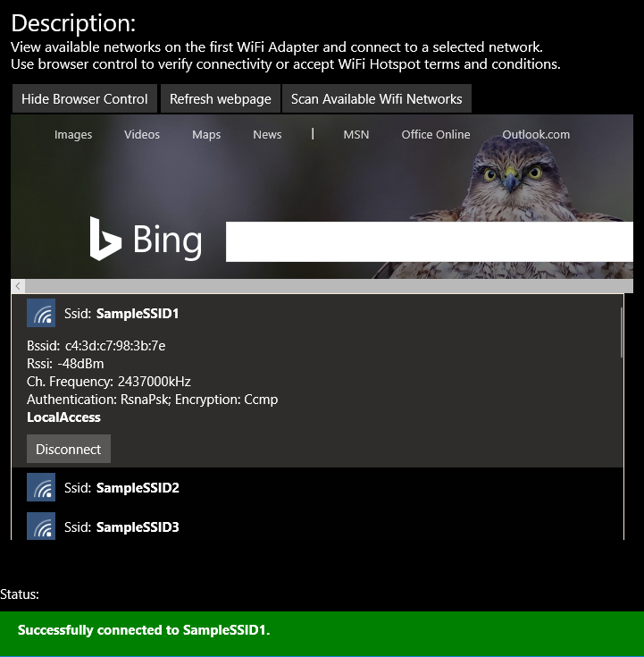

# WiFi Connector

We'll learn how to find and connect to WiFi networks using a Universal Windows Platform (UWP) app that makes use of the [`Windows.Devices.WiFi.WiFiAdapter`](https://msdn.microsoft.com/en-us/library/windows/apps/windows.devices.wifi.wifiadapter.aspx) API.

This is a headed sample.  To better understand what headed mode is and how to configure your device to be headed, follow the instructions on the [Headed and Headless mode](https://docs.microsoft.com/en-us/windows/iot-core/learn-about-hardware/HeadlessMode) site.

### Load the project in Visual Studio

You can find the source code for this sample in our [git repository](../../../Samples). Clone the project to your machine and open the project from Visual Studio.

The code for the WiFi Connect sample can be found under: [\WiFiConnector\CS](../../../Samples/WiFiConnector/CS)

### Connecting your WiFi adapter

You'll need:

* A Windows 10 IoT Core capable board with onboard WiFi, such as the Raspberry Pi 3 or DragonBoard 410c or
* A USB WiFi adapter. For a list of supported WiFi adapters see the [Ecosystem Compatibility List](https://docs.microsoft.com/en-us/windows/iot-core/learn-about-hardware/HardwareCompatList)

### Deploy your app

If you're building for Minnowboard Max, select `x86` as the architecture. If you're building for Raspberry Pi 2 or 3 or DragonBoard , select `ARM`.


Select **Remote Machine** to point to IoT device and hit F5 to deploy to your device. Go back to the basic 'Hello World' [sample](../../Samples/HelloWorld). if you need guidance

### Test your app

The sample app when deployed displays a screen similar to the one below.



If you have a WiFi adapter connected to your board, click on the "Scan Available WiFi Networks" button to start scanning and displaying the list of WiFi networks in the vicinity.

Each WiFi network is identified by its SSID along with an icon showing the signal strength.



The selected network shows some information about the SSID including the signal strength, channel frequency and authentication mode. The connection status is also shown for each.

You can connect to the your SSID by clicking on the one you need. If a security key (password) is needed, a dialog will be displayed asking for it. Also, a checkbox asking if the WiFi service should attempt to reconnect to the particular SSID automatically such as at boot time.

If WiFi Protected Setup (WPS) is supported a WPS button is shown. To use this button first click on the WPS button on your router and then on the WPS button in the application.



For networks that support Extensible Authentication Protocol (EAP), also known as Enterprise WiFi authentication, a password checkbox will be shown. If your enterprise network device is configured with the required certificates, you can simply click **Connect**.



If you must enter a user name and password to connected your network then select the **Password** checkbox and then enter the **User** and **Password**.  The **Domain** is optional and only needs to be entered on networks that require it.



A message on the status bar will indicate if the connection has been successful, or if not the reason the connection could not be made.

Because some networks, like WiFi hotspots, may require additional information that can only be provided through a browser, the app will open a browser control to enable users to complete a connection as needed. Or, if Internet access is already available, the Bing.com page will be displayed.

Selecting the currently connected network also displays a **Disconnect** button that can be used to disconnect from the network.




## Let's look at the code

The code for this sample makes use of the [`Windows.Devices.WiFi.WiFiAdapter`](https://msdn.microsoft.com/en-us/library/windows/apps/windows.devices.wifi.wifiadapter.aspx) API.

The **WiFiAdapter** class can be used to scan, find and connect to both open and secure WiFI networks by making use of the Wlan service running on Windows devices.

### Required device capabiity

Accessing the WiFi adapter from your code requires a device capability for WiFi devices added to the manifest. The `wifiControl` DeviceCapability is the one we need. So, we should add it to the AppX manifest, **Package.appxmanifest** file:

**NOTE:** While you can add other capabilities directly by double clicking and opening the **Package.appxmanifest** file in the UI editor, the wifiControl can only be added via the XML editor (Right Click on the file -> Open with -> XML (Text) Editor) and adding the device capability below:

``` xml
  <Capabilities>
    <Capability Name="internetClient" />
	<!-- Add the capability here -->
    <DeviceCapability Name="wifiControl" />
  </Capabilities>
```

### Scenario Code

The code of this sample is mostly contained within WiFiConnect_Scenario.xaml and .cs files. Values that are bound to properties in **ListView** items can be found in DisplayHelper.cs.

### Requesting access
The first step to access the device is to request access using the static `WiFiAdapter.RequestAccessAsync()` method.

**Note**, in a headed app, the method must be called from the UI thread. However, in an IOT headless app (Background Application), which doesn't have a UI thread, the method can be called from any thread.

When access is granted, any of the WiFiAdapter methods can now be used. So, we start by trying to find a WiFi adapter on the current device, using the WiFiAdapter device selector.

```csharp

    var access = await WiFiAdapter.RequestAccessAsync();
    if (access != WiFiAccessStatus.Allowed)
    {
        rootPage.NotifyUser("Access denied", NotifyType.ErrorMessage);
    }
    else
        {
        DataContext = this;
        var result = await Windows.Devices.Enumeration.DeviceInformation.FindAllAsync(WiFiAdapter.GetDeviceSelector());
        if (result.Count >= 1)
        {
            firstAdapter = await WiFiAdapter.FromIdAsync(result[0].Id);

            var button = new Button();
            button.Content = string.Format("Scan Available Wifi Networks");
            button.Click += Button_Click;
            Buttons.Children.Add(button);
        }
        else
        {
            rootPage.NotifyUser("No WiFi Adapters detected on this machine.", NotifyType.ErrorMessage);
        }
    }
```

Alternatively, `WiFiAdapter.FindAllAdaptersAsync()` can be used to find all WiFi adapters to achieve the same.

```csharp
// Not part of the sample:
var result = await WiFiAdapter.FindAllAdaptersAsync();
if (result.Count >= 1)
{
    firstAdapter = result[0];
    // rest of the code
}
```


### Scanning for WiFi networks

The next step is to scan for available WiFi networks, this can be achieved using the `WiFiAdapter.ScanAsync()` method.

```csharp
private async void Button_Click(object sender, RoutedEventArgs e)
{
    try
    {
        await firstAdapter.ScanAsync();
    }
    catch (Exception err)
    {
        rootPage.NotifyUser(String.Format("Error scanning WiFi adapter: 0x{0:X}: {1}", err.HResult, err.Message), NotifyType.ErrorMessage);
        return;
    }
    await DisplayNetworkReportAsync(firstAdapter.NetworkReport);
}
```

When the scan is complete, the `WiFiAdapter.NetworkReport` property is updated which  can then be used to get and display information to identify each of the WiFi networks found using a read-only collection of `WiFiAvailableNetwork`s. We add each to the result collection, so it can then be mapped to Xaml UI using properties of the `WiFiNetworkDisplay` helper class.

```csharp

    private async Task DisplayNetworkReportAsync(WiFiNetworkReport report)
    {
    rootPage.NotifyUser(string.Format("Network Report Timestamp: {0}", report.Timestamp), NotifyType.StatusMessage);

    ResultCollection.Clear();

    foreach (var network in report.AvailableNetworks)
    {
        var item = new WiFiNetworkDisplay(network, firstAdapter, fakeSsid);
        item.UpdateAsync();
        if (IsConnected(network))
        {
            ResultCollection.Insert(0, item);
            ResultsListView.SelectedItem = ResultsListView.Items[0];
            ResultsListView.ScrollIntoView(ResultsListView.SelectedItem);
            SwitchToItemState(network, WifiConnectedState, false);
        }
        else
        {
            ResultCollection.Add(item);
        }
    }
    ResultsListView.Focus(FocusState.Pointer);
    }

```

### Connecting to a WiFi network

When a WiFi network is selected from the ones displayed, we need to determine if we want to collect the password credential. The WiFi network authentication type is what we need to determine that:

```csharp
    
    private void UpdateNetworkKeyVisibility()
    {
        // Only show the password box if needed
        if ((AvailableNetwork.SecuritySettings.NetworkAuthenticationType == NetworkAuthenticationType.Open80211 &&
                AvailableNetwork.SecuritySettings.NetworkEncryptionType == NetworkEncryptionType.None) ||
                IsEapAvailable)
        {
            NetworkKeyInfoVisibility = false;
        }
        else
        {
            NetworkKeyInfoVisibility = true;
        }
    }
```

To determine if the network supports WPS we can check if the current network supports **WiFiWpsKind.PushButton**.

```csharp

    public async Task<bool> IsWpsPushButtonAvailableAsync()
    {
        var result = await adapter.GetWpsConfigurationAsync(availableNetwork);
        if (result.SupportedWpsKinds.Contains(WiFiWpsKind.PushButton))
            return true;

        return false;
    }
```

And finally, to determine if EAP network support is available we can check to see if the authentication type is **Rsna** or **Wpa**.

```csharp

    public bool IsEapAvailable
    {
        get
        {
            return ((availableNetwork.SecuritySettings.NetworkAuthenticationType == NetworkAuthenticationType.Rsna) ||
                (availableNetwork.SecuritySettings.NetworkAuthenticationType == NetworkAuthenticationType.Wpa));
        }
    }
```

Finally, to connect to the selected network, an overload of `WiFiAdapter.ConnectAsync()` need to be used. The method's overloads allow specifying the available network to connect to, password if needed and whether or not to automatically reconnect to this network when in range.

The status returned in the async result indicates whether the connection was successful or. Only `WiFiConnectionStatus.Success` indicates success. Other returned values indicates the connection failure reason.

```csharp
    
    Task<WiFiConnectionResult> didConnect = null;
    WiFiConnectionResult result = null;
    if (pushButtonConnect)
    {
        didConnect = firstAdapter.ConnectAsync(selectedNetwork.AvailableNetwork, reconnectionKind, null, String.Empty, WiFiConnectionMethod.WpsPushButton).AsTask<WiFiConnectionResult>();
    }
    else if (selectedNetwork.IsEapAvailable)
    {
        if (selectedNetwork.UsePassword)
        {
            var credential = new PasswordCredential();
            if (!String.IsNullOrEmpty(selectedNetwork.Domain))
            {
                credential.Resource = selectedNetwork.Domain;
            }
            credential.UserName = selectedNetwork.UserName ?? "";
            credential.Password = selectedNetwork.Password ?? "";

            didConnect = firstAdapter.ConnectAsync(selectedNetwork.AvailableNetwork, reconnectionKind, credential).AsTask<WiFiConnectionResult>();
        }
        else
        {
            didConnect = firstAdapter.ConnectAsync(selectedNetwork.AvailableNetwork, reconnectionKind).AsTask<WiFiConnectionResult>();
        }
    }
    else if (selectedNetwork.AvailableNetwork.SecuritySettings.NetworkAuthenticationType == Windows.Networking.Connectivity.NetworkAuthenticationType.Open80211 &&
            selectedNetwork.AvailableNetwork.SecuritySettings.NetworkEncryptionType == NetworkEncryptionType.None)
    {
        didConnect = firstAdapter.ConnectAsync(selectedNetwork.AvailableNetwork, reconnectionKind).AsTask<WiFiConnectionResult>();
    }
    else
    {
        // Only the password portion of the credential need to be supplied
        if (String.IsNullOrEmpty(selectedNetwork.Password))
        {
            didConnect = firstAdapter.ConnectAsync(selectedNetwork.AvailableNetwork, reconnectionKind).AsTask<WiFiConnectionResult>();
        }
        else
        {
            var credential = new PasswordCredential();
            credential.Password = selectedNetwork.Password ?? "";

            didConnect = firstAdapter.ConnectAsync(selectedNetwork.AvailableNetwork, reconnectionKind, credential).AsTask<WiFiConnectionResult>();
        }
    }

    SwitchToItemState(selectedNetwork, WifiConnectingState, false);

    if (didConnect != null)
    {
        result = await didConnect;
    }

    if (result != null && result.ConnectionStatus == WiFiConnectionStatus.Success)
    {
        rootPage.NotifyUser(string.Format("Successfully connected to {0}.", selectedNetwork.FakeSsid), NotifyType.StatusMessage);

        // refresh the webpage
        webViewGrid.Visibility = Visibility.Visible;
        toggleBrowserButton.Content = "Hide Browser Control";
        refreshBrowserButton.Visibility = Visibility.Visible;

        ResultCollection.Remove(selectedNetwork);
        ResultCollection.Insert(0, selectedNetwork);
        ResultsListView.SelectedItem = ResultsListView.Items[0];
        ResultsListView.ScrollIntoView(ResultsListView.SelectedItem);

        SwitchToItemState(selectedNetwork, WifiConnectedState, false);
    }
    else
    {
        rootPage.NotifyUser(string.Format("Could not connect to {0}. Error: {1}", selectedNetwork.Ssid, result.ConnectionStatus), NotifyType.ErrorMessage);
        SwitchToItemState(selectedNetwork, WifiConnectState, false);
    }
```

If you need to disconnect, `WiFiAdapter.Disconnect()` can be used.

```csharp

    private void Disconnect_Click(object sender, RoutedEventArgs e)
    {
        var selectedNetwork = ResultsListView.SelectedItem as WiFiNetworkDisplay;
        if (selectedNetwork == null || firstAdapter == null)
        {
            rootPage.NotifyUser("Network not selected", NotifyType.ErrorMessage);
            return;
        }

        selectedNetwork.Disconnect();
        SetSelectedItemState(selectedNetwork);
    }
```

### To summarize:

* To enable WiFi device access, add the `wifiControl` DeviceCapability to the AppX manifest

* In the code, first thing is to request access to WiFiAdapter methods using `WiFiAdapter.RequestAccessAsync()`

* Find available WiFi adapters by enumerating WiFi devices using WiFi adapter device selector or `WiFiAdapter.FindAllAdaptersAsync()`

* Use the `WiFiAdapter.ScanAsync()` method to find all available networks

* Finally, connect to an available network using `WiFiAdapter.ConnectAsync()` and check the connection result
